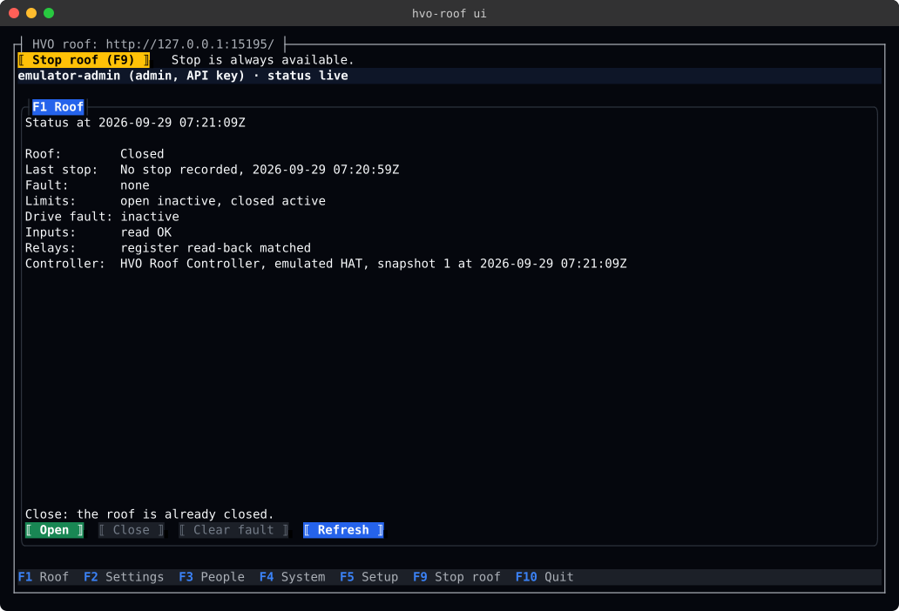
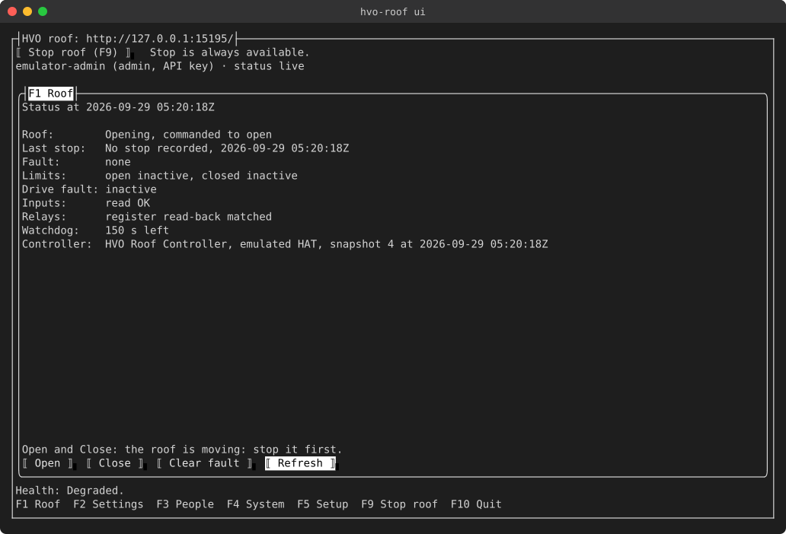
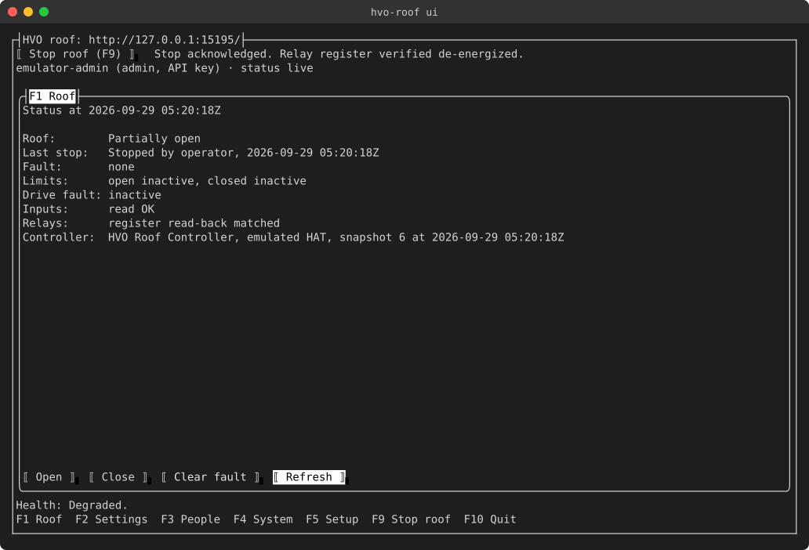
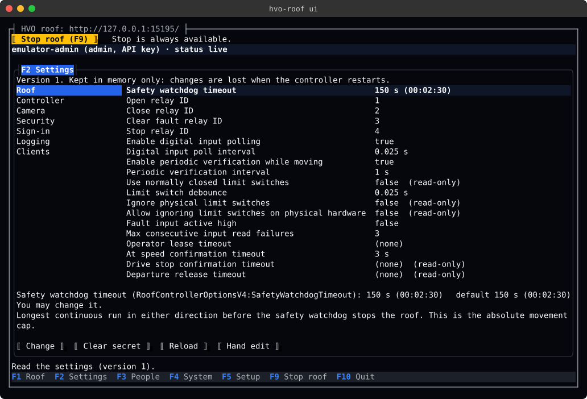
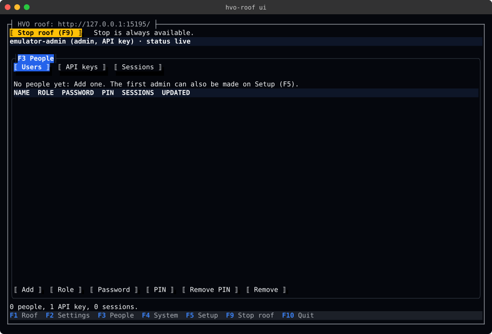
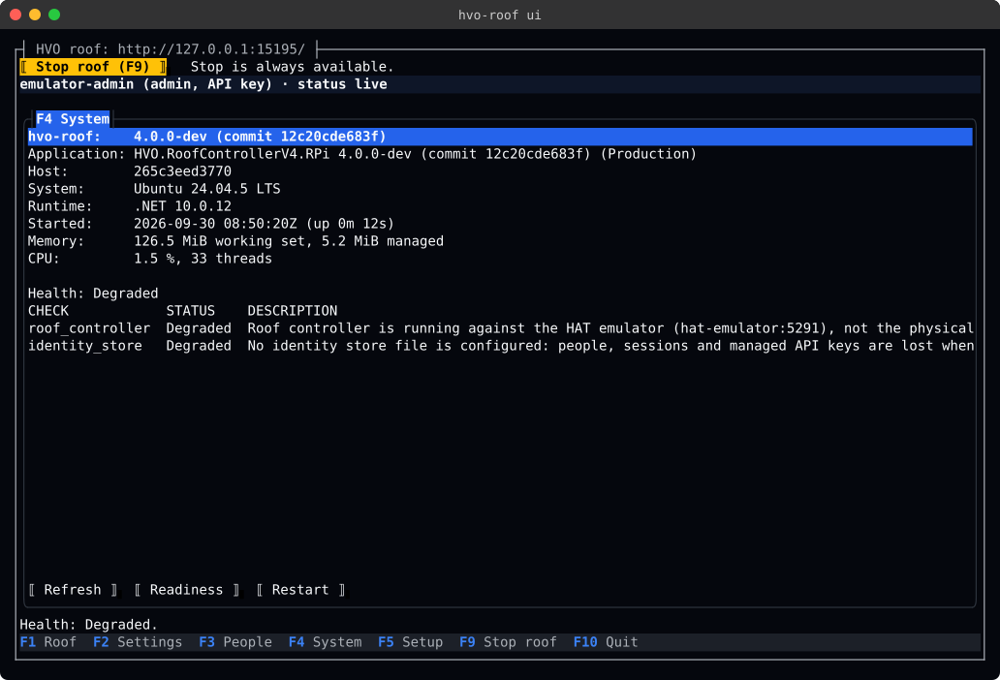
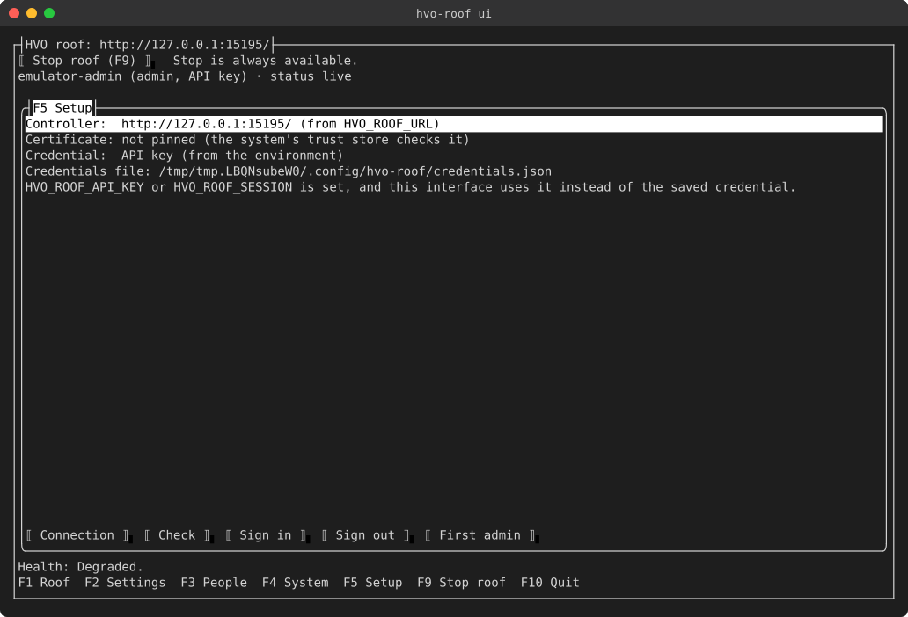

# hvo-roof: the command line and the terminal interface

`hvo-roof` is the roof controller's command-line client (#45). It runs on the Pi next to the controller, or on any
Linux machine that can reach it. Like every UI client, it talks to the controller only over its REST API and status hub,
using the client library ([src/HVO.RoofControllerV4.Client](../src/HVO.RoofControllerV4.Client/README.md)). It never
reaches into the controller's process. `hvo-roof ui` opens a full-screen terminal interface (Terminal.Gui). It has the
roof, the settings, people and keys, the controller's health and restart, and setup, with **Stop roof (F9)** on every
page.

## Install

`hvo-roof` is one self-contained file, so the machine needs no .NET runtime.

| Where | Build | Notes |
|-------|-------|-------|
| The Pi | `linux-arm64` | Runs next to the controller, over SSH or at the Pi's console. |
| Development | `linux-x64` | The same program, for a workstation. |

CI publishes both builds on every run of the `CI` workflow, as the `hvo-roof-<run id>` artifact. To build one
yourself, run from `src/` (so `src/global.json` picks the SDK):

```bash
cd src
dotnet publish HVO.RoofControllerV4.Cli -c Release -r linux-arm64 -o ../out/hvo-roof-arm64
# or -r linux-x64 for a workstation
```

Copy the file into the `PATH`, for example:

```bash
scp ../out/hvo-roof-arm64/hvo-roof pi@roof.local:/tmp/
ssh pi@roof.local 'sudo install -m 0755 /tmp/hvo-roof /usr/local/bin/hvo-roof && rm /tmp/hvo-roof'
hvo-roof --version
```

`hvo-roof ui` needs a terminal of at least 80 × 24 that sends function keys: the Linux console, SSH from any common
terminal, or tmux.

## Setup

Run `hvo-roof setup` once for each person and machine. In a terminal it asks for anything the options leave out:

```bash
hvo-roof setup --controller https://roof.local:5001/ --api-key
```

- **`--controller`** is the controller's address. The address is saved in the credentials file.
- **`--api-key`** reads a key from the terminal without echo, or as one line of standard input. It is never read from
  the command line.
- **`--certificate-sha256`** pins the controller's self-signed certificate by its SHA-256 (64 hex digits, colons
  allowed). When the certificate is not accepted, setup says so and points to this option. `none` removes a saved pin.
- **`--create-admin <name>`** adds the first admin person, with a password that setup asks for. It needs an admin API
  key, which is how a new installation gets its first person.

Setup then checks the connection, and says who the controller takes the credential to be.

To use a person's password instead of a key:

```bash
hvo-roof login ada        # asks for the password; saves the session
hvo-roof whoami
hvo-roof logout           # ends the session; a saved API key is kept
hvo-roof passwd           # changes the signed-in person's password
```

The terminal interface's **Setup (F5)** page does the same: Connection, Check, Sign in, Sign out and First admin.

## Credentials

- **The file.** Credentials are kept in `$XDG_CONFIG_HOME/hvo-roof/credentials.json`, or in
  `~/.config/hvo-roof/credentials.json` when that variable is not set. `--credentials-file` names another file.
  - The file is written with mode `0600` in a directory with mode `0700`.
  - `hvo-roof` refuses a file that other users can read, and a directory that other users can change (exit 3).
- **The environment.** These variables override the file, as a container or a script would set them:
  - `HVO_ROOF_URL`: the controller's address.
  - `HVO_ROOF_API_KEY` or `HVO_ROOF_SESSION`: the credential.
  - `HVO_ROOF_CERT_SHA256`: the certificate pin. It overrides the file's pin on its own, too.
  - `HVO_ROOF_ON_BEHALF_OF`: the person a shared key acts for.
- **Order.** The address comes from `--controller`, then the environment, then the file. The credential comes from the
  environment, then the file (a saved session first, then a saved key). An `HVO_ROOF_URL` that is not an `http` or
  `https` address, or a pin that is not 64 hex digits, is an error (exit 3). That applies even when `--controller` is
  given, and to `setup`, so that a broken environment is not hidden.
- **Secrets never go on the command line.** This covers passwords, PINs, API keys and secret settings. They are read
  from the terminal without echo, or as one line of standard input. A new key's value is shown once, when it is added
  or rotated.

## Commands

Every command takes `--json`, `--controller` and `--credentials-file`, and `--help` describes each command.

| Command | Role | What it does |
|---------|------|--------------|
| `status [--watch]` | viewer | The roof's status. `--watch` follows the status hub, with one line per change of the roof's state (not one per heartbeat), and says so when the status goes stale, or when no status has arrived 3 s after it started. |
| `health [--probe ready\|live]` | viewer | The controller's health checks. Exits 8 unless the controller is healthy. `--probe` asks the anonymous readiness or liveness probe, which needs no credential. |
| `stop` | viewer | **Stop roof.** Sent at once over REST. Exits 9 when the relays could not be verified off. |
| `open`, `close [--no-wait]` | operator | Starts the motion and follows it to the end, renewing the operator lease. Ctrl+C sends Stop. |
| `lease` | operator | Renews the operator lease of the motion in progress (for scripts that use `--no-wait`). |
| `clear-fault [--pulse-ms]` | operator | Clears a latched fault once its cause is resolved. |
| `whoami` | any | The controller in use, and who the controller takes the credential to be. |
| `login`, `logout`, `passwd` | any | Signing in with a password (see [Setup](#setup)). |
| `config show\|get\|set\|set-secret\|diff\|apply\|discard` | operator (UI group), admin | The controller's settings (see [Settings](#settings)). |
| `users list\|show\|add\|set\|remove` | admin | The people who sign in. |
| `pins list\|set\|remove` | admin | The PINs that people use at a kiosk. |
| `keys list\|add\|set\|rotate\|remove` | admin | API keys. Keys from the controller's configuration are read-only. |
| `sessions list\|end` | admin | People's sessions. Tokens are never shown. |
| `info` | admin | The controller's version, host and resource use. |
| `restart [--force] [--confirm-safety-critical]` | admin | Restarts the controller, so that settings read at startup take effect. The controller stops the roof and verifies the stop first, and refuses when it cannot. `health --probe ready` says when it is back. |
| `setup` | none | See [Setup](#setup). |
| `ui` | any | The terminal interface (see [The terminal interface](#the-terminal-interface)). |

**Stop** needs only the credential in use. It never needs a PIN or a fresh sign-in, it is never queued behind another
request, and it is worded the same as in every other client:

| Outcome | Wording | Exit |
|---------|---------|-----:|
| Verified | `Stop acknowledged. Relay register verified de-energized.` | 0 |
| Acknowledged | `Stop acknowledged by the controller.` | 0 |
| Not verified | `Stop acknowledged, but the relay register could not be verified. Confirm at the roof that the motor has stopped.` | 9 |
| Key refused | `Stop was not sent because the controller did not accept the key. Use the stop control at the roof.` | 5 |
| Not delivered, no answer, an answer that could not be read, or a server error (HTTP 5xx, including a 503 when the controller could not verify the stop or its hardware is unavailable) | `Stop failed: <reason> Use the stop control at the roof.` | 9 |
| Refused by the controller (HTTP 403, or another 4xx) | `Stop failed: <reason> Use the stop control at the roof.` | 6 or 7 |

A signal does not cut `stop` short: it sends the Stop, waits for the answer, and reports it with the exit code above.
`stop --json` writes the same document whatever the outcome, with the exit code in it:
`{"outcome", "message", "exitCode", "code", "status"}`. `outcome` is `Acknowledged`, `RelayUnverified` or `Failed`;
`code` is the controller's problem code, when it gave one; `status` is the roof's status, when the answer carried it.

**Motion.** `open` and `close` follow the roof until it stops, then print where it stopped. While they follow it, they
renew the operator lease; a lease that cannot be renewed (no answer, or a server error) is an error (exit 4), and the
controller stops the roof when the lease runs out. If the command is interrupted (see [Signals](#signals)), it sends Stop first and exits 130. That
includes an interruption before the controller's answer arrives, because the roof may already be moving. With
`--json`, an interrupted command writes `{"interrupted": true, "exitCode": 130, "stop": {...}}`, where `stop` is the
`stop --json` document.

The status comes from the status hub. While the hub is not connected, the command says so on standard error
(`Live status is not connected: reading the status every 2 s instead. Ctrl+C sends Stop.`) and reads the status over
REST every 2 s. A read that gets no answer, or a server error (a proxy's 502, say), is not a status: the command keeps
reading, and with no status at all for 30 s it gives up (exit 4) and says that the roof may still be moving.

With `--no-wait`, the command returns once the controller accepts the motion. If the controller holds the motion on a
lease, the command says so, and the roof stops when the lease runs out unless something runs `hvo-roof lease`.

## Settings

The settings are the controller's `appsettings.Local.json` (#42). `hvo-roof` reads and changes them through the API,
one group at a time, and they can equally be edited in the file itself.

| Command | What it does |
|---------|--------------|
| `config show [group]` | Lists the settings you may read, with their values. Secrets show only whether they are set. |
| `config get <key>` | One setting: its value, its default, and what changing it involves (a safety-critical change, or one that needs a restart). |
| `config set <key=value>...` | Changes settings of one group. An empty value clears a setting that may be empty. Durations take `90`, `90s`, `5m` or `01:30:00`. `--dry-run` shows the change without sending it. |
| `config set-secret <key>...` | Sets secret settings of one group, each read from the terminal or standard input in the order given. Settings that are valid only together, such as the camera's `UserName` and `Password`, are set in one change. `--clear` removes them. |
| `config diff` | Shows an edit made to the file by hand that is not in effect yet. |
| `config apply` | Applies the pending hand edit. |
| `config discard` | Writes the file back as the controller has it. |

A **safety-critical change** is shown and not sent until you confirm it with `--confirm-safety-critical` (exit 10
until then). Examples are relay mapping, limit or fault polarity, and turning off the operator lease or the at-speed
check. The same rule applies to a pending hand edit that contains such a change (`config apply`), and to a restart that
would load one (`restart`).

Operators may change only the UI group (for example the kiosk's screen timeout and the default camera). Every other
group needs an admin. A setting you may not change is refused before anything is sent, with the exit code the
controller's own refusal would give: 6 for the role or a local-only setting, and 7 while a hand edit is pending.

`config diff`, `apply` and `discard` need the admin role (exit 6 otherwise), because the controller shows a pending
hand edit only to admins. For anyone else "no hand edit is pending" would be a guess; the refusal says when the
controller's answer shows that one is pending.

## Scripts

- **Output.** Results go to standard output. Errors, progress and prompts go to standard error.
- **`--json`.** Writes one JSON document on standard output. On failure, that document is
  `{"error": {"exitCode", "kind", "message", "status", "code", "detail", ...}}`. `status --watch --json` writes one line
  of JSON per change. A command that needs a confirmation writes `{"sent": false, "confirmationRequired": true, ...}`.
  A command line that cannot be parsed (an unknown command or option, or a value of the wrong form) is reported as text
  on standard error with exit 2, even with `--json`.
- **Values.** A value the command line can check itself, such as a number out of range or a duration it cannot read,
  is a usage error (exit 2) and nothing is sent. Values that only the controller can judge are sent, and its refusal
  is exit 7 with each reason listed.
- **Unattended use.** A script never gets a prompt it cannot answer. Without a terminal, secrets are read as one line
  of standard input, and a missing value is a usage error (exit 2).
- **Secrets in a change.** The change that `config set-secret` lists before it is sent (and its `changes` in JSON)
  shows a secret being set as `(new value)`. Setting a secret is always a change, even over one that is set, because
  its value is never shown. Clearing a secret that is not set is not a change.

### Signals

`hvo-roof` handles SIGINT (Ctrl+C), SIGTERM, and SIGHUP (the terminal closing, or an SSH session dropping) the same way:

- **The first signal** ends the command, not the process. A command that has the roof moving (`open`, `close`, or
  `ui`) sends Stop first. The command exits 130.
- **The process still ends.** 5 s after the first signal it exits 130. `open`, `close`, `stop` and `ui` have up to
  15 s, for the Stop timeout (10 s) and a margin to print its answer and restore the terminal.
- **A second signal** ends the process at once, except in `open`, `close`, `stop` and `ui`: nothing cuts their Stop
  short. Closing a terminal sends SIGHUP twice (the kernel's and the shell's, well under a millisecond apart), before a
  command can have seen the first.

### Exit codes

| Code | Name | Meaning |
|-----:|------|---------|
| 0 | Success | The command did what it was asked. |
| 1 | Failed | Something failed that no other code describes, for example an answer that could not be read. |
| 2 | Usage | The command line was not valid: an unknown command or option, or a missing or malformed value. |
| 3 | NotConfigured | No controller address or credential, or the credentials file cannot be used (for example, other users can read it). `hvo-roof setup` fixes this. |
| 4 | Unreachable | The controller could not be reached, or did not answer in time. |
| 5 | SignedOut | The controller did not accept the credential (HTTP 401): the key is wrong or the session has ended. |
| 6 | Forbidden | The credential is valid, but its role may not do this (HTTP 403). |
| 7 | Refused | The controller refused the command, for example because of the roof's state, a latched fault, a settings version conflict or a value it does not accept. |
| 8 | Unhealthy | `health`: the controller answered, but it is degraded or unhealthy. |
| 9 | StopNotVerified | `stop`: nothing confirms that the roof stopped. The controller could not verify that the relays are off, or the stop did not reach it, its answer never came or could not be read, or it answered with a server error (HTTP 5xx). Use the stop control at the roof. `ui`: the same, for the last Stop sent from the interface. |
| 10 | ConfirmationRequired | Nothing was sent, because the command needs a confirmation. A safety-critical change is confirmed with `--confirm-safety-critical` once you have reviewed it. A question (removing a user or key, discarding a hand edit, restarting) is confirmed at the terminal, or with `--force` when there is none. |
| 11 | Stale | `status --watch`: it was ended while the status was stale (no recent message from the controller), or before any status arrived. |
| 130 | Interrupted | The command was interrupted (Ctrl+C, SIGTERM, or the terminal closing) before it finished. What it had sent may still take effect. |

## The terminal interface

`hvo-roof ui` shows the controller's address, a **Stop roof (F9)** button, and who you are (for example
`ada (admin) · status live`) above five pages:

| Key | Page | What it has |
|-----|------|-------------|
| F1 | Roof | The status, with Open, Close, Clear fault and Refresh. Each button that cannot be used says why, for example "the roof is already closed". |
| F2 | Settings | The settings by group, built from the controller's catalogue. Change, Clear secret, Reload, and review of a hand edit. |
| F3 | People | People, API keys and sessions (admin). |
| F4 | System | Health, readiness, the version and resource use (admin), and Restart (admin). |
| F5 | Setup | Connection, a connection check, Sign in, Sign out, and First admin. |



- **F9 sends Stop from every page, even over an open prompt**, and the result appears next to the button. The Stop
  button is never disabled.
- **Esc** closes a prompt, and never closes the interface.
- **F10** quits. A termination signal (the terminal closing, or SIGTERM) closes the interface the same way, and
  `hvo-roof ui` then exits 130.
- **Motion started here.** An Open or Close started here is held on the operator lease, and the interface renews the
  lease while the roof moves. When the controller holds motion on no lease, the interface says
  `Open accepted. F9 or quitting stops it.` Either way, quitting while the roof moves sends Stop first
  (`Stopping the roof, which moves on a command from this interface, before closing.`).
- **Quitting never cuts a Stop short.** While a Stop is on its way, quitting says
  `Waiting for Stop to be answered before closing.` and closes once the controller answers.
- **Quitting does not hide a Stop that nothing confirmed.** When the Stop that quitting sent or waited for failed, or
  its relays could not be verified, F10 leaves the interface open with the result on screen
  (`Nothing confirmed the Stop, so the interface stays open. F10 closes it.`). Whenever the last Stop sent from the
  interface was not confirmed, `hvo-roof ui` repeats its result on the restored terminal and exits 9 (130 after a
  termination signal, which closes the interface anyway).
- **A stale status.** When the status stops arriving, a banner says `STALE: no status since …`. When live status is not
  connected, a status read with Refresh is stale from the start: the banner says
  `STALE: status from a single read at …; live status is not connected. Stop still works.` The Roof page then shows
  the last known state under `LAST KNOWN STATE, as of …`, and offers no Open or Close. Stop still works.
- **Nothing is claimed that the controller has not said.** Before the first status, the Roof page says so rather than
  showing a position.
- **Safety-critical changes need confirmation.** On the Settings page they open a prompt, and nothing is sent until it
  is confirmed. A restart that would load such a change needs the same confirmation.

### Colours

The interface uses HVO Dark, the web console's theme (`RoofUiPalette` in the client library), so it looks like the
web console: light text on the dark page background, the focused control in the accent blue, **Stop yellow**, Open
green and Close red, a stale status in the theme's warning colours, and an error in its danger colours. Terminal.Gui
draws the theme's colours in true colour, or as the nearest of 256 or 16 colours when that is all the terminal has.

With `NO_COLOR` set (see [no-color.org](https://no-color.org)), the interface uses the terminal's own colours instead.
Stop and the focused control are in reverse video, input fields are underlined, disabled controls are faint, and a
stale status or an error is bold in reverse video. Buttons have no shadow.

The right-click menu of a text field keeps Terminal.Gui's own colours.

### Screens

These are drawn from a run against the emulated roof (see [Tests](#tests)), so the controller says it is degraded:
an emulated HAT is not a production controller.

**Opening, then F9.** Another client opened the roof. The Roof page follows the motion, and F9 stops it and says what
the controller verified.





**Settings (F2).** The groups on the left, the group's settings on the right, and the selected setting's key, default
and description below. A setting that cannot be changed here says why (for example, read-only).



**People (F3), System (F4) and Setup (F5).**







## Tests

Nothing here needs the Pi, the HAT or the roof.

- **Commands** run in the test process against the controller's API with a mocked roof. The tests check their output,
  `--json` and exit codes (`tests/HVO.RoofControllerV4.RPi.Tests/Cli`), with a virtual clock for the stale status, the
  REST reads while live status is not connected, and the grace periods after a signal (`RoofCliTerminationTests`).
- **The terminal interface** is drawn on Terminal.Gui's in-memory driver with a virtual clock (`RoofTerminalUiTests`).
  The tests check:
  - Stop on every page and over a prompt;
  - Esc and F10, including quitting while the roof moves or while a Stop is on its way, and a termination signal;
  - the stale view, including a single read while live status is not connected;
  - the lease while the roof moves, and motion held on no lease;
  - the HVO Dark colours, and the interface with `NO_COLOR`;
  - the Setup, People, Settings and System pages, including confirmation of safety-critical changes.
- **Scenarios** (`RoofCliScenarios`, `TestCategory=Scenario`) run `hvo-roof open`, `close` and `stop`, and the terminal
  interface, against the emulated roof. The operator lease is 5 s, shorter than the travel, so a motion reaches its
  limit only if the client renews the lease.
- **A real terminal.** `tests/cli/terminal-smoke.sh` runs the published `hvo-roof` in tmux, on a tmux server of its
  own, against the compose emulator profile (called by `tests/emulator/compose-smoke-test.sh` when `HVO_ROOF_CLI` is
  set). It:
  - runs a few commands and checks their exit codes;
  - opens every page of the interface;
  - stops, with F9, a roof that another client started, and checks with `status --json` that the roof stopped short of
    the open limit;
  - checks that Esc leaves the interface open and that F10 exits 0;
  - closes the terminal of `hvo-roof open` (a tmux window killed under its shell, which delivers SIGHUP twice) and sends
    SIGTERM to `hvo-roof close` while each follows the roof, and checks that each sent Stop, that the controller verified
    it and that the roof stopped short of the limit, and that `close` exited 130.

  The `Emulator image` workflow keeps the screens as the `terminal-screens-<run id>` artifact: each as text, with its
  colours (`.ans`), and as an SVG image drawn by `tests/cli/ansi-to-svg.py`. The screenshots above are those images.
  To refresh them, run the smoke locally and copy the images into `docs/images/terminal/`:

  ```bash
  dotnet publish src/HVO.RoofControllerV4.Cli -c Release -r linux-x64 -o /tmp/hvo-roof
  HVO_ROOF_CLI=/tmp/hvo-roof/hvo-roof TERMINAL_SMOKE_OUT=/tmp/screens tests/emulator/compose-smoke-test.sh
  cp /tmp/screens/0[1-7]-*.svg docs/images/terminal/
  ```
