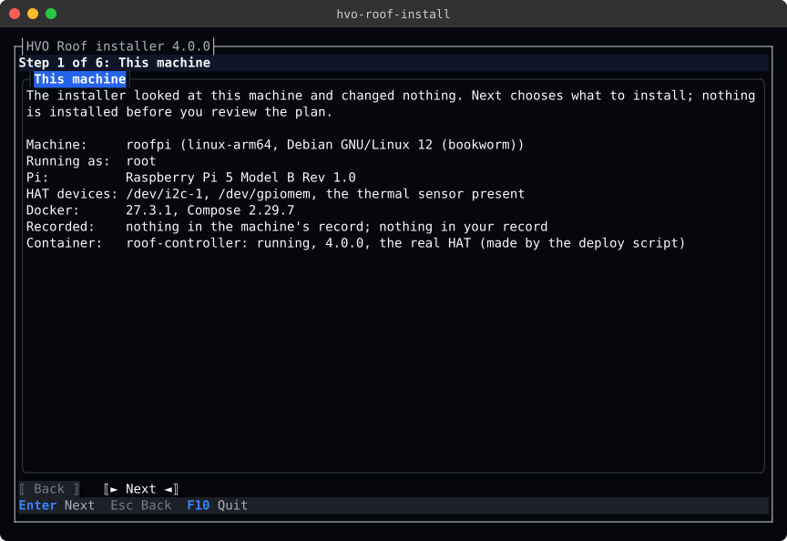
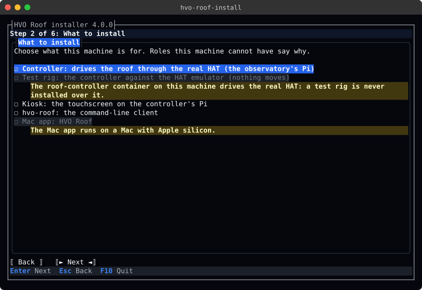
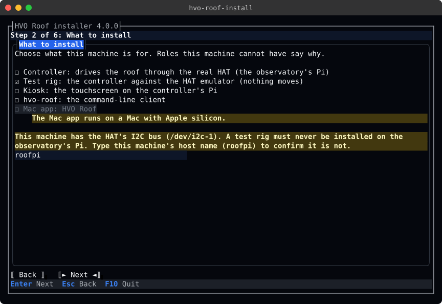
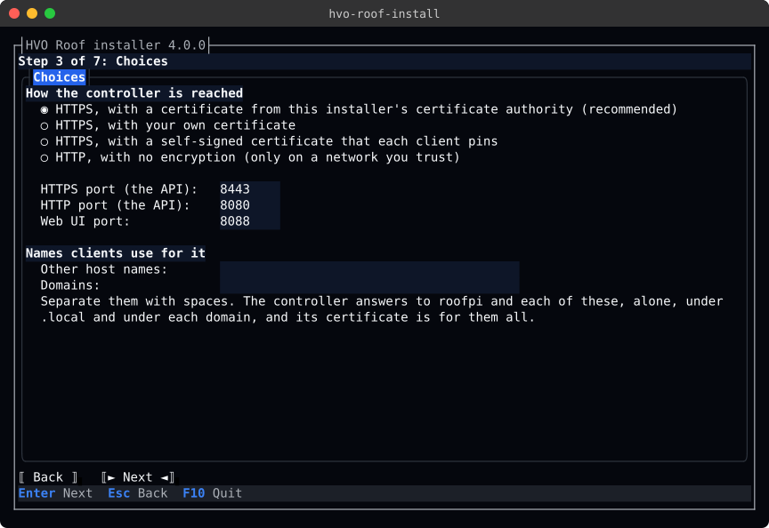
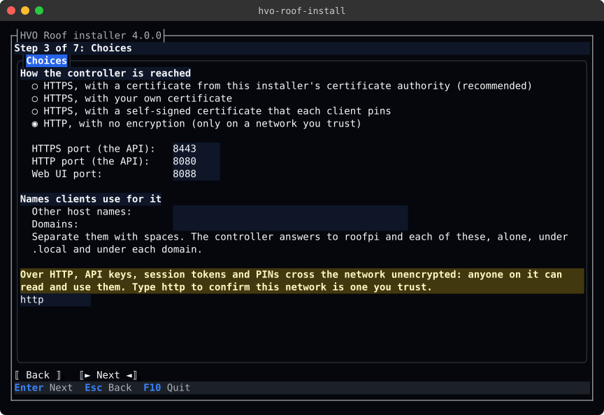
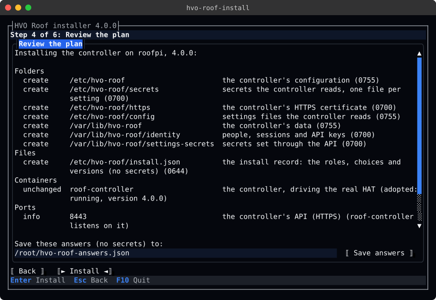
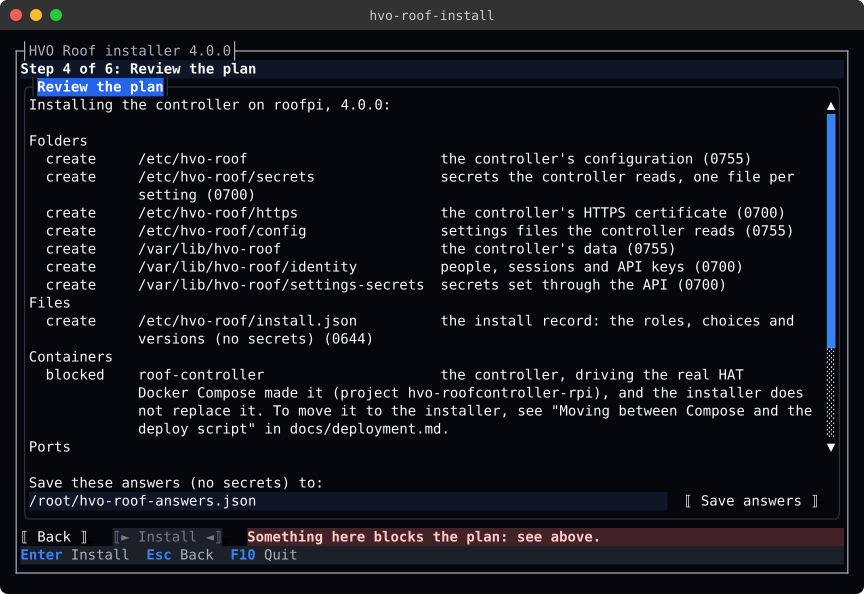
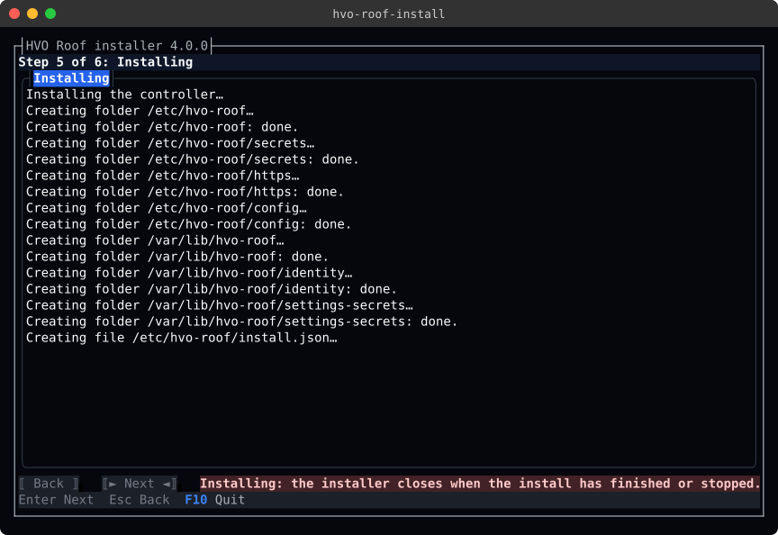
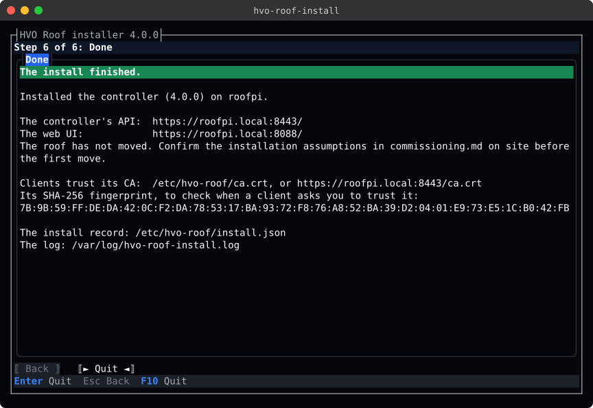
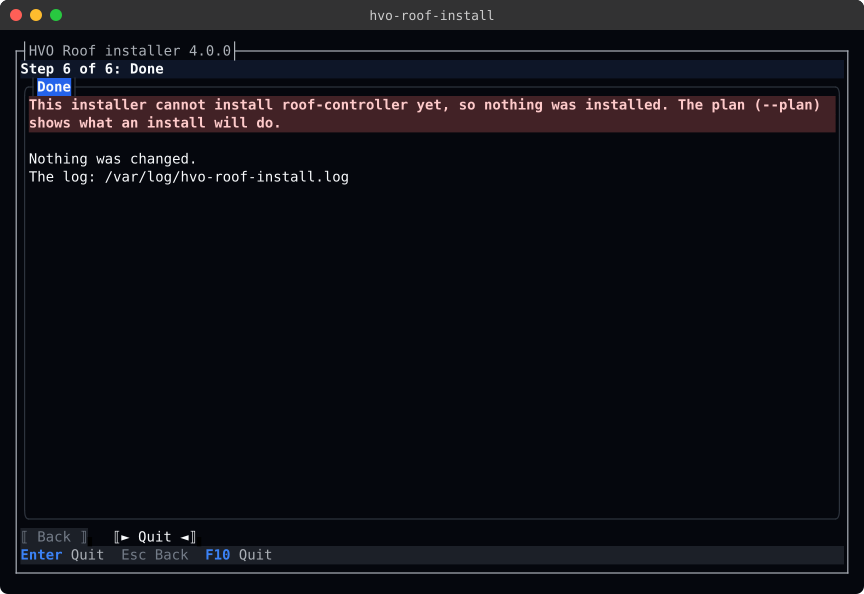

# Installing: hvo-roof-install

`hvo-roof-install` is the installer (#61). It sets up the roof controller's pieces on a machine:

- the controller;
- a test rig;
- the touchscreen kiosk;
- `hvo-roof`, the command-line client;
- the Mac app.

It records what it installed, so a later run can check, repair and upgrade what is there. It never moves the roof.

It runs as a wizard in the terminal, in the same HVO Dark look as the other interfaces. It can also run without asking
anything, from an answers file that the wizard saves.

> **What it does today.** This release of the installer:
>
> - looks at the machine;
> - offers only the roles the machine can have, and refuses the rest;
> - works out and shows the plan;
> - saves answers files;
> - makes the controller's folders, its certificate authority and its HTTPS certificate ([Certificates](#certificates));
> - writes the install record.
>
> It adopts a controller that the deploy script already runs ([Deploying](deployment.md#deploying-with-the-script)).
> The later installer issues make the rest:
>
> - #69: deploying the controller and a rig;
> - #70: the kiosk;
> - #71: `hvo-roof` and the Mac app.
>
> Until then, an install that needs one of those parts is refused, with exit code 3, before anything changes. `--plan`
> shows what such an install will do.

## Getting it

`hvo-roof-install` is one self-contained file, so the machine needs no .NET runtime. It is built for linux-arm64 (the
Pi), linux-x64 and osx-arm64 (Apple silicon). There is no build for an Intel Mac or for Windows.

Every run of the `CI` workflow publishes the three builds as the `hvo-roof-install-<run id>` artifact. From #73, each
release carries them as assets, with `install.sh` to download the right one.

To build one yourself, run this from `src/`, so that `src/global.json` picks the SDK:

```bash
cd src
dotnet publish HVO.RoofControllerV4.Installer -c Release -r linux-arm64 -o ../out/hvo-roof-install-arm64
# or -r linux-x64, or -r osx-arm64 for a Mac
```

The wizard needs a terminal of at least 80 × 24 that sends function keys: the Linux console, SSH from any common
terminal, tmux, or Terminal on a Mac.

## Running it

| Command | What it does |
|---------|--------------|
| `hvo-roof-install` | Opens the wizard. |
| `hvo-roof-install --answers FILE` | Installs from an answers file without asking anything, printing the plan and each step. |
| `hvo-roof-install --plan --answers FILE` | Prints every folder, file, container, service and port the install would make or change, and changes nothing. |
| `hvo-roof-install --plan` | The same for what is installed here, from its install record: yours, or with `sudo` (or without a record of yours) the machine's. |
| `hvo-roof-install --version` | Prints the installer's version and the commit it was built from, such as `4.0.0+0123abcd…`. |
| `hvo-roof-install cert` | Checks the controller's certificate and its CA, and makes or renews what needs it. `--plan` shows what it would do. |
| `hvo-roof-install cert show` | Shows the controller's certificate and CA: what they are for, until when, and their fingerprints. |
| `hvo-roof-install cert import FILE` | Puts your own certificate in place for the controller. |

The installer runs as root for the machine's roles, and as you for your own ([Roles](#roles)).

- **The controller, a rig on Linux or the kiosk:** run it with `sudo`.
- **`hvo-roof`, the Mac app or a rig on a Mac:** run it as yourself, without `sudo`.

It refuses to mix the two in one run, and refuses the wrong one for a role. `--plan` does not need root, but planning
the controller or a rig needs Docker access (on Linux, root or the `docker` group).

It asks for no secret, except the password of a certificate you import, which it never shows, keeps or logs. Keys are
made on the machine, straight into files that only their user can read. From #69, a person types the first
administrator's password. An answers file, the plan, the record and the log never hold a secret.

### Exit codes

`install.sh` and scripts rely on these.

| Code | Meaning |
|------|---------|
| 0 | Installed. With `--plan`, the plan can be carried out. |
| 1 | A step failed. The log says which step, and what the installer did before it. Nothing after that step changed; running the installer again carries on. |
| 2 | The command line or the answers file was not valid. |
| 3 | Refused, and nothing was changed. The reason is one of these: a role this machine cannot have, a missing prerequisite (`sudo`, Docker), something the installer will not replace, a part it cannot install yet, or a certificate the controller could not serve. |
| 130 | You quit before installing, or the installer was interrupted (Ctrl+C stops between steps). |

## Roles

| Role | In an answers file | Where it runs | Runs as | Record |
|------|--------------------|---------------|---------|--------|
| The controller, driving the real HAT | `controller` | Only the observatory's Raspberry Pi: 64-bit Raspberry Pi OS with `/dev/i2c-1`, `/dev/gpiomem` and the thermal sensor | root | `/etc/hvo-roof/install.json` |
| A test rig: the controller against the HAT emulator | `rig` | Linux (amd64 or arm64) with Docker, or an Apple silicon Mac with Docker Desktop | root on Linux; you on a Mac | the machine's on Linux; yours on a Mac |
| The kiosk | `kiosk` | The controller's Pi | root | `/etc/hvo-roof/install.json` |
| `hvo-roof` | `cli` | Linux or an Apple silicon Mac | you | yours |
| The Mac app | `mac-app` | An Apple silicon Mac | you | yours |

Your record is `$XDG_CONFIG_HOME/hvo-roof/install.json`, or `~/.config/hvo-roof/install.json`. `hvo-roof` keeps its
credentials in the same folder.

A rig on Linux keeps its files where the controller does, in the deploy script's folders:

- `/etc/hvo-roof`, with `secrets`, `https` and `config` inside it;
- `/var/lib/hvo-roof`, with `identity` and `settings-secrets` inside it.

A rig on a Mac keeps them in `~/Library/Application Support/HVO Roof Rig`, which Docker Desktop shares with its
containers.

### The guards

The installer refuses a choice that would put the roof at risk, or that cannot work, before it changes anything:

- **The real HAT only on its Pi.** The controller is offered only on a 64-bit Linux Pi with the HAT's three devices.
  On a Pi where I2C is not enabled, the installer names the missing devices and the command that enables I2C
  (`sudo raspi-config nonint do_i2c 0`, then a reboot).
- **Never a rig on the real HAT's machine.** A test rig is refused in either of these cases:
  - the machine's record says the machine drives the real HAT;
  - a `roof-controller` container there drives the real HAT.
- **A typed confirmation for a rig near a HAT.** Before a rig is installed on a machine with `/dev/i2c-1`, for the
  first time, a person types the machine's host name, to confirm that it is not the observatory's Pi. An answers
  file can give it as `rigConfirmation`. The wizard never saves the confirmation, so each new rig is confirmed on its
  own machine.
- **One controller container.** The controller and a rig cannot share a machine: both run as the `roof-controller`
  container.
- **The kiosk with its controller.** The kiosk needs the controller on the same Pi: choose both, or install the
  controller first.
- **Docker.** The controller and a rig need Docker running, and the right to use it.
- **Root rules.** See [Running it](#running-it).
- **Compose.** A container that Docker Compose made is described in the plan but never replaced. Move it first: see
  [Moving between Compose and the deploy script](deployment.md#moving-between-compose-and-the-deploy-script).
- **Busy ports.** A port that something else already listens on blocks the plan.
- **A typed confirmation for plain HTTP.** Before the controller serves plain HTTP, when it does not already, a person
  types `http`, to confirm that keys, session tokens and PINs may cross this network unencrypted. An answers file can
  give it as `httpConfirmation`. The wizard never saves it.

## What it looks for

Before asking anything, and without changing anything, the installer looks at the following:

- **The machine:** the platform, the host name, who runs the installer, the operating system and the Pi's model.
- **The controller's certificate and CA:** who issued the certificate, the names it is for, until when, and whether
  its password opens it. Each run warns when either expires soon, or when the certificate is not for a name clients
  use ([Renewing](#renewing)).
- **The HAT's devices:** `/dev/i2c-1`, `/dev/gpiomem` and `/sys/class/thermal/thermal_zone0/temp`.
- **Docker:** its version, and Compose v2's version.
- **The install records:** the machine's, and yours. A record the installer cannot read is reported and replaced, and
  until then a test rig is refused, since the record may say the machine drives the real HAT. A record from a newer
  installer is never replaced: install with that installer, or a newer one.
- **`/etc/hvo-roof`,** when it was set up without the installer.
- **The containers:** `roof-controller` and `hat-emulator`. For each, the installer finds:
  - its state and version;
  - whether it drives the real HAT or an emulator;
  - whether the deploy script or Docker Compose made it.
- **The kiosk's service:** `hvo-roof-kiosk.service`.
- **The programs:** `hvo-roof` on the `PATH` (or in `~/.local/bin` or `/usr/local/bin`), and `HVO Roof.app` in
  `/Applications` or `~/Applications`.

The wizard's first page shows what it found, and the log keeps it. A later run starts from the recorded roles and
choices.

## The wizard

The wizard has six steps. The key bar says what the keys do:

- **Enter** does what the highlighted button says.
- **Esc** goes back a step. It never closes the installer.
- **F10** quits, unless the install is running: then the installer finishes (or stops) first.

**1. This machine.** What the installer found. Nothing has changed yet.



**2. What to install.** Each role this machine can have. A role it cannot have is shown with the reason, and cannot be
chosen.



On a machine with the HAT's I2C bus, choosing a test rig asks for the host name:



**3. Choices.** The questions of the roles chosen, filled in from the record, or with the defaults:

- **The controller:** how clients connect (private CA, your own certificate, self-signed, or HTTP), the ports, and
  the other names and domains clients use for it ([Certificates](#certificates)). No domain is listed unless you
  list it: the page names those this machine's resolver searches, and you add one only if clients use names in it.
- **`hvo-roof`:** its folder.
- **The Mac app:** its folder.



Choosing HTTP asks you to type `http`, to confirm that keys, session tokens and PINs may cross the network unencrypted:



**4. Review the plan.** Every change the install would make, checked against the machine, as `--plan` prints it
([The plan](#the-plan)). Install goes ahead only when nothing blocks the plan. **Save answers** writes the answers
file, which installs the same way elsewhere with `--answers`.



A blocked step says why, and Install stays off:



**5. Installing.** Each step as it runs. The installer cannot be left until the install has finished or stopped.



**6. Done.** What was installed, where to reach it, how clients trust its certificate, what comes next, and where the
record and the log are. The same text stays in the terminal after the wizard closes.



When the install is refused, or a step fails, the Done page says why. It also says what was changed, if anything.



## Answers files

An answers file holds everything the wizard asks, as JSON. It has no secret. Members are camelCase, and names are
kebab-case. A member the installer does not know is an error, so a misspelt one is not silently ignored.

```json
{
  "schema": 1,
  "roles": ["controller"],
  "controller": {
    "connection": "private-ca",
    "httpsPort": 8443,
    "httpPort": 8080,
    "webPort": 8088,
    "hostNames": ["roof"],
    "domains": ["observatory.example"]
  }
}
```

| Member | Values | Default |
|--------|--------|---------|
| `schema` | `1` | `1` |
| `roles` | Any of `controller`, `rig`, `kiosk`, `cli`, `mac-app` | Required |
| `controller.connection` | `private-ca`, `own-certificate`, `self-signed`, `http` | `private-ca` |
| `controller.httpsPort` | The controller's API over HTTPS (the deploy script's `HTTPS_HOST_PORT`) | `8443` |
| `controller.httpPort` | The controller's API over HTTP, with `http` (`HOST_PORT`) | `8080` |
| `controller.webPort` | The web UI (`WEB_HOST_PORT`) | `8088` |
| `controller.hostNames` | Other short names clients use for the controller, such as `roof` ([Certificates](#certificates)) | None |
| `controller.domains` | The domains clients reach it under, such as `observatory.example` | None. The wizard names the search domains in `/etc/resolv.conf`, but lists none unasked. |
| `cli.folder` | `~/.local/bin` or `/usr/local/bin` | `~/.local/bin` |
| `macApp.folder` | `/Applications` or `~/Applications` | `/Applications` |
| `rigConfirmation` | This machine's host name, for a rig on a machine with `/dev/i2c-1` | None |
| `httpConfirmation` | `http`, to serve plain HTTP where the controller does not already | None |

The `controller` section applies to a rig too. A section for a role that is not chosen is dropped. The wizard never
saves `rigConfirmation` or `httpConfirmation`, so each machine is confirmed on its own. The wizard saves answers to `hvo-roof-answers.json` in the folder where the installer was started, unless you give another path.

## The plan

`--plan`, and the wizard's review page, list each step under what it makes, with what it would do here:

- **create:** the step makes something new.
- **change:** the step changes something that is there.
- **unchanged:** it is already as it should be.
- **info:** for example, a port the controller will listen on.
- **blocked:** the step cannot go ahead. The line under it says why, and nothing is installed.

For example, for a test rig on a Linux workstation:

```text
$ hvo-roof-install --plan --answers rig.json
The plan for a test rig on rig1, 4.0.0:

Folders
  create     /etc/hvo-roof                                 the controller's configuration (0755)
  create     /etc/hvo-roof/secrets                         secrets the controller reads, one file per setting (0700)
  create     /etc/hvo-roof/https                           the controller's HTTPS certificate (0700)
  create     /etc/hvo-roof/ca                              the certificate authority's key (0700)
  create     /etc/hvo-roof/config                          settings files the controller reads (0755)
  create     /var/lib/hvo-roof                             the controller's data (0755)
  create     /var/lib/hvo-roof/identity                    people, sessions and API keys (0700)
  create     /var/lib/hvo-roof/settings-secrets            secrets set through the API (0700)
Files
  create     /etc/hvo-roof/ca.crt                          the certificate authority clients trust (its key stays in /etc/hvo-roof/ca) (a new CA, which may issue only for names in local, localhost, rig1, and private addresses)
  create     /etc/hvo-roof/secrets/Kestrel__Certificates__Default__Password  the certificate file's password (random, never shown) (0600)
  create     /etc/hvo-roof/https/roof-controller.pfx       the controller's certificate, from its CA, for rig1 (for 3 names and 3 addresses, until 2027-11-02)
  create     /etc/hvo-roof/install.json                    the install record: the roles, choices and versions (no secrets) (0644)
Containers
  create     hat-emulator                                  the HAT emulator: the roof, drive and limit switches the rig drives (deployed by digest with the deploy script)
  create     roof-controller                               the controller, against the HAT emulator (deployed by digest with the deploy script)
Ports
  info       8443                                          the controller's API (HTTPS) (free; roof-controller will listen on it)
  info       8088                                          the web UI (free; roof-controller will listen on it)

14 to create, 0 to change, 0 unchanged.
Installing a test rig needs root: run the installer with sudo.
```

### Running it again

Each step checks the machine just before it runs, and changes only what differs. A folder with the wrong mode has its
mode set, and its contents are never touched. The record is rewritten only when it would say something new. A second
run of the same answers changes nothing: "Nothing to change: this machine is already as the answers describe."

After a failed step, running the installer again carries on from where it stopped.

## Certificates

The controller serves its API and the web UI over HTTPS, unless you choose plain HTTP. `controller.connection` says
how clients trust it:

| Connection | The certificate | What each client does |
|------------|-----------------|-----------------------|
| `private-ca` (the default) | Issued by the installer's own certificate authority (CA), made on the controller's machine. | Trusts the CA once. A renewed certificate then needs nothing more. |
| `own-certificate` | Yours, from your own CA, put in place with `cert import`. | Nothing, when it already trusts your CA. |
| `self-signed` | Signed by itself. | Pins it, and pins it again after each renewal. |
| `http` | None. Keys, session tokens and PINs cross the network unencrypted. | Nothing. Use it only on a network you trust: a person types `http` to confirm. |

### The installer's CA

The CA and the certificates it issues use ECDSA P-256 keys and SHA-256. They meet the rules that browsers and Apple's
platforms set for a server certificate.

- **The CA** lasts 10 years. Its key is made on the machine, straight into a file only root can read, and never leaves
  it. The CA may issue only for these, so a client that trusts it refuses anything else it signs:
  - `local`, `localhost`, and the short names and domains of the controller;
  - the private networks (`10.0.0.0/8`, `172.16.0.0/12`, `192.168.0.0/16`, `fc00::/7`) and loopback.

  So a stolen Pi, or the CA's key, cannot pass for a public site to the clients. It can still sign for any `.local`
  name, any name in a listed domain, and any private address, so keep the key safe, list only the domains clients use,
  and if a Pi or its key is lost, remove its CA from each client's trust.
- **The certificate** lasts 397 days, the most browsers accept. It is for:
  - the machine's short host name and each name in `controller.hostNames`, each alone, under `.local` and under each
    domain in `controller.domains`;
  - `localhost`;
  - the machine's private addresses, `127.0.0.1` and `::1`. Addresses on Docker and other virtual networks, and
    link-local and public addresses, are left out.

  The controller answers to the same names (its `AllowedHosts`).
- **A self-signed certificate** is for the same names, and lasts 825 days, the most Apple's platforms accept.

| File | Mode | Holds |
|------|------|-------|
| `/etc/hvo-roof/ca/ca.key` | `0600`, in a `0700` folder | The CA's private key |
| `/etc/hvo-roof/ca.crt` | `0644` | The CA's certificate, for clients |
| `/etc/hvo-roof/https/roof-controller.pfx` | `0600` | The certificate, its key, and its CA's certificate |
| `/etc/hvo-roof/secrets/Kestrel__Certificates__Default__Password` | `0600` | The file's password: random, never shown |

These are the paths [deployment.md](deployment.md#2-tls-certificate) uses: the deploy script serves the certificate
with `HTTPS_CERT_DIR=/etc/hvo-roof/https` and the default `HTTPS_CERT_FILE`.

### Trusting the CA

The Done page, `cert` and `cert show` print the CA's SHA-256 fingerprint. A client gets the CA from the controller at
`https://<host>.local:<HTTPS port>/ca.crt`, or as a copy of `/etc/hvo-roof/ca.crt`. Check the fingerprint the client shows
against the one the installer printed before trusting it. The TLS handshake cannot give the CA: the server leaves a
self-signed root out of it.

### Renewing

Every run of the installer, `--plan` included, warns when one of these applies:

- the certificate expires within 30 days, or has expired;
- the CA expires within 400 days, so that its last certificate still lasts its full 397 days;
- the certificate is not for a name or address clients use;
- the certificate's password does not open it.

`sudo hvo-roof-install cert` then makes what needs making, and changes only what differs:

- **A new CA** when the CA is missing or cannot be read, expires within 400 days, may not issue for a name the
  controller now has, or does not limit the names it may issue for. `--new-ca` makes one even when none of these apply.
  Every client must then trust the new CA.
- **The certificate again** when the CA is new, the names or addresses have changed, it expires within 30 days,
  another CA issued it, or its password does not open it. `--renew` issues it again even when none of these apply.
- **The modes** of the files, when they differ.

With nothing recorded yet, such as a controller the deploy script runs, it uses the defaults: the installer's CA,
unless your own certificate from another CA is in place. It then says which connection to choose when you install the
controller, so the certificate is kept. It refuses to issue while this machine's clock is before the CA's start: set
the time (NTP) first.

It prints the plan, each step, and the certificate as `cert show` does. It never restarts the controller or moves the
roof. The controller serves a new certificate once it is deployed again: when the roof is idle, run the deploy script
again ([Deploying](deployment.md#deploying-with-the-script)). From #69 the installer does that step.

`cert --plan` shows what `cert` would do, and changes nothing. It runs without root, but then cannot check the files
that only root can read.

### Your own certificate

`sudo hvo-roof-install cert import FILE` puts your certificate in place and records that the controller serves your
own. The file is one of these:

- a PKCS#12 file (`.pfx`, `.p12`) with its key;
- PEM (`.crt`, `.pem`) with its chain and its key, or with `--key FILE` for the key.

When the file or the key has a password, the installer asks for it, or reads it from `--password-file FILE`. The
password opens the file only: the installer writes the controller's own file with a new random password. It refuses a
certificate that has expired, is not yet valid, is a CA's, or is not for a server, and a key whose password needs more
than 600,000 iterations to derive its key (export it again with fewer). It warns when the certificate is not for a name
or address clients use, and when it lasts longer than Apple's platforms accept. Importing the same certificate again
changes nothing, unless its chain has changed. `--plan` checks the file and shows what would change.

The installer never renews your certificate. Before it expires, import the new one.

## The record and the log

The record says which roles are installed, with their choices and the release. Every later run reads it, for these
purposes:

- to offer the same choices;
- to refuse a test rig on the real HAT's machine;
- from #72, to upgrade, roll back or uninstall.

It is written last, once everything before it is in place, and it holds no secret.

| File | Mode | Holds |
|------|------|-------|
| `/etc/hvo-roof/install.json` | `0644` | The machine's roles: the controller, a rig on Linux, the kiosk. |
| `~/.config/hvo-roof/install.json` | `0600`, in a `0700` folder | Your roles: `hvo-roof`, the Mac app, a rig on a Mac. |

The log records the following, each with the time:

- what the installer found;
- each command it ran, and how the command ended (the last 40 lines of its output);
- each change it made.

A secret is written as `[secret]`, and a command that handles one is logged without its input or output. `--plan`
writes no log.

| Run as | Log | Mode |
|--------|-----|------|
| root | `/var/log/hvo-roof-install.log` | `0640`, owned by root |
| you, on Linux | `$XDG_STATE_HOME/hvo-roof/install.log`, or `~/.local/state/hvo-roof/install.log` | `0600` |
| you, on a Mac | `~/Library/Logs/hvo-roof-install.log` | `0600` |

## Tests

Nothing here needs the Pi, the HAT or the roof. The tests (`tests/HVO.RoofControllerV4.RPi.Tests/Installer`) run
the installer on a fake machine: a Pi with or without the HAT's devices, a Linux workstation, or a Mac. The fake
machine has files, modes, containers and ports, and its programs are stubbed. The tests check:

- the plan for each role on each machine;
- the guards and their messages;
- that a second run changes nothing;
- that answers files round-trip;
- that no secret reaches an answers file, the record or the log;
- the certificates: the CA's name constraints and the names on the certificate it issues, that the key files are made
  owner-only and never printed, renewal before expiry, a changed name or a new CA, importing a PFX or PEM with its
  chain, and refusing a certificate the controller could not serve;
- the exit codes.

The controller's side, `GET /ca.crt` and the `https_certificate` health check, has its own tests
(`Security/CaCertificateEndpointTests` and `HealthChecks/RoofCertificateHealthCheckTests`).

The wizard is drawn on Terminal.Gui's in-memory driver, with the same pages, keys, colours and work off its thread as
in a terminal.

CI publishes the three builds and checks that each is the right platform. It also checks what the linux-x64 build
prints for `--version` and `--plan`.

### Refreshing the screenshots

The wizard's tests save each page as ANSI. CI draws the pages as SVG and keeps them as the `installer-renders-<run id>`
artifact. To refresh the pictures above, download that artifact from a green run and copy its `.svg` files into
`docs/images/install/`. To draw them locally, run this from `src/`:

```bash
HVO_INSTALLER_RENDERS_DIR=/tmp/installer-renders \
  dotnet test ../tests/HVO.RoofControllerV4.RPi.Tests --filter "FullyQualifiedName~.Installer.InstallerWizardTests"
for ans in /tmp/installer-renders/*.ans; do
  python3 ../tests/cli/ansi-to-svg.py "$ans" "../docs/images/install/$(basename "${ans%.ans}").svg" --title hvo-roof-install
done
```
