# Installing: hvo-roof-install

`hvo-roof-install` is the installer (#61). It sets up the roof controller's pieces on a machine:

- the controller;
- a test rig;
- the touchscreen kiosk;
- `hvo-roof`, the command-line client;
- the Mac app.

It records what it installed, so a later run can check, repair and upgrade what is there. It never moves the roof.

It runs as a wizard in the terminal, in the same HVO Dark look as the other interfaces. It can also run without asking
anything, from an answers file that the wizard saves.

> **What it does.** The installer:
>
> - looks at the machine;
> - offers only the roles the machine can have, and refuses the rest;
> - works out and shows the plan;
> - saves answers files;
> - makes the controller's folders, its keys, its certificate authority and its HTTPS certificate
>   ([Certificates](#certificates));
> - deploys the controller, or a test rig with its HAT emulator, from the release's images by their digests, through
>   the deploy script ([Deploying](deployment.md#deploying-with-the-script)), and adds the first admin;
> - sets up the touchscreen kiosk on the controller's Pi ([The kiosk](#the-kiosk));
> - installs `hvo-roof` and the Mac app on other machines, connected to the controller and trusting its CA once you
>   have checked its fingerprint ([hvo-roof and the Mac app](#hvo-roof-and-the-mac-app));
> - writes the install record;
> - upgrades what it installed, rolls it back, backs up and restores the controller's and the kiosk's data, and
>   uninstalls ([Upgrading](#upgrading), [Rolling back](#rolling-back),
>   [Backing up and restoring](#backing-up-and-restoring), [Uninstalling](#uninstalling)).
>
> It adopts a controller that the deploy script already runs.

## Before you start

### The Pi

The controller and the kiosk run on the observatory's Raspberry Pi, with the HAT. Set the Pi up first:

1. **Raspberry Pi OS Lite (64-bit).** Write it to the Pi's card or drive with
   [Raspberry Pi Imager](https://www.raspberrypi.com/software/): under the operating systems, choose Raspberry Pi OS
   (other), then Raspberry Pi OS Lite (64-bit). `install.sh` refuses a 32-bit system, and the kiosk needs the display
   with no desktop holding it ([The guards](#the-guards)).
2. **Imager's settings.** Before it writes, edit its OS customisation settings:
   - **the host name,** such as `roof-pi`. Clients reach the controller by it (`roof-pi.local`), and the installer makes
     the controller's certificate and CA for it. Choose it now: a new host name later needs a new CA, which every client
     must trust again ([Renewing](#renewing));
   - **your user name and password,** for the user who runs the installer with `sudo`;
   - **SSH,** with public-key authentication only and your public key, so that you install from another machine;
   - **the time zone** and the keyboard layout;
   - **Wi-Fi** only when the Pi has no network cable.
3. **A fixed address.** Give the Pi a DHCP reservation on the router, so that its address stays the same. The
   certificate is made for the Pi's addresses too: after a change of address, `sudo hvo-roof-install cert` issues it
   again, under the same CA.
4. **Up to date.** Start the Pi, sign in over SSH, and bring it up to date:

   ```bash
   sudo apt update && sudo apt full-upgrade -y && sudo reboot
   ```

5. **The clock.** Raspberry Pi OS sets its clock from the network. `install.sh` refuses a clock more than 5 minutes out,
   since TLS, the release's attestation and the certificates the installer makes depend on it. `timedatectl` shows
   whether it is synchronised.
6. **The HAT and the screen.** With the Pi off, fit the HAT and, for the kiosk, connect the touch display, so that the
   installer finds them. You need not turn I2C on or install Docker first: `install.sh` offers to do both
   ([What install.sh checks](#what-installsh-checks)).

### The roof

The installer never moves the roof, and nothing in an install commands it to move. Even so, for the first install of the
controller on the observatory's Pi:

- **Close the roof,** and have someone see it, on site or by camera, while the controller starts for the first time.
- **Isolate the drive by its STOP loop, not its power.** When the site has a stop that opens the drive's STOP loop
  without the Pi ([C1](commissioning.md#c1-independent-hardware-stop-path)), hold it open until the install is done.
  Leave the drive powered: the controller reads a drive with no power as a drive fault (IN3 low,
  [hardware overview](projects/roof-controller-v4-rpi/hardware-overview.md#93-vfd-healthyfault-input---in3)) and
  latches it, and the deploy then fails its readiness check.
- **Commission it** before you first open the roof from the new controller: go through the
  [commissioning checks](commissioning.md) and the installation assumptions they depend on.

Once a controller runs, an install or an upgrade replaces it only while the roof is idle: the deploy script stops the
roof with a verified Stop first, and puts the old controller back if the new one fails a check
([Running it again](#running-it-again)).

### The other machines

| Role | Needs |
|------|-------|
| `hvo-roof` | Linux (64-bit ARM or x86-64) or a Mac with Apple silicon. |
| The Mac app | A Mac with Apple silicon, and an admin's name and password, to make its device key. |
| A test rig | Linux (64-bit ARM or x86-64) with Docker, or a Mac with Apple silicon and Docker Desktop. |

`hvo-roof` and the Mac app need the controller's address and its CA's SHA-256 fingerprint, which the controller's
installer shows on its Done page, and `sudo hvo-roof-install cert show` prints on the controller
([Trusting the CA](#trusting-the-ca)). Install the controller first.

## Getting it

`hvo-roof-install` is one self-contained file, so the machine needs no .NET runtime. It is built for linux-arm64 (the
Pi), linux-x64 and osx-arm64 (Apple silicon). There is no build for an Intel Mac or for Windows.

Each release carries the three builds as assets: `hvo-roof-install-linux-arm64`, `hvo-roof-install-linux-x64` and
`hvo-roof-install-osx-arm64` ([The assets](releasing.md#the-assets)). [`install.sh`](#installsh) downloads the right one.
Every run of the `CI` workflow publishes them too, as the `hvo-roof-install-<run id>` artifact.

An install puts the installer in place for the later runs that upgrade, roll back, back up and uninstall:
`/usr/local/sbin/hvo-roof-install` for the machine's roles, and `~/.local/bin/hvo-roof-install` for yours. An upgrade
replaces it with the new release's, and keeps the one it replaced beside it, as `hvo-roof-install.previous`.

To build one yourself, run this from `src/`, so that `src/global.json` picks the SDK:

```bash
cd src
dotnet publish HVO.RoofControllerV4.Installer -c Release -r linux-arm64 -o ../out/hvo-roof-install-arm64
# or -r linux-x64, or -r osx-arm64 for a Mac
```

The wizard needs a terminal of at least 80 × 24 that sends function keys: the Linux console, SSH from any common
terminal, tmux, or Terminal on a Mac.

## install.sh

Each release carries `install.sh`, a script that checks the machine, downloads the release's installer for it, checks
the download, and starts it. On the observatory's Pi, for the controller and its kiosk:

```bash
curl -fsSL https://github.com/HualapaiValley/HVO.RoofController/releases/latest/download/install.sh | bash -s -- --roles controller,kiosk
```

On the other machines, change `--roles`:

```bash
# A test rig: Linux with Docker, or a Mac with Docker Desktop
curl -fsSL https://github.com/HualapaiValley/HVO.RoofController/releases/latest/download/install.sh | bash -s -- --roles rig
# hvo-roof and the Mac app, on your Mac, as you (not with sudo)
curl -fsSL https://github.com/HualapaiValley/HVO.RoofController/releases/latest/download/install.sh | bash -s -- --roles cli,mac-app
# hvo-roof on Linux, as you
curl -fsSL https://github.com/HualapaiValley/HVO.RoofController/releases/latest/download/install.sh | bash -s -- --roles cli
```

Without `--roles` it asks what the machine is for, and the installer asks the rest. Pipe it to `bash`, not `sh`: it
needs bash 3.2 or later, which a Mac has. Each release's `install.sh` installs that release: for another than the
latest, take it from `releases/download/v4.0.0/install.sh`. The repository's copy names no release, and refuses to
run.

The script reads nothing from the download it runs from: its questions, sudo's and the installer's are on the terminal.
A download cut short runs nothing. To read the script before you run it:

```bash
curl -fsSLO https://github.com/HualapaiValley/HVO.RoofController/releases/latest/download/install.sh
less install.sh
bash install.sh --roles controller,kiosk
```

`SHA256SUMS` lists it, and the release workflow's attestation covers it, as for every asset
([The assets](releasing.md#the-assets)).

### What install.sh checks

It checks everything first, prints each check, and stops before downloading anything when one fails. It changes
nothing until every check has passed: then it installs Docker, or turns I2C on, if you agree to it (see below):

- **The platform.** Linux on 64-bit ARM or x86-64, with glibc and a 64-bit system, or a Mac with Apple silicon (under
  Rosetta too). It refuses a 32-bit Raspberry Pi OS (even on a 64-bit kernel), musl (Alpine), an Intel Mac, and any
  other system or processor.
- **The roles.** From `--roles`, else the answers file's (`--answers FILE`), else what is installed (for a command such
  as `upgrade`), else a question. It refuses what the installer would ([Roles](#roles)): the controller on a machine
  that is not a Pi, a role installed as root with one installed as you, and a role of yours run as root.
- **Its commands.** curl, tar and sha256sum (shasum on a Mac).
- **sudo**, when the installer runs as root and you are not root: sudo asks for your password on the terminal.
- **Free space.** 200 MB in `TMPDIR` (or `/tmp`) for the download; 200 MB in your home for `hvo-roof` and the Mac app;
  on Linux, 2 GB in Docker's folder for the images (`/var/lib/docker` when it installs Docker).
- **The network and the clock.** github.com answers, and this machine's clock is within 5 minutes of github.com's: a
  clock further out breaks TLS, the attestation and the certificates the installer makes. On Linux it notes a clock
  that is not synchronised.
- **For the controller, a rig and the kiosk:** ghcr.io answers, and Docker Engine 20.10 or later runs. It notes a
  missing Compose v2, which the installer does not need.
- **For the controller on the Pi:** I2C is on (`/dev/i2c-1`).
- **For a first install of the controller or a rig, without an answers file:** ports 8443, 8088 and 8080 (a first
  install: the record for the run, root's or yours, names no controller or rig). A port in use is only noted: the
  installer asks which ports to use, and checks the ones chosen (an answers file's too).

When Docker is missing on Debian, Raspberry Pi OS or Ubuntu, or I2C is off on a Pi with raspi-config, it offers to
install Docker from Docker's apt repository, or to turn I2C on with raspi-config (`--install-docker` and `--enable-i2c`
agree without asking). It offers only once every other check has passed, asks about both before it makes either, and
makes them last: a check that fails, or an offer you refuse, leaves the machine as it was. When something fails after a
change (Docker's engine does not answer once installed, or raspi-config can only turn I2C on from the next start), its
last line names the change. For I2C from the next start, restart the Pi and run the script again.

Then it downloads `hvo-roof-install-<platform>` and `SHA256SUMS` into a folder of its own in `TMPDIR`, which it removes
afterwards. It refuses the installer unless:

- its SHA-256 is the one `SHA256SUMS` lists;
- its attestation, when `gh` is installed and signed in, says the release workflow built it from the release's tag;
- its `--version` is the release's.

It then starts the installer: with sudo for the machine's roles (the controller, a rig on Linux and the kiosk), and as
you for yours.

### install.sh's options

Its options come first. The first argument that is not one of them, and everything after it (or after `--`), goes to
the installer: `| bash -s -- upgrade`, `| bash -s -- --answers rig.json`, `| bash -s -- --plan`.

| Option | What it does |
|--------|--------------|
| `--roles LIST` | What the machine is for, so that the right things are checked: `controller`, `rig`, `kiosk`, `cli` or `mac-app`, separated by commas. |
| `--from DIR` | Takes the installer and `SHA256SUMS` from `DIR`, a folder holding the release's files, not from GitHub. The installer reads the release from it too (its `--release DIR`), except for `rollback`, whose `--release` is the release before. |
| `--check` | Checks the machine, then stops: downloads nothing, installs nothing and changes nothing. |
| `--install-docker` | When Docker is needed and missing, installs it from Docker's apt repository without asking. |
| `--enable-i2c` | When the controller needs I2C and it is off, turns it on with raspi-config without asking. |
| `-h`, `--help` | Its help. After the installer's arguments, `--help` is the installer's. |

With no terminal (cron, CI, or SSH without one), it asks nothing: give `--roles` or `--answers FILE`, run it as root or
where sudo asks for no password, and give `--install-docker` or `--enable-i2c` for what it would have offered. The
installer then reads nothing from its standard input, and refuses a question it would have asked.

Its exit code is the installer's when the installer ran ([Exit codes](#exit-codes)). Otherwise it is 0 when `--check`
passed; 1 when a check, the download or its verification failed (a Docker or I2C offer with no terminal to make it
on is a failed check); and 2 for a command line, an answer or a role that is not valid, or roles or a sudo password
with no terminal to ask for them on.

## Running it

| Command | What it does |
|---------|--------------|
| `hvo-roof-install` | Opens the wizard. |
| `hvo-roof-install --answers FILE` | Installs from an answers file without asking anything, printing the plan and each step. |
| `hvo-roof-install --plan --answers FILE` | Prints every folder, file, container, service and port the install would make or change, and changes nothing. |
| `hvo-roof-install --plan` | The same for what is installed here, from its install record: yours, or with `sudo` (or without a record of yours) the machine's. |
| `hvo-roof-install --version` | Prints the installer's version and the commit it was built from, such as `4.0.0+0123abcd…`. |
| `hvo-roof-install cert` | Checks the controller's certificate and its CA, makes or renews what needs it, and redeploys the controller to serve it once the roof is idle and you agree. `--plan` shows what it would do. |
| `hvo-roof-install cert show` | Shows the controller's certificate and CA: what they are for, until when, and their fingerprints. |
| `hvo-roof-install cert import FILE` | Puts your own certificate in place for the controller. |
| `hvo-roof-install upgrade` | Upgrades what is installed here to the latest release, or to `--version VERSION`, with the choices the record holds ([Upgrading](#upgrading)). |
| `hvo-roof-install rollback` | Goes back to the release installed before the last upgrade ([Rolling back](#rolling-back)). |
| `hvo-roof-install backup` | Backs up the controller's and the kiosk's files into one archive that only root reads ([Backing up and restoring](#backing-up-and-restoring)). |
| `hvo-roof-install restore FILE` | Puts a backup's files back, on a new Pi or after an uninstall, and installs what its record says. |
| `hvo-roof-install uninstall` | Removes what the installer installed here and keeps its data; `--purge` removes the data too ([Uninstalling](#uninstalling)). |

The installer runs as root for the machine's roles, and as you for your own ([Roles](#roles)).

- **The controller, a rig on Linux or the kiosk:** run it with `sudo`.
- **`hvo-roof` or the Mac app:** run it as yourself, without `sudo`.
- **A rig on a Mac:** run it as yourself too, and on its own: `hvo-roof` and the Mac app are installed in a later run,
  once the rig is running ([The guards](#the-guards)).

It refuses to mix the two in one run, and refuses the wrong one for a role. `--plan` does not need root, but planning
the controller or a rig needs Docker access (on Linux, root or the `docker` group).

Keys are made on the machine, straight into files that only their user can read, and never shown. The only secrets a
person gives are the first admin's password and PIN, the camera's password, the password of the admin who makes the
Mac app's device key, and the password of a certificate you import ([Passwords and PINs](#passwords-and-pins)). The installer never shows, keeps or logs one. An answers file, the
plan, the record and the log never hold a secret.

### The release it installs

Each installer installs its own release: `--version` names it. It reads that release's `release.json` from GitHub,
which names the controller's and the HAT emulator's images on GHCR, each by its digest. Docker pulls those images by
their digests, and no others: the deploy script deploys the controller's image only when Docker reports that digest.

For a machine that cannot reach GitHub, download `release.json` from the release's page on a machine that can, and give
its folder with `--release DIR`. Docker still pulls the images from `ghcr.io`.

### Exit codes

`install.sh` and scripts rely on these.

| Code | Meaning |
|------|---------|
| 0 | Installed. With `--plan`, the plan can be carried out. |
| 1 | A step failed. The log says which step, and what the installer did before it. Nothing after that step changed; running the installer again carries on. |
| 2 | The command line or the answers file was not valid, or a question had no one to answer it: a password with no file, `uninstall` without `--yes`, or `--purge` without `--confirm` and `--backup` or `--no-backup`. |
| 3 | Refused, and nothing was changed. The reason is one of these: a role this machine cannot have, or a choice the guards refuse ([The guards](#the-guards)); a missing prerequisite (`sudo`, Docker); something the installer will not replace; a certificate the controller could not serve; a controller CA that could not be fetched, or whose SHA-256 is not the one given; a folder you cannot write to; the keychain over SSH; or, for `--plan` from a record an earlier release wrote, an answer the record does not give. For the commands after an install: nothing recorded as installed; an upgrade to an older release; a rollback with no release before; a release with no installer for this machine to upgrade to; a restore on a machine with something installed, of a backup that is not root's alone or that a newer release made, or over different files without `--replace`; a backup into a file that is there, or into a folder a purge removes, or of a folder someone other than root can change; or a `--purge` confirmed with another machine's name, or under a controller it does not stop. |
| 130 | You quit before installing, or the installer was interrupted. Ctrl+C stops between steps, and never kills a deploy script that has started. It stops that script too, which puts the old controller back, unless the new controller has already passed its checks: the script then runs to its end, and the installer exits 130 only when steps were left ([Running it again](#running-it-again)). |

## Roles

| Role | In an answers file | Where it runs | Runs as | Record |
|------|--------------------|---------------|---------|--------|
| The controller, driving the real HAT | `controller` | Only the observatory's Raspberry Pi: 64-bit Raspberry Pi OS with `/dev/i2c-1`, `/dev/gpiomem` and the thermal sensor | root | `/etc/hvo-roof/install.json` |
| A test rig: the controller against the HAT emulator | `rig` | Linux (amd64 or arm64) with Docker, or an Apple silicon Mac with Docker Desktop | root on Linux; you on a Mac | the machine's on Linux; yours on a Mac |
| The kiosk | `kiosk` | The controller's Pi | root | `/etc/hvo-roof/install.json` |
| `hvo-roof` | `cli` | Linux or an Apple silicon Mac | you | yours |
| The Mac app | `mac-app` | An Apple silicon Mac | you | yours |

Your record is `$XDG_CONFIG_HOME/hvo-roof/install.json`, or `~/.config/hvo-roof/install.json`. `hvo-roof` keeps its
credentials in the same folder.

A rig on Linux keeps its files where the controller does, in the deploy script's folders:

- `/etc/hvo-roof`, with `secrets`, `https` and `config` inside it;
- `/var/lib/hvo-roof`, with `identity` and `settings-secrets` inside it.

A rig on a Mac keeps them in `~/Library/Application Support/HVO Roof Rig`, which Docker Desktop shares with its
containers.

### The guards

The installer refuses a choice that would put the roof at risk, or that cannot work, before it changes anything:

- **The real HAT only on its Pi.** The controller is offered only on a 64-bit Linux Pi with the HAT's three devices.
  On a Pi where I2C is not enabled, the installer names the missing devices and the command that enables I2C
  (`sudo raspi-config nonint do_i2c 0`, then a reboot).
- **Never a rig on the real HAT's machine.** A test rig is refused in either of these cases:
  - the machine's record says the machine drives the real HAT;
  - a `roof-controller` container there drives the real HAT.
- **A typed confirmation for a rig near a HAT.** Before a rig is installed on a machine with `/dev/i2c-1`, for the
  first time, a person types the machine's host name, to confirm that it is not the observatory's Pi. An answers
  file can give it as `rigConfirmation`. The wizard never saves the confirmation, so each new rig is confirmed on its
  own machine.
- **One controller container.** The controller and a rig cannot share a machine: both run as the `roof-controller`
  container.
- **The kiosk with its controller.** The kiosk needs the controller on the same Pi: choose both, or install the
  controller first.
- **The kiosk's screen.** The kiosk draws on the display itself, so it needs a connected screen, and no desktop
  (`display-manager.service`) holding it, now or at the next boot: use Raspberry Pi OS Lite, or boot to the console.
  Once the kiosk is installed, a screen that is off or unplugged does not stop an update.
- **Docker.** The controller and a rig need Docker running, and the right to use it.
- **Root rules.** See [Running it](#running-it).
- **The rig before its clients on a Mac.** A rig on a Mac is refused with `hvo-roof` or the Mac app in the same run:
  they trust the rig's CA by its SHA-256, which you can compare only once the rig has made it. Install the rig, then
  run the installer again for them.
- **The keychain on a Mac.** `trustInKeychain` is refused anywhere but a Mac. On Linux, add the CA to a browser by
  hand ([Trusting the controller in a browser](#trusting-the-controller-in-a-browser)).
- **One controller for `hvo-roof` and the Mac app.** They share one controller, and your record keeps it once for
  both. A run for one of them, with another controller address or another CA or certificate SHA-256 than the other
  one was installed with, is refused: give the same controller, or choose both to move them together. The wizard
  checks it on its Client page, where the controller is given.
- **Compose.** A container that Docker Compose made is described in the plan but never replaced. Move it first: see
  [Moving between Compose and the deploy script](deployment.md#moving-between-compose-and-the-deploy-script).
- **Busy ports.** A port that something else already listens on blocks the plan.
- **An API key the controller refuses.** The controller refuses to start with an entry in `/etc/hvo-roof/secrets`
  that has no name, a role other than `RoofViewer`, `RoofOperator` or `RoofAdmin`, both a key and a key hash or
  neither, a key shorter than 24 or longer than 512 characters, a hash that is not 64 hexadecimal digits, or a kiosk
  key without the `RoofViewer` role. The deploy script's pre-flight check fails on such an entry, so it blocks a
  deploy: the plan names the entry and what is wrong with it, never its key. A controller that is left as it is is
  not blocked.
- **A typed confirmation for plain HTTP.** Before the controller serves plain HTTP, when it does not already, a person
  types `http`, to confirm that keys, session tokens and PINs may cross this network unencrypted. An answers file can
  give it as `httpConfirmation`. The wizard never saves it.

## What it looks for

Before asking anything, and without changing anything, the installer looks at the following:

- **The machine:** the platform, the host name, who runs the installer, the operating system and the Pi's model.
- **The controller's certificate and CA:** who issued the certificate, the names it is for, until when, and whether
  its password opens it. Each run warns when either expires soon, or when the certificate is not for a name clients
  use ([Renewing](#renewing)).
- **The HAT's devices:** `/dev/i2c-1`, `/dev/gpiomem` and `/sys/class/thermal/thermal_zone0/temp`.
- **Docker:** its version, and Compose v2's version.
- **The install records:** the machine's, and yours. A record the installer cannot read is reported and replaced, and
  until then a test rig is refused, since the record may say the machine drives the real HAT. A record from a newer
  installer is never replaced: install with that installer, or a newer one.
- **`/etc/hvo-roof`,** when it was set up without the installer.
- **The containers:** `roof-controller` and `hat-emulator`. For each, the installer finds:
  - its state and version;
  - whether it drives the real HAT or an emulator;
  - whether the deploy script or Docker Compose made it.
- **The kiosk's service:** `hvo-roof-kiosk.service`.
- **The display:** the display outputs in `/sys/class/drm` and whether a screen is connected to one, and whether a
  desktop (`display-manager.service`) runs, or starts at boot (it is enabled, and the Pi boots to `graphical.target`).
- **The programs:** `hvo-roof` on the `PATH` (or in `~/.local/bin` or `/usr/local/bin`), and `HVO Roof.app` in
  `/Applications` or `~/Applications`.

The wizard's first page shows what it found, and the log keeps it. A later run starts from the recorded roles and
choices.

## The wizard

The wizard has up to eight steps. A step with nothing to ask for the roles chosen is passed over, and not counted:
step 4 asks about the controller for the controller or a rig, and about the connection to it for `hvo-roof` and the
Mac app; step 6 comes only when the plan needs a password. The key bar says
what the keys do:

- **Enter** does what the highlighted button says, even from a list of options (**Space** chooses an option).
- **Esc** goes back a step. It never closes the installer.
- **F10** quits, unless the install is running: then the installer finishes (or stops) first.

**1. This machine.** What the installer found. Nothing has changed yet.


**2. What to install.** Each role this machine can have. A role it cannot have is shown with the reason, and cannot be
chosen.


On a machine with the HAT's I2C bus, choosing a test rig asks for the host name:


**3. Choices.** The questions of the roles chosen, filled in from the record, or with the defaults:

- **The controller:** how clients connect (private CA, your own certificate, self-signed, or HTTP), the ports, and
  the other names and domains clients use for it ([Certificates](#certificates)). No domain is listed unless you
  list it: the page names those this machine's resolver searches, and you add one only if clients use names in it.
- **The kiosk:** whether to hide the console's cursor behind it, and who to give a PIN for signing in at it
  ([The kiosk](#the-kiosk)). The page names the operators and admins on the controller who have no PIN yet.
- **`hvo-roof`:** its folder.
- **The Mac app:** its folder.


With the kiosk chosen too:

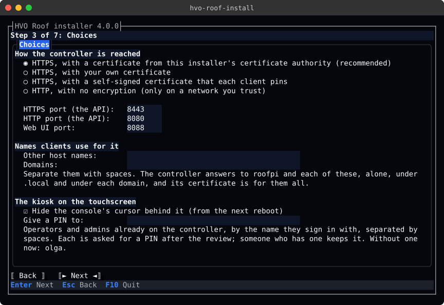

Choosing HTTP asks you to type `http`, to confirm that keys, session tokens and PINs may cross the network unencrypted:


**4. The controller.** For the controller or a rig:

- **The first admin:** the name of the first person, who signs in to the web UI and adds everyone else, and whether
  they have a PIN for the kiosk. They are added only while the controller has no admin. Leave the name empty to add
  nobody.
- **The camera** (the controller only): the Blue Iris server and a user that may only view. Leave the server empty
  to leave the camera as it is. The page reminds you that earlier versions held a Blue Iris credential in their
  source, and that the old user's password must change ([security.md](security.md), "Rotate the Blue Iris credential").
  The installer writes the camera's settings to the secrets folder, so they take precedence over the camera settings
  in the web UI, which cannot change them then. Run the installer again to change the camera.
- **Telemetry:** the OTLP/HTTP endpoint the controller exports to. Empty turns the export off.
- **Settings from a backup:** the full path of an `appsettings.Local.json`, for a controller that has no settings yet
  ([Settings from a backup](#settings-from-a-backup)).

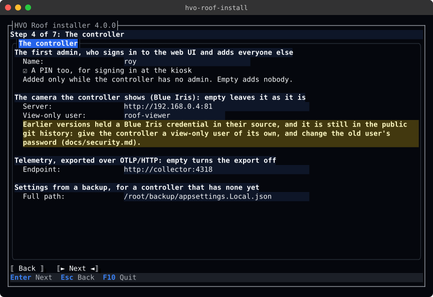

A rig has the HAT emulator in place of the camera: how many times as fast as real time it runs, its camera's frame
rate, and whether other machines may use it (over HTTPS only).

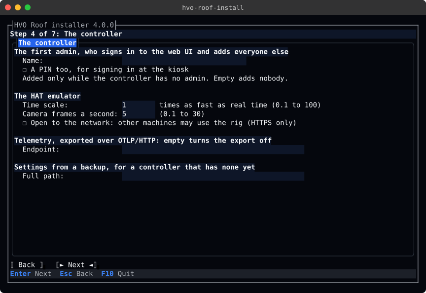

**4. Connecting to the controller.** For `hvo-roof` and the Mac app:

- **The address:** the controller as this machine reaches it, with its port, such as `https://roof.local:8443`.
- **How they trust it,** as the controller serves it ([Certificates](#certificates)):
  - **Its private CA.** **Fetch its CA** gets the CA from the controller and shows its name and SHA-256 fingerprint.
    Compare the fingerprint with the one on the Done page of the controller's installer, or from
    `sudo hvo-roof-install cert show` on the controller, and tick that it is the same. Next stays on the page until
    you do, and a changed address needs its CA fetched again.
  - **Its self-signed certificate:** give the certificate's SHA-256 fingerprint, from the same places. Each
    connection is pinned to it.
  - **As this machine trusts any website:** a certificate of your own from a CA this machine already trusts, or
    plain HTTP.
- **The keychain** (on a Mac, with the CA): trust the CA in your login keychain too, so Safari and Chrome open the web
  UI without a warning.
- **The admin who makes the Mac app's device key** (the Mac app only), by the name they sign in with
  ([The Mac app's device key](#the-mac-apps-device-key)).

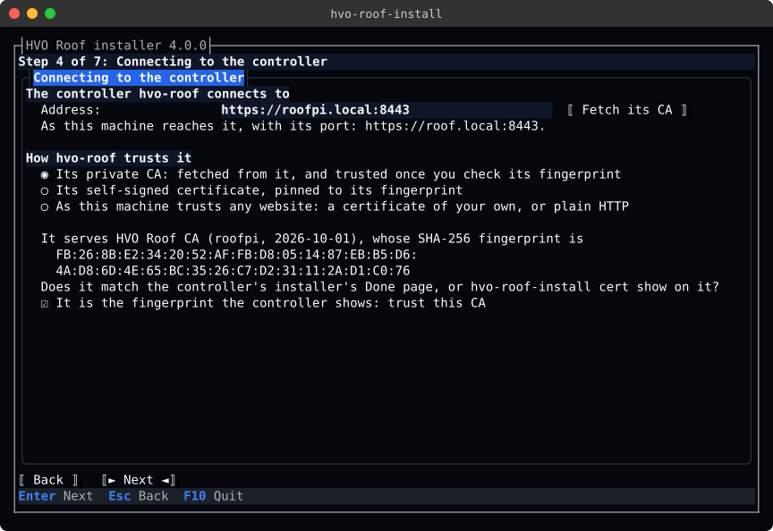

For the Mac app, the page also offers the keychain and asks for the admin:

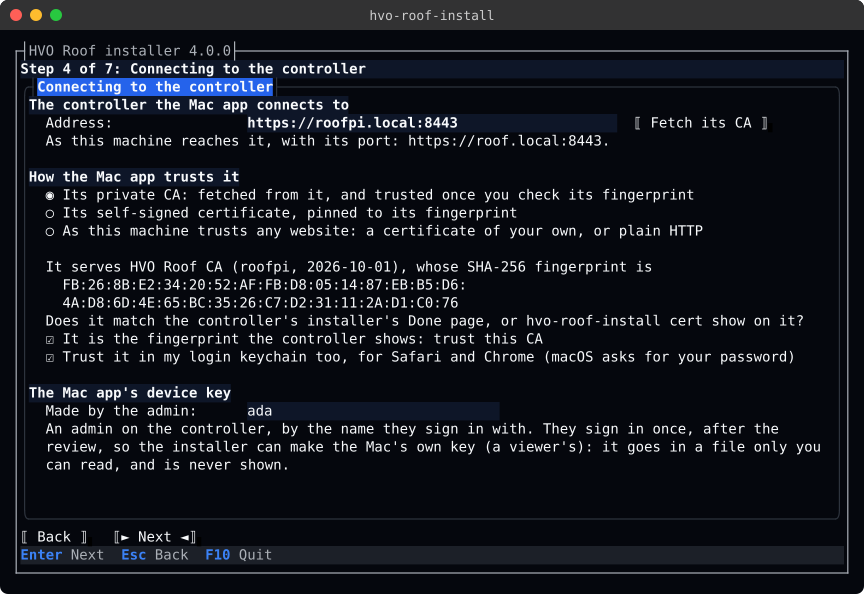

**5. Review the plan.** Every change the install would make, checked against the machine, as `--plan` prints it
([The plan](#the-plan)). Install goes ahead only when nothing blocks the plan. **Save answers** writes the answers
file, which installs the same way elsewhere with `--answers`. When the plan needs a password, the button says Next.

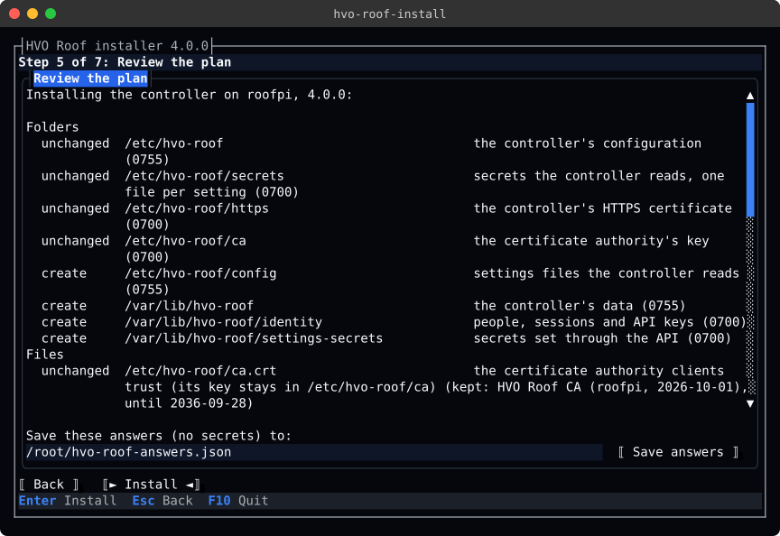

A blocked step says why, and Install stays off:

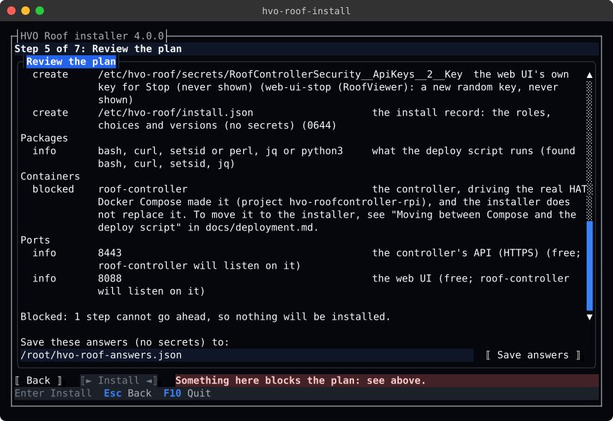

**6. Passwords.** Only the passwords and PINs the plan needs ([Passwords and PINs](#passwords-and-pins)): the first
admin's, when the controller has no admin yet, the camera's, when its files are made or its user changes, and the
password of the admin who makes the Mac app's device key, when the Mac needs one. A new password or PIN is typed
twice; the admin's, which they already have, once. Each is shown only as dots. None is saved, in the answers or anywhere else, or logged, and the fields are
cleared once the install has them.

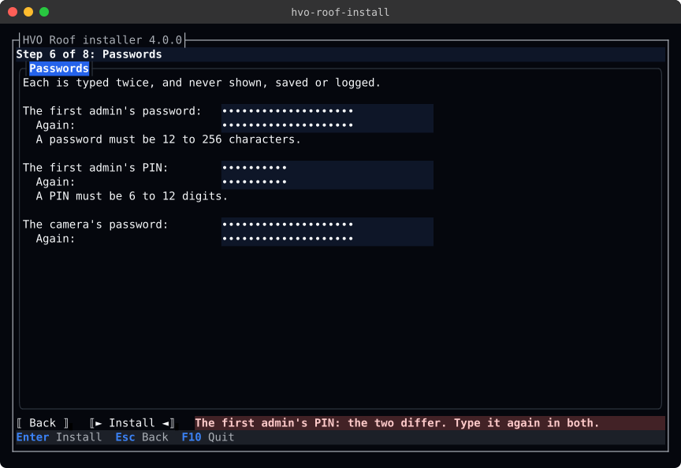

**7. Installing.** Each step as it runs. The installer cannot be left until the install has finished or stopped.

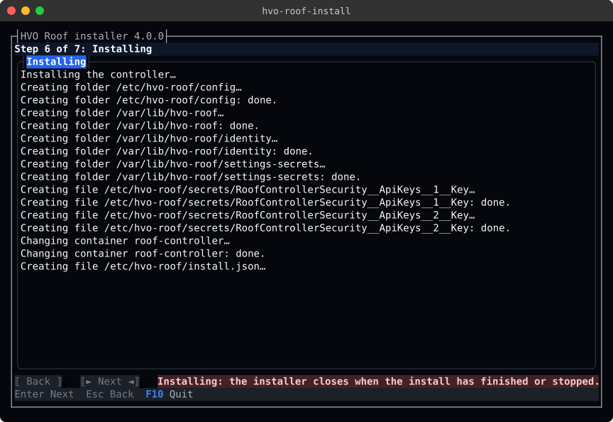

**8. Done.** What was installed, where to reach it and its log, that the roof has not moved, what to back up, how
clients trust its certificate, and where the record and the install's log are. The same text stays in the terminal
after the wizard closes.

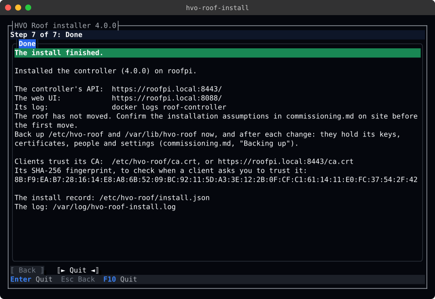

When a step fails, the Done page says why, and where the log is. Nothing after that step was changed, and running
the installer again carries on from there ([Running it again](#running-it-again)). An install refused before it
started says that nothing was changed.

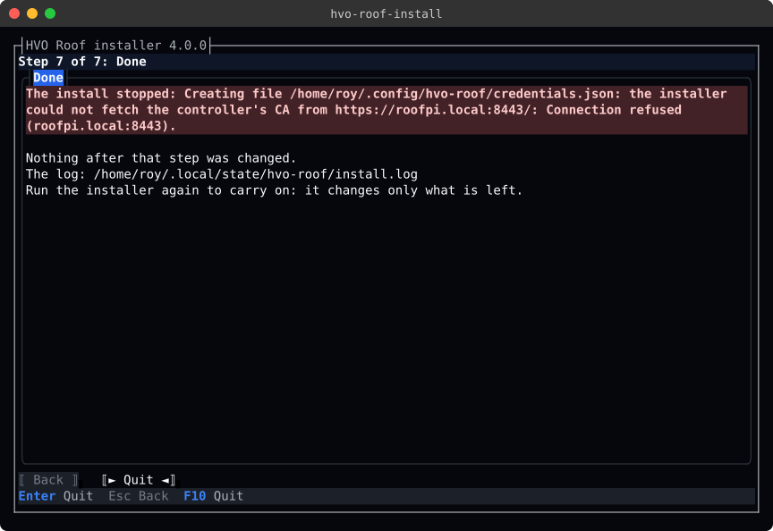

## Answers files

An answers file holds everything the wizard asks, as JSON. It has no secret. Members are camelCase, and names are
kebab-case. A member the installer does not know is an error, so a misspelt one is not silently ignored.

```json
{
  "schema": 1,
  "roles": ["controller"],
  "controller": {
    "connection": "private-ca",
    "httpsPort": 8443,
    "httpPort": 8080,
    "webPort": 8088,
    "hostNames": ["roof"],
    "domains": ["observatory.example"],
    "firstAdmin": { "name": "observer", "pin": true },
    "camera": { "baseUrl": "http://192.168.0.4:81", "userName": "roof-viewer" },
    "telemetryEndpoint": "http://collector:4318"
  }
}
```

A rig's `controller` section has no `camera`. It has a `rig` section instead:

```json
{
  "roles": ["rig"],
  "controller": {
    "firstAdmin": { "name": "tester" },
    "rig": { "timeScale": 10, "cameraFramesPerSecond": 5, "openToLan": false }
  }
}
```

With the kiosk, a `kiosk` section:

```json
{
  "roles": ["controller", "kiosk"],
  "controller": { "firstAdmin": { "name": "observer", "pin": true } },
  "kiosk": { "hideCursor": true, "pins": ["olga"] }
}
```

For `hvo-roof` and the Mac app on a Mac, a `client` section, and the admin who makes the Mac app's device key:

```json
{
  "roles": ["cli", "mac-app"],
  "client": {
    "controller": "https://roofpi.local:8443",
    "caSha256": "FB:26:8B:E2:34:20:52:AF:FB:D8:05:14:87:EB:B5:D6:4A:D8:6D:4E:65:BC:35:26:C7:D2:31:11:2A:D1:C0:76",
    "trustInKeychain": true
  },
  "macApp": { "admin": "ada" }
}
```

| Member | Values | Default |
|--------|--------|---------|
| `schema` | `1` | `1` |
| `roles` | Any of `controller`, `rig`, `kiosk`, `cli`, `mac-app` | Required |
| `controller.connection` | `private-ca`, `own-certificate`, `self-signed`, `http` | `private-ca` |
| `controller.httpsPort` | The controller's API over HTTPS (the deploy script's `HTTPS_HOST_PORT`) | `8443` |
| `controller.httpPort` | The controller's API over HTTP, with `http` (`HOST_PORT`) | `8080` |
| `controller.webPort` | The web UI (`WEB_HOST_PORT`) | `8088` |
| `controller.hostNames` | Other short names clients use for the controller, such as `roof` ([Certificates](#certificates)) | None |
| `controller.domains` | The domains clients reach it under, such as `observatory.example` | None. The wizard names the search domains in `/etc/resolv.conf`, but lists none unasked. |
| `controller.firstAdmin.name` | The first person, an admin, added when the controller has no admin yet. Their password, and their PIN with `"pin": true`, are typed, or given in files ([Passwords and PINs](#passwords-and-pins)). | None. The wizard asks. |
| `controller.firstAdmin.pin` | `true` to give the first admin a PIN for the kiosk | `false` |
| `controller.camera.baseUrl` | The Blue Iris server the controller shows the camera from, such as `http://192.168.0.4:81`. It must have no path, and no user name or password. | None: the camera is left as it is. |
| `controller.camera.userName` | A Blue Iris user that may only view, when the server asks for one. Its password is typed, or given in a file. | None |
| `controller.telemetryEndpoint` | An OTLP/HTTP endpoint for the controller's telemetry, such as `http://collector:4318` | None: export is off |
| `controller.importSettingsFrom` | The full path of an `appsettings.Local.json` to start a controller that has no settings with ([Settings from a backup](#settings-from-a-backup)). Not recorded. | None |
| `controller.rig.timeScale` | A rig only: how many times as fast as real time the emulated roof runs, from `0.1` to `100` | `1` (the wizard offers the running emulator's) |
| `controller.rig.cameraFramesPerSecond` | A rig only: the emulated camera's frame rate, from `0.1` to `30` | `5` (the wizard offers the running emulator's) |
| `controller.rig.openToLan` | A rig only: `true` to publish its API and web UI on every address, not only on this machine's loopback address. Needs HTTPS. | `false` |
| `kiosk.hideCursor` | `true` to hide the console's cursor behind the kiosk, from the next reboot (`vt.global_cursor_default=0` in `/boot/firmware/cmdline.txt`). `false` leaves `cmdline.txt` as it is. | `true` |
| `kiosk.pins` | People on the controller, operators or admins, by the name they sign in with, to give a PIN for signing in at the kiosk. Someone who has one keeps it. Not recorded. | None |
| `cli.folder` | `~/.local/bin` or `/usr/local/bin` | `~/.local/bin` |
| `macApp.folder` | `/Applications` or `~/Applications` | `/Applications` |
| `macApp.admin` | An admin on the controller, by the name they sign in with, who signs in once so the installer can make the Mac app's device key. Their password is typed, or given in a file. | Required for the Mac app |
| `client.controller` | The controller `hvo-roof` and the Mac app connect to, as this machine reaches it, with its port, such as `https://roof.local:8443` | Required for either |
| `client.caSha256` | The SHA-256 fingerprint of the controller's private CA, as its installer's Done page or `cert show` gives it: the CA is fetched from the controller and trusted only when it matches. Colons between the pairs are optional. | None |
| `client.certificateSha256` | The SHA-256 fingerprint of the controller's self-signed certificate, which each connection is pinned to | None |
| `client.trustInKeychain` | On a Mac, `true` to trust the CA in your login keychain too, for Safari and Chrome ([Trusting the controller in a browser](#trusting-the-controller-in-a-browser)). Needs `client.caSha256`. | `false` |
| `rigConfirmation` | This machine's host name, for a rig on a machine with `/dev/i2c-1` | None |
| `httpConfirmation` | `http`, to serve plain HTTP where the controller does not already | None |

The `controller` section applies to a rig too. A section for a role that is not chosen is dropped. An answers file
has no place for a password, a PIN or a key: a member such as `password` is an error. The wizard never
saves `rigConfirmation` or `httpConfirmation`, so each machine is confirmed on its own. The wizard saves answers to `hvo-roof-answers.json` in the folder where the installer was started, unless you give another path.

### Passwords and PINs

A person types each password and PIN; none is saved in an answers file, the record or the log. The installer asks
only when a step needs one:

- the first admin's password, typed twice, when the controller has no admin yet;
- the first admin's PIN, typed twice, with `"pin": true`;
- the camera's password, when its files are made or its user changes;
- the kiosk's PIN for each person in `kiosk.pins` who has none yet, typed twice;
- the password of `macApp.admin`, typed once, when the Mac needs a new device key.

Without a terminal (`--answers` in a script), give each in a file that only you can read, and the installer reads
its first line: `--admin-password-file FILE`, `--admin-pin-file FILE`, `--camera-password-file FILE`,
`--sign-in-password-file FILE` for the Mac app's admin, and `--pin-file NAME=FILE` for each person's PIN
(`--pin-file olga=/root/olga-pin`). When a
step needs one that was not given, the installer stops with exit code 2 and changes nothing.

### Settings from a backup

`controller.importSettingsFrom`, the wizard's **Settings from a backup**, starts a controller with the settings saved
from another one. Give the full path of the saved `appsettings.Local.json`, such as a copy from a backup of
`/etc/hvo-roof/config` ([commissioning.md](commissioning.md#the-settings-file)).

- The installer copies it to `/etc/hvo-roof/config/appsettings.Local.json` as it is, and only while the controller has
  no settings file there. It never changes the settings of a controller that has them: change those in the web UI, or
  with `hvo-roof settings`.
- A controller that runs is redeployed to read them.
- The installer checks that the file holds a JSON object that sets no secret, and refuses the install before anything
  changes when it does not. A secret is a setting named `Key` or `Password`, or the camera's `BlueIris:UserName`: the
  settings file is one anyone on the machine can read, and the controller refuses one that sets a secret. The message
  names the setting, never its value. Take it out of the backup and put it in a file in `/etc/hvo-roof/secrets`
  instead; the installer asks for the camera's user and password itself. The deploy script's [deployment check](deployment.md#the-deployment-check) then reads it as the
  controller will, before the controller is replaced.
- The path is not recorded in the install record, since an import is done once. Running the same answers again
  changes nothing.

## The plan

`--plan`, and the wizard's review page, list each step under what it makes, with what it would do here:

- **create:** the step makes something new.
- **change:** the step changes something that is there.
- **unchanged:** it is already as it should be.
- **info:** for example, a port the controller will listen on.
- **blocked:** the step cannot go ahead. The line under it says why, and nothing is installed.

For example, for a test rig on a Linux workstation:

```text
$ hvo-roof-install --plan --answers rig.json
The plan for a test rig on rig1, 4.0.0:

Folders
  create     /etc/hvo-roof                                 the controller's configuration (0755)
  create     /etc/hvo-roof/secrets                         secrets the controller reads, one file per setting (0700)
  create     /etc/hvo-roof/https                           the controller's HTTPS certificate (0700)
  create     /etc/hvo-roof/ca                              the certificate authority's key (0700)
  create     /etc/hvo-roof/config                          settings files the controller reads (0755)
  create     /var/lib/hvo-roof                             the controller's data (0755)
  create     /var/lib/hvo-roof/identity                    people, sessions and API keys (0700)
  create     /var/lib/hvo-roof/settings-secrets            secrets set through the API (0700)
Files
  create     /etc/hvo-roof/ca.crt                          the certificate authority clients trust (its key stays in /etc/hvo-roof/ca) (a new CA, which may issue only for names in local, localhost, rig1, and private addresses)
  create     /etc/hvo-roof/secrets/Kestrel__Certificates__Default__Password  the certificate file's password (random, never shown) (0600)
  create     /etc/hvo-roof/https/roof-controller.pfx       the controller's certificate, from its CA, for rig1 (for 3 names and 3 addresses, until 2027-11-02)
  create     /etc/hvo-roof/secrets/RoofControllerSecurity__ApiKeys__0__Key  the installer's operator key: the deploy script's Status and verified Stop (never shown) (installer-operator (RoofOperator): a new random key, never shown)
  create     /etc/hvo-roof/secrets/RoofControllerSecurity__ApiKeys__1__Key  the installer's admin key: adds the first admin (never shown) (installer-admin (RoofAdmin): a new random key, never shown)
  create     /etc/hvo-roof/secrets/RoofControllerSecurity__ApiKeys__2__Key  the web UI's own key for Stop (never shown) (web-ui-stop (RoofViewer): a new random key, never shown)
  create     /etc/hvo-roof/secrets/BlueIris__BaseUrl       the camera the controller shows: the HAT emulator's (http://hat-emulator:5290)
  create     /etc/hvo-roof/secrets/BlueIris__Password      the camera's password: none (empty)
  create     /etc/hvo-roof/secrets/BlueIris__UserName      the camera's user: none, the emulator asks for none (empty)
  create     /usr/local/sbin/hvo-roof-install              hvo-roof-install: upgrade, rollback, backup and uninstall (release 4.0.0's, 0755)
  create     /etc/hvo-roof/install.json                    the install record: the roles, choices and versions (no secrets) (0644)
Users
  create     tester                                        the first admin: signs in to the web UI and adds everyone else (added through the controller's API as RoofAdmin, with a password)
Packages
  info       bash, curl, setsid or perl, jq or python3     what the deploy script runs (found bash, curl, setsid, jq)
Containers
  create     hat-emulator                                  the HAT emulator: the roof, drive and limit switches the rig drives (release 4.0.0's image by digest, on the hvo-emulator network, its control API on 127.0.0.1:5290)
  create     roof-controller                               the controller, against the HAT emulator (release 4.0.0 by digest, through the deploy script)
Ports
  info       8443                                          the controller's API (HTTPS) (free; roof-controller will listen on it)
  info       8088                                          the web UI (free; roof-controller will listen on it)

22 to create, 0 to change, 0 unchanged.

The install asks for the first admin's password (or give it with --admin-password-file FILE).
Installing a test rig needs root: run the installer with sudo.
```

### Running it again

Each step checks the machine just before it runs, and changes only what differs. A folder with the wrong mode has its
mode set, and its contents are never touched. The record is rewritten only when it would say something new. A second
run of the same answers changes nothing: "Nothing to change: this machine is already as the answers describe."

After a failed step, running the installer again carries on from where it stopped. So does it after Ctrl+C, which
stops the installer between steps. The installer never kills a deploy script that has started. A Ctrl+C at the terminal
(outside the wizard, which reads its own keys) reaches the script too, which stops and puts the old controller back if
it was replacing it; the installer then says what runs as the controller, and exits 130. Once the new controller has
passed the script's checks, the script ignores Ctrl+C and runs to its end, as it does for an interrupt only the
installer gets (`kill -INT`): the installer then stops before its next step and exits 130, or finishes when no step
was left. An API key entry that a stopped install left with its name but no key is finished by the next run.

The deploy script runs with a clean environment. Only `PATH`, `HOME`, `USER`, `LOGNAME`, `LANG`, `TERM`, `TMPDIR`
and Docker's own `DOCKER_HOST`, `DOCKER_CONFIG`, `DOCKER_CERT_PATH` and `DOCKER_TLS_VERIFY` reach it from the
installer's; the installer gives it the rest. A setting of the deploy script's in your shell never changes what the
installer deploys. The installer also sets `REQUIRE_IDLE_ROOF`: the script then stops before it replaces the
controller when it cannot read the roof's status, as well as when the roof moves
([Deploying](deployment.md#deploying-with-the-script)).

## The kiosk

On the controller's Pi, the installer sets up the touchscreen kiosk ([kiosk.md](kiosk.md)) as the steps in
[Install](kiosk.md#by-hand) do by hand:

- **Packages:** the display, touch and font libraries, with apt, when any is missing.
- **The user:** `hvo-kiosk`, a system user in `video`, `input` and `render`.
- **The program:** `/opt/hvo-roof-kiosk/hvo-roof-kiosk`, from the release's `hvo-roof-kiosk` tarball, checked against
  the size and SHA-256 in `release.json`, and the program inside it against its SHA-256 too. The program it replaces
  is kept as `hvo-roof-kiosk.previous`, to go back to ([kiosk.md](kiosk.md#by-hand)).
- **The device key:** the controller's own kiosk key (`kiosk`, a `RoofViewer` key marked `Kiosk` and `Local`), made
  like the installer's other keys, and redeployed to the controller once the roof is idle. The kiosk's copy is
  `/etc/hvo-roof-kiosk/device-key`, `0400`, which only `hvo-kiosk` reads.
- **The settings:** `/opt/hvo-roof-kiosk/appsettings.Local.json`, with the controller on `localhost`:
  `https://localhost:8443/` trusting the installer's CA (`/etc/hvo-roof/ca.crt`), pinning the controller's certificate
  when it is self-signed or your own, or `http://localhost:8080/` over plain HTTP. Settings changed by hand there are
  kept.
- **The service:** `hvo-roof-kiosk.service` and the backlight's udev rule, applied, then the service enabled and
  started. It is started again when its program, key, settings, unit or rule change.
- **The cursor:** with `kiosk.hideCursor`, `vt.global_cursor_default=0` in `/boot/firmware/cmdline.txt`. It takes
  effect at the next reboot, which the Done page reminds you of.
- **PINs:** for each person in `kiosk.pins`, a PIN typed twice, or read from `--pin-file NAME=FILE`, set through the
  controller's API. A viewer, or a name that is not on the controller, blocks the plan; someone with a PIN keeps it.

`hvo-roof-install cert` keeps the kiosk's settings with the certificate: renewing a self-signed certificate re-pins
it, and restarts the kiosk. A certificate from the installer's CA needs no change.

## hvo-roof and the Mac app

On your own Linux machine or Apple silicon Mac, the installer sets up `hvo-roof` ([cli.md](cli.md)) and the Mac app
([mac.md](mac.md)), connected to a controller that already runs. Run it as yourself, without `sudo`. For example, for
both on a Mac, with the answers above:

```text
$ hvo-roof-install --plan --answers mac.json
The plan for hvo-roof and the Mac app on studio, 4.0.0:

Folders
  unchanged  /Users/roy/.local/bin                         your programs (there already, and kept as it is)
  create     /Users/roy/Library/Application Support/HVO Roof  the Mac app's settings and device key: yours alone (0700)
Files
  create     /Users/roy/.local/bin/hvo-roof                hvo-roof: the roof from the command line, and its terminal UI (release 4.0.0's, 0755)
  create     /Users/roy/.config/hvo-roof/credentials.json  hvo-roof's connection: the controller and how it is trusted (you sign in with hvo-roof login) (https://roofpi.local:8443, trusting its CA (FB:26:8B:E2…))
  create     /Applications/HVO Roof.app                    the Mac app (release 4.0.0's, without macOS's quarantine mark)
  create     /Users/roy/Library/Application Support/HVO Roof/ca.crt  the controller's CA: the Mac app trusts the controller's certificate by it (https://roofpi.local:8443, trusting its CA (FB:26:8B:E2…))
  create     /Users/roy/Library/Application Support/HVO Roof/device-key  the Mac app's device key: a Viewer's, which shows the roof and offers Stop when no one is signed in (a Viewer key (mac-studio-roy) made by ada, who signs in once; 0600, yours alone)
  create     /Users/roy/Library/Application Support/HVO Roof/appsettings.Local.json  the Mac app's settings: the controller's address, how it trusts it, and its key (https://roofpi.local:8443, trusting its CA (FB:26:8B:E2…))
  change     /Users/roy/Library/Keychains/login.keychain-db  trusts the controller's CA in your login keychain: Safari and Chrome open the web UI without a warning (HVO Roof CA (roofpi, 2026-10-01), trusted for websites: macOS asks for your password)
  create     /Users/roy/.local/bin/hvo-roof-install        hvo-roof-install: upgrade, rollback, backup and uninstall (release 4.0.0's, 0755)
  create     /Users/roy/.config/hvo-roof/install.json      the install record: the roles, choices and versions (no secrets) (0600)
Checks
  run        HVO Roof.app --check                          opens the app's window once, and closes it: it starts with these settings (after the changes above)

9 to create, 1 to change, 1 unchanged, 1 check to run.

The install asks for the Mac app's admin's password (or give it with --sign-in-password-file FILE).
```

### Trusting the controller

With a private CA, the installer fetches the CA from the controller's `/ca.crt`, which anyone may read, and checks
that the certificate the controller presents was issued by it. It keeps the CA only when the CA's SHA-256 fingerprint
is the one you gave: the one on the Done page of the controller's installer, or from `sudo hvo-roof-install cert show`
on the controller. A CA with another fingerprint blocks the plan, and nothing is changed. Check the fingerprint on
the controller itself, not in a message that could have been changed on its way.

With a self-signed certificate, `hvo-roof` and the Mac app pin it instead. With a certificate of your own, or plain
HTTP, they trust the controller as this machine trusts any website.

### hvo-roof

- **The program:** the release's `hvo-roof` for this machine (linux-x64, linux-arm64 or osx-arm64), checked against
  the SHA-256 in `release.json`, in `~/.local/bin` or `/usr/local/bin`. `/usr/local/bin` is offered only when you may
  write to it without `sudo`. The program it replaces is kept as `hvo-roof.previous`.
- **The connection:** `~/.config/hvo-roof/credentials.json` (or under `$XDG_CONFIG_HOME`), `0600`, with the
  controller's address and its CA or pin. A sign-in saved there for the same controller is kept; one for another
  controller is removed.

Then sign in with `hvo-roof login`. Put `~/.local/bin` on your `PATH` if it is not.

### The Mac app

- **The app:** `HVO Roof.app` from the release's zip, checked against the SHA-256 in `release.json`, in
  `/Applications` or `~/Applications`. The app is signed but not notarised, so the installer unpacks it without macOS's
  quarantine mark (`ditto --noqtn`), and removes a mark that is there: macOS then opens it without a warning. The app
  it replaces is kept as `HVO Roof.app.previous` in the settings folder.
- **Its settings folder:** `~/Library/Application Support/HVO Roof`, `0700`, with:
  - `ca.crt`, the controller's CA, with a private CA;
  - `device-key`, `0600` ([The Mac app's device key](#the-mac-apps-device-key));
  - `appsettings.Local.json`, with the controller's address, the CA's file or the certificate's pin, and the key's
    file. Settings you change there by hand are kept.
- **The check:** once the rest is in place, the installer opens the app with `--check`, which opens its window with
  these settings and closes it. It stops the install when the app cannot start. Over SSH, where the app cannot open a
  window, the plan says so, and you open HVO Roof on the Mac to check it.
- **The keychain,** with `client.trustInKeychain`: the CA is trusted for websites in your login keychain. macOS asks
  for your password, on the Mac's own screen: over SSH, the plan is blocked. The installer looks for the CA there by
  its SHA-256, not its name, and reads its trust settings: once it is trusted for websites, a later run changes
  nothing, even over SSH or with the controller out of reach. A certificate of the same name, or the CA with its trust
  set to deny, does not count.

### The Mac app's device key

The Mac app shows the roof, and offers Stop, with a device key of its own: an API key with the Viewer role, named
`mac-HOST-USER` after the Mac and you. People sign in in the app to open or close the roof.

To make the key, the admin in `macApp.admin` signs in to the controller's API once, with their password typed in the
wizard or given with `--sign-in-password-file FILE`. The installer adds the key, writes it straight to `device-key`
(`0600`, yours alone), and ends the admin's session. The key is never shown, logged, or put on the clipboard, and the
password is not kept.

A later run checks the key with the controller, and keeps one it takes: it needs no password then. A key the
controller refuses is replaced, and a Mac that had a key of its name gets a new secret for it. A key of that name that
is not a Mac's (a kiosk key, another role's, or one from the secrets folder) is left alone: the install stops there,
with no key written, until you remove it on the web UI's People page.

### Trusting the controller in a browser

The web UI is served with the same certificate as the API, so a browser warns until it trusts the controller's CA
too. Get the CA, and check its fingerprint before you trust it:

```bash
curl -fsSk -o hvo-roof-ca.crt https://roof.local:8443/ca.crt   # -k: the fingerprint is checked next
openssl x509 -in hvo-roof-ca.crt -noout -subject -fingerprint -sha256
```

On a Mac, the installer's settings folder already holds it, checked: `~/Library/Application Support/HVO Roof/ca.crt`.

- **Safari and Chrome on a Mac:** tick the keychain in the wizard, or give `client.trustInKeychain`. By hand:
  `security add-trusted-cert -r trustRoot -p ssl -k ~/Library/Keychains/login.keychain-db hvo-roof-ca.crt`, which asks
  for your password.
- **Chrome and Chromium on Linux** read the NSS database in your home folder:
  `certutil -d sql:$HOME/.pki/nssdb -A -t "C,," -n "HVO Roof CA" -i hvo-roof-ca.crt` (from `libnss3-tools`). Restart
  the browser.
- **Command-line tools on Linux** (`curl`, `wget`) read the system's store: on Debian, Ubuntu and Raspberry Pi OS,
  `sudo cp hvo-roof-ca.crt /usr/local/share/ca-certificates/hvo-roof-ca.crt && sudo update-ca-certificates`.
- **Firefox** may keep its own list: if it warns, open Settings → Privacy & Security → View Certificates →
  Authorities, import `hvo-roof-ca.crt`, and tick "Trust this CA to identify websites".

If the controller makes a new CA (`cert --new-ca`), remove the old one and trust the new one the same way. Running
the installer again with the new fingerprint replaces the CA in `hvo-roof`'s connection and the Mac app's settings,
and trusts the new one in the keychain; remove the old one there with Keychain Access.

## Certificates

The controller serves its API and the web UI over HTTPS, unless you choose plain HTTP. `controller.connection` says
how clients trust it:

| Connection | The certificate | What each client does |
|------------|-----------------|-----------------------|
| `private-ca` (the default) | Issued by the installer's own certificate authority (CA), made on the controller's machine. | Trusts the CA once. A renewed certificate then needs nothing more. |
| `own-certificate` | Yours, from your own CA, put in place with `cert import`. | Nothing, when it already trusts your CA. |
| `self-signed` | Signed by itself. | Pins it, and pins it again after each renewal. |
| `http` | None. Keys, session tokens and PINs cross the network unencrypted. | Nothing. Use it only on a network you trust: a person types `http` to confirm. |

### The installer's CA

The CA and the certificates it issues use ECDSA P-256 keys and SHA-256. They meet the rules that browsers and Apple's
platforms set for a server certificate.

- **The CA** lasts 10 years. Its key is made on the machine, straight into a file only root can read, and never leaves
  it. The CA may issue only for these, so a client that trusts it refuses anything else it signs:
  - `local`, `localhost`, and the short names and domains of the controller;
  - the private networks (`10.0.0.0/8`, `172.16.0.0/12`, `192.168.0.0/16`, `fc00::/7`) and loopback.

  So a stolen Pi, or the CA's key, cannot pass for a public site to the clients. It can still sign for any `.local`
  name, any name in a listed domain, and any private address, so keep the key safe, list only the domains clients use,
  and if a Pi or its key is lost, remove its CA from each client's trust.
- **The certificate** lasts 397 days, the most browsers accept. It is for:
  - the machine's short host name and each name in `controller.hostNames`, each alone, under `.local` and under each
    domain in `controller.domains`;
  - `localhost`;
  - the machine's private addresses, `127.0.0.1` and `::1`. Addresses on Docker and other virtual networks,
    link-local and public addresses, and IPv6 temporary and deprecated addresses, which do not last, are left out.

  The controller answers to the same names (its `AllowedHosts`).
- **A self-signed certificate** is for the same names, and lasts 825 days, the most Apple's platforms accept.

| File | Mode | Holds |
|------|------|-------|
| `/etc/hvo-roof/ca/ca.key` | `0600`, in a `0700` folder | The CA's private key |
| `/etc/hvo-roof/ca.crt` | `0644` | The CA's certificate, for clients |
| `/etc/hvo-roof/https/roof-controller.pfx` | `0600` | The certificate, its key, and its CA's certificate |
| `/etc/hvo-roof/secrets/Kestrel__Certificates__Default__Password` | `0600` | The file's password: random, never shown |

These are the paths [deployment.md](deployment.md#2-tls-certificate) uses: the deploy script serves the certificate
with `HTTPS_CERT_DIR=/etc/hvo-roof/https` and the default `HTTPS_CERT_FILE`.

### Trusting the CA

The Done page, `cert` and `cert show` print the CA's SHA-256 fingerprint. A client gets the CA from the controller at
`https://<host>.local:<HTTPS port>/ca.crt`, or as a copy of `/etc/hvo-roof/ca.crt`. Check the fingerprint the client shows
against the one the installer printed before trusting it. The TLS handshake cannot give the CA: the server leaves a
self-signed root out of it. The installer does this for `hvo-roof` and the Mac app
([Trusting the controller](#trusting-the-controller)); for a browser, see
[Trusting the controller in a browser](#trusting-the-controller-in-a-browser).

### Renewing

Every run of the installer, `--plan` included, warns when one of these applies:

- the certificate expires within 30 days, or has expired;
- the CA expires within 400 days, so that its last certificate still lasts its full 397 days;
- the certificate is not for a name or address clients use;
- the certificate's password does not open it.

It says none of these when the controller is recorded as serving plain HTTP, since a certificate left in place is not
served then.

`sudo hvo-roof-install cert` then makes what needs making, and changes only what differs:

- **A new CA** when the CA is missing or cannot be read, expires within 400 days, may not issue for a name the
  controller now has, or does not limit the names it may issue for. `--new-ca` makes one even when none of these apply.
  Every client must then trust the new CA.
- **The certificate again** when the CA is new, the names or addresses have changed, it expires within 30 days,
  another CA issued it, or its password does not open it. `--renew` issues it again even when none of these apply.
- **The modes** of the files, when they differ.

With nothing recorded yet, such as a controller the deploy script runs, it uses the defaults: the installer's CA,
unless a certificate that this machine's CA did not issue is in place, which it keeps as yours. It then says which
connection to choose when you install the controller, so the certificate is kept. Without root it cannot read the
certificate to tell, so with nothing recorded even `cert --plan` needs `sudo`. When a record is there but cannot be
read, it refuses until the record is fixed or removed, since the record may say to keep the certificate.

It refuses to issue while this machine's clock is before the CA's start, and `--plan` shows it as blocked. If the clock
is wrong, set the time (NTP) and run it again. If the clock is right, the CA was made while it was ahead: make a new one
with `cert --new-ca`.

It prints the plan, each step, and the certificate as `cert show` does. It never moves the roof.

The controller serves a new certificate once it is deployed again. When the record says the installer runs the
controller, `cert` then redeploys it, through the deploy script as an install does:

- **Only while the roof is idle.** It reads the controller's status first, and again just before the deploy script
  runs. While the roof moves, it leaves the controller as it is and says to run `sudo hvo-roof-install cert --redeploy`
  once the roof is idle.
- **Only when the certificate is all that would change.** When more would, it leaves the controller as it is and says
  to run `sudo hvo-roof-install`, which redeploys it with the new certificate. More would change with a new release,
  for example, or with camera settings or API keys that an install which stopped before its redeploy wrote. It checks
  this again just before the deploy script runs, after you agree.
- **Only once you agree.** It asks `Redeploy the controller now? [y/N]`. With no one at a terminal, such as in a
  script, it does not ask and does not redeploy. `--redeploy` redeploys without asking. `--no-redeploy` puts the
  certificate in place and stops there.

The deploy script stops the roof with a verified Stop before it replaces the controller, and puts the old one back if
the new one fails a check. A controller that is stopped serves the new certificate when it starts again. One that is not
deployed yet serves it once `hvo-roof-install` deploys it. When something else stands in the way, such as a controller
that Docker Compose made, `cert` says what it is: once that is dealt with, run `cert --redeploy`. After a Ctrl+C that
stopped the deploy script, it says what runs as the controller, and that `cert --redeploy` finishes. When the script ran
to its end anyway (see [Running it again](#running-it-again)), the controller serves the new certificate.

`cert --redeploy` also redeploys a controller that serves another certificate than the one in place, such as after a
renewal that was not redeployed. On a machine that cannot reach GitHub, give the release's folder with `--release DIR`,
as for an install ([The release it installs](#the-release-it-installs)). It exits with code 3 when it could not
redeploy: the roof moves, more than the certificate would change, or no controller is deployed. So does `cert` when you
agreed to the redeploy and the check just before the deploy script refuses it. The certificate is in place either way.

With nothing recorded, such as a controller the deploy script runs, it never redeploys, and `--redeploy` is refused
before anything changes. When the roof is idle, run the deploy script again
([Deploying](deployment.md#deploying-with-the-script)).

`cert --plan` shows what `cert` would do, the redeploy included, and changes nothing. It runs without root, but then
cannot check the files that only root can read.

### Your own certificate

`sudo hvo-roof-install cert import FILE` puts your certificate in place and records that the controller serves your
own. The file is one of these:

- a PKCS#12 file (`.pfx`, `.p12`) with its key;
- PEM (`.crt`, `.pem`) with its chain and its key, or with `--key FILE` for the key.

When the file or the key has a password, the installer asks for it, or reads it from `--password-file FILE`. The
password opens the file only: the installer writes the controller's own file with a new random password. It refuses a
certificate that has expired, is not yet valid, is a CA's, or is not for a server, and a key whose password needs more
than 300,000 iterations to derive its key, the most that .NET opens in a PKCS#12 file (export it again with fewer). It
warns when the certificate is not for a name or address clients use, and when it lasts longer than Apple's platforms
accept. Importing the same certificate again changes nothing, unless its chain has changed. `--plan` checks the file and
shows what would change. It then redeploys the controller to serve it, as `cert` does ([Renewing](#renewing)), and takes
`--redeploy` and `--no-redeploy` too.

The installer never renews your certificate. Before it expires, import the new one.

## Upgrading

`sudo hvo-roof-install upgrade` upgrades what is installed here to the latest release, with the choices the record
holds. Run it as yourself, without `sudo`, for `hvo-roof`, the Mac app or a rig on a Mac. `--version 4.0.1` names the
release instead of the latest, and `--release DIR` reads it from a folder ([The release it installs](#the-release-it-installs)).
`--plan` shows what the upgrade would change, as the installer running it sees it, and changes nothing.

Each installer installs its own release, so the installer hands over to the new release's:

1. It says what is installed and what replaces it, and prints the upgrade notes of each release after the one installed,
   up to the new one, oldest first: what someone upgrading must do, such as a setting to change. An upgrade across
   several releases shows every one's. Read them before the upgrade goes on. The new release's installer, run by
   you, shows them too; handed over to, it does not show them again.
2. It puts the release's installer for this machine in its own place, checked against the SHA-256 in `release.json`,
   and keeps the one it replaces as `hvo-roof-install.previous`. A release with no installer for this machine (a build
   of your own) is refused: download that release's installer and run its `upgrade`.
3. The new installer installs its release, as `--answers` installs the record's choices
   ([Running it again](#running-it-again)):
   - the controller, through the deploy script: a verified Stop of the roof, which must be idle, then the new
     controller, checked before the old one is let go and kept as `roof-controller-previous`;
   - a rig's HAT emulator, from the new release;
   - the kiosk's program, keeping the one it replaces as `hvo-roof-kiosk.previous`; and `hvo-roof` and the Mac app,
     keeping the ones they replace beside them.
4. The record then says the new release, and the one before it (`previousVersion`) for a rollback.

```text
$ sudo hvo-roof-install upgrade
4.0.0 is installed here; 4.0.1 replaces it.

Upgrade notes for 4.0.1:
  Nothing to do by hand.
Release 4.0.1: https://github.com/HualapaiValley/HVO.RoofController/releases/tag/v4.0.1

/usr/local/sbin/hvo-roof-install: release 4.0.1's, 0755.
Creating file /usr/local/sbin/hvo-roof-install…
Creating file /usr/local/sbin/hvo-roof-install: done.
Handing over to release 4.0.1's installer.

Upgrading from 4.0.0 to 4.0.1.
…
```

An upgrade never goes back: a release older than the one installed is refused, and [Rolling back](#rolling-back) is
the way back. The release that is installed already is checked, and repaired, as a second run of the installer would
be: "4.0.1 is installed here: checking that everything is as it should be." So after a failed step or Ctrl+C,
`upgrade` again carries on, with the new installer already in place.

## Rolling back

`sudo hvo-roof-install rollback` goes back to the release installed before the last upgrade, the record's
`previousVersion`. `--plan` shows what it would change, and changes nothing.

- The deploy script's `--rollback` swaps the controller with `roof-controller-previous`, after a verified Stop of the
  idle roof, and checks the one it puts back as it checks a new one
  ([Rolling back](deployment.md#rolling-back)). Nothing is pulled. The controller from before keeps the settings and
  data as they are now.
- A rig's HAT emulator is replaced by the one of the release before, from that release's `release.json`: on GitHub,
  or in `--release DIR`, which is then the release before's folder.
- The kiosk, `hvo-roof`, the Mac app and the installer go back to the release before's, swapped with the copies the
  upgrade kept beside them when those are the release before's. A release from before the installer was a release
  asset has no installer, and the one here stays.
- The record says the release before, and the release it went back from (`rolledBackFrom`).

It goes back one release, once: a rollback leaves no `previousVersion`, and running it again says so, changes nothing
and exits 0. `upgrade` goes forward again. A machine with only one release ever installed has nothing to go back to,
and the rollback is refused (exit 3).

## Backing up and restoring

`sudo hvo-roof-install backup` writes one archive of the controller's and the kiosk's files:

- `/etc/hvo-roof`: the settings, the secrets, the certificate, the CA with its key, and the install record;
- `/var/lib/hvo-roof`: the people, the API keys and the settings set through the API;
- `/etc/hvo-roof-kiosk` and `/opt/hvo-roof-kiosk/appsettings.Local.json`: the kiosk's device key and settings.

The programs and images are not in it: they come from the release. The archive is a `.tar.gz`, root's and `0600`,
written whole or not at all. Its first entry, `hvo-roof-backup.json`, lists every file with its mode, owner and
SHA-256, the host and the release. `--output FILE` names it; without it, it goes in `/var/backups/hvo-roof`, a folder
only root opens, as `hvo-roof-<host>-<UTC time>.tar.gz`. It never replaces a file, and never goes in a folder it backs
up or a purge removes, `/opt/hvo-roof-kiosk` included. Before it keeps the archive, it reads it back as a restore
would: one a restore could not read is not kept, and the backup fails.

- Each file and folder keeps its permission bits, without setuid, setgid or the sticky bit: the install that follows a
  restore sets the modes it needs.
- Every folder it reads must be root's, with only root writing to it: whoever else could change one could put a file of
  theirs in place of another as it is read. Such a folder is refused, with the `chown` and `chmod` that fix it, and
  nothing is written.

```text
$ sudo hvo-roof-install backup --output /root/roofpi.tar.gz
Backed up 18 files and 8 folders to /root/roofpi.tar.gz (0600, root's):
  /etc/hvo-roof: 17 files
  /var/lib/hvo-roof: 1 file

Keep a copy of /root/roofpi.tar.gz off this machine, where only you can read it: it holds the controller's secrets, its certificate authority's key and the kiosk's device key. Anyone with it can act as the controller.
```

**Where to keep it.** The archive is not encrypted: anyone who reads it can act as the controller, issue certificates
its clients trust, and sign in as the kiosk. Copy it off the Pi, with `scp` as root or with `sudo cat` over SSH, to a
place only you can read: an encrypted disk, or a password manager's file store, kept offline. A copy on the Pi alone
goes with the Pi's SD card. Back up after each change: a new person, a new key, a renewed certificate. Nothing it holds
is ever printed or logged: only paths and counts.

`sudo hvo-roof-install restore FILE` puts a backup back, on a new Pi or on this one after an uninstall, then installs
what the backup's record says, with this installer's release. Download the installer first ([Getting it](#getting-it)):
the backup's release's, or a newer one. `--plan` says what it would put back and
changes nothing; `--release DIR` reads the release from a folder.

- The archive must be root's and `0600` or `0400`. The restore checks the file it opened, as well as the path, so a
  file put in its place in between is refused too. A backup a newer installer made, or of a newer release, is refused:
  restore it with that release's installer.
- A restore is for a machine with nothing installed. Uninstall first; a plain uninstall keeps the data, which the
  restore then replaces only with `--replace`, so the data is never overwritten by mistake.
- The files go back with their modes and owners, and the install that follows checks them as any run does. The first
  admin, the keys and the passwords are the backup's: the restore asks for none.
- **The same machine name** keeps the CA and the certificate, so clients go on trusting the controller as before.
- **Another name** (a new Pi called something else) gets a certificate for its own names. It comes from the backup's CA
  when that CA may issue for them, and otherwise from a new CA; the plan says which. Clients then trust the new CA in
  place of the old one: run the installer for `hvo-roof` and the Mac app again, with the new CA's fingerprint, and trust
  it again in each browser ([Trusting the CA](#trusting-the-ca)).

## Uninstalling

`sudo hvo-roof-install uninstall` removes what the installer installed here, from its record, in this order:

- the controller, stopped by the deploy script's `--stop` after a verified Stop of the roof
  ([Deploying](deployment.md#deploying-with-the-script)), with the one kept for a rollback, a rig's HAT emulator and
  its network, each with its image when no other container uses it;
- the kiosk's service, its program and the udev rule for the screen's backlight;
- `hvo-roof` and the Mac app, with the copies kept beside them;
- the installer itself, last.

The controller goes first. When it does not stop, nothing else is removed: the kiosk goes on showing the roof, and
`uninstall` again carries on once the roof is idle. The deploy script stops only a running controller: one that is
paused or restarting blocks the uninstall, which changes nothing; start it or let it settle, then uninstall.

The data stays: the settings, secrets, certificate and CA, the people and the kiosk's device key. The record says when
it was uninstalled, and keeps the choices, so an install that follows can offer them again. The `hvo-kiosk` user, the
apt packages and the install log stay too. It shows what it will remove and asks first; `--yes` goes ahead without
asking, and `--plan` only shows it. Running it again changes nothing.

`--purge` removes the data too: `/etc/hvo-roof`, `/var/lib/hvo-roof`, the kiosk's `/etc/hvo-roof-kiosk` and
`/opt/hvo-roof-kiosk`, and the record. As yourself, it removes the Mac app's settings and device key and
`~/.config/hvo-roof`. The folder holding the record goes last, with the record the last thing in it, then the
installer, so a purge stopped part way can be run again. A controller deployed here that the uninstall does not stop
(one deployed by hand after an uninstall) refuses a purge, which would remove its files from under it: remove it with
the deploy script first. It cannot be undone, so it asks for two more things:

- **this machine's name**, typed when asked or given with `--confirm HOST`, so that data is not removed from the wrong
  machine over SSH;
- **a backup** first: `--backup FILE` writes one, as `backup --output FILE` does; at the terminal it offers one in
  `/var/backups/hvo-roof`, and `--no-backup` goes without. Keep a backup in `/var/backups/hvo-roof` off the machine
  before it goes: a purge does not remove that folder, but the next owner of the Pi could read it.

```bash
sudo hvo-roof-install uninstall --purge --backup /root/roofpi.tar.gz --confirm roofpi
```

## The record and the log

The record says which roles are installed, with their choices and the release. Every later run reads it, for these
purposes:

- to offer the same choices;
- to refuse a test rig on the real HAT's machine;
- to upgrade, roll back or uninstall.

It is written last, once everything before it is in place, and it holds no secret. Besides the roles and their
choices, it says:

| Field | What it says |
|-------|--------------|
| `version` | The release installed. |
| `installerVersion` | The installer that last wrote it. |
| `previousVersion` | The release installed before the last upgrade: what `rollback` goes back to. A rollback clears it. |
| `rolledBackFrom` | The release `rollback` went back from. An upgrade clears it. |
| `uninstalledAt` | When `uninstall` removed the roles, keeping the data and the choices. An install clears it. |
| `installedAt`, `updatedAt` | When it was first written, and last. |

| File | Mode | Holds |
|------|------|-------|
| `/etc/hvo-roof/install.json` | `0644` | The machine's roles: the controller, a rig on Linux, the kiosk. |
| `~/.config/hvo-roof/install.json` | `0600`, in a `0700` folder | Your roles: `hvo-roof`, the Mac app, a rig on a Mac. |

The log records the following, each with the time:

- what the installer found;
- each command it ran, and how the command ended (the last 40 lines of its output);
- each change it made.

A secret is written as `[secret]`, and a command that handles one is logged without its input or output. `--plan`
writes no log.

| Run as | Log | Mode |
|--------|-----|------|
| root | `/var/log/hvo-roof-install.log` | `0640`, owned by root |
| you, on Linux | `$XDG_STATE_HOME/hvo-roof/install.log`, or `~/.local/state/hvo-roof/install.log` | `0600` |
| you, on a Mac | `~/Library/Logs/hvo-roof-install.log` | `0600` |

## Troubleshooting

Start with what was said: each check that fails, each refusal and each failed step says why, and what to do. Then:

- **The log.** It keeps what the installer found, every command it ran and how it ended
  ([The record and the log](#the-record-and-the-log)): `sudo less /var/log/hvo-roof-install.log` for the machine's
  roles, `~/.local/state/hvo-roof/install.log` (Linux) or `~/Library/Logs/hvo-roof-install.log` (Mac) for yours.
- **The plan.** `--plan` shows each step, and what blocks one, without changing anything ([The plan](#the-plan)).
- **Running it again.** After a failed step or Ctrl+C, the installer carries on from where it stopped
  ([Running it again](#running-it-again)).
- **The exit code** says what kind of trouble it was ([Exit codes](#exit-codes)).

### install.sh

| It says | What to do |
|---------|------------|
| `This machine runs 32-bit ARM …`, or `… a 64-bit kernel and a 32-bit system …` | Write Raspberry Pi OS Lite (64-bit) to the Pi ([Before you start](#the-pi)). |
| `FAIL  This machine's clock is … out …` | Turn synchronisation on (`sudo timedatectl set-ntp true`), wait until `timedatectl` says `System clock synchronized: yes`, then run it again. |
| `FAIL  github.com did not answer …`, or `FAIL  ghcr.io did not answer …` | Check the machine's network and DNS: it needs both. On a machine that cannot reach GitHub, give the release's files with `--from DIR`; Docker still pulls the images from ghcr.io. |
| `FAIL  I2C is off …` | Run it again with `--enable-i2c`, or turn I2C on with `sudo raspi-config nonint do_i2c 0`. |
| `FAIL  raspi-config turned I2C on from the next start …` | Restart the Pi (`sudo reboot`), then run it again. |
| `FAIL  Docker is not installed …` | Run it again with `--install-docker` (Raspberry Pi OS, Debian or Ubuntu), or install Docker Engine 20.10 or later yourself. On a Mac, install Docker Desktop and start it. |
| `FAIL  Docker is installed, and its engine did not answer …` | Start it: `sudo systemctl enable --now docker`, or open Docker Desktop. |
| `FAIL  The controller drives the real HAT, on the observatory's Raspberry Pi, and this is not a Pi …` | The controller runs only on the observatory's Pi. To try it on another machine, choose a test rig (`--roles rig`). |
| `… is yours, and never installed as root …` | Run it as yourself, without `sudo`: `hvo-roof` and the Mac app are installed for you. |
| `Programs cannot run from … (it is mounted noexec) …` | Give it a folder that programs can run from: `mkdir -p ~/.cache/hvo-tmp`, then put `TMPDIR=~/.cache/hvo-tmp` before `bash` in the command. |
| `… SHA-256 is …, and SHA256SUMS says …` | The download was not the release's: run it again. A proxy that changes downloads does this too. If it happens again, open an issue. |
| `note  its attestation was not checked: gh …` | Only a note: the SHA-256 and the version were checked. To have the attestation checked too, install [gh](https://cli.github.com) and sign in (`gh auth login`). |

### The installer

- **It refused (exit code 3).** Nothing was changed. The message names the reason, often one of
  [the guards](#the-guards); `--plan` shows the step it blocks.
- **A step failed (exit code 1).** Nothing after that step changed. The log names the step, and ends with the last 40
  lines of the output of the command that failed. Put right what it says, then run the installer again.
- **The deploy script stopped before it replaced the controller.** The roof was moving, or its status could not be
  read. The old controller still runs. Run the installer again once the roof is idle.
- **The deploy script put the old controller back.** The new one failed a check, which the end of the script's output
  in the log names. The old controller runs as before.
- **The wizard's keys do nothing, or it draws badly.** It needs a terminal of at least 80 × 24 that sends function
  keys ([Getting it](#getting-it)). Or install from an answers file, with no wizard ([Answers files](#answers-files)).

### The clients

- **A browser warns that the connection is not private.** It does not trust the controller's CA yet: check the CA's
  fingerprint, then trust it ([Trusting the controller in a browser](#trusting-the-controller-in-a-browser)).
- **A browser, `hvo-roof` or the Mac app stopped trusting the controller.** The controller has a new CA: `cert` made
  one, such as after a change of host name ([Renewing](#renewing)). Trust the new CA in each browser, and run the
  installer again for `hvo-roof` and the Mac app (both in one run, when both are installed) with the new CA's
  fingerprint ([hvo-roof and the Mac app](#hvo-roof-and-the-mac-app)).
- **The kiosk shows nothing.** `journalctl -u hvo-roof-kiosk` says why ([Install](kiosk.md#install)). A desktop that
  holds the display stops it: use Raspberry Pi OS Lite, or have the Pi boot to the console
  (`sudo systemctl set-default multi-user.target`, then restart it).
- **The Mac app opens a window that says why it did not start.** See
  [When it does not start](mac.md#when-it-does-not-start).

## Tests

Nothing here needs the Pi, the HAT or the roof. The tests (`tests/HVO.RoofControllerV4.RPi.Tests/Installer`) run
the installer on a fake machine: a Pi with or without the HAT's devices, a Linux workstation, or a Mac. The fake
machine has files, modes, containers and ports, and its programs are stubbed. The tests check:

- the plan for each role on each machine;
- the guards and their messages;
- that a second run changes nothing;
- that answers files round-trip;
- that no secret reaches an answers file, the record or the log;
- the certificates: the CA's name constraints and the names on the certificate it issues, that the key files are made
  owner-only and never printed, renewal before expiry, a changed name or a new CA, importing a PFX or PEM with its
  chain, and refusing a certificate the controller could not serve;
- the kiosk's steps (`InstallerKioskTests`): its files, modes and owners, its settings for each way the controller is
  reached, its PINs, a rollback copy on update, and its settings following a renewed certificate;
- `hvo-roof` and the Mac app (`InstallerClientTests`): the release's program for each platform, the controller's CA
  saved only when its fingerprint is the one given, a connection to another controller replacing the old sign-in, the
  Mac app without its quarantine mark, its device key made through the controller's API (a real one, in process), its
  settings kept when you changed them, `--check`, and the login keychain;
- upgrading, rolling back and uninstalling (`InstallerLifecycleTests`): the new release's installer put in place and
  handed over to, every release's upgrade notes since the one installed (shown once, whichever installer runs the
  upgrade), an older release refused, the record's versions, a rollback once and only once, the deploy script's
  `--stop` before anything else goes and a controller it cannot stop, the data kept, and `--purge` with its name and
  its backup, its order, and a controller it does not stop;
- backing up and restoring (`InstallerBackupTests`): the archive's entries, modes and owners, a backup that fails
  leaving nothing, one a restore could not read back, folders someone other than root can change, no secret printed or
  logged, a restore on a new machine with the same name or another, `--replace`, and the archives a restore refuses,
  one swapped in after the check included (restore checks the file it opened through `/proc`, so its tests run on
  Linux only);
- the exit codes.

The controller's side, `GET /ca.crt` and the `https_certificate` health check, has its own tests
(`Security/CaCertificateEndpointTests` and `HealthChecks/RoofCertificateHealthCheckTests`).

The wizard is drawn on Terminal.Gui's in-memory driver, with the same pages, keys, colours and work off its thread as
in a terminal.

CI publishes the three builds and checks that each is the right platform. It also checks what the linux-x64 build
prints for `--version` and `--plan`.

### install.sh's tests

`tests/install/install-sh-tests.sh` runs `install.sh` as a release publishes it (`build/release-assets.py` writes the
release's version into it), piped to bash as the one-line install does. Every command it runs that looks at the machine
or changes it is a stand-in (`tests/install/fakes/fake-command`): `uname`, `sudo`, `curl`, `docker`, `apt-get`,
`raspi-config` and the rest. Each stand-in answers as the test sets it, and logs its arguments and whether it ran as
root. The release's files are a stand-in installer (`tests/install/fakes/hvo-roof-install`) and its `SHA256SUMS`. A
test with a person at the keyboard runs the script on a pseudo-terminal of its own (`tests/install/on-terminal`), which
types the answers. The tests check:

- every platform it refuses, and the three it takes;
- the roles from each source, and those it refuses, with whether the installer runs as root;
- sudo's password, asked once, and refused;
- each check failing, with what it says, and that nothing was downloaded;
- installing Docker and turning I2C on, asked, refused, with their options, and with no terminal; that neither is made
  when a check fails, or when the other is refused; and the last line naming what was made when a check fails after it;
- the download refused for a wrong `SHA256SUMS` entry, a SHA-256 that differs, an attestation that fails, and a
  wrong version, with its folder removed;
- the hand-over: the installer's arguments, its exit code, its questions on the terminal, and `--from`;
- a download cut short at every point: nothing runs;
- that nothing reads the download after the script.

CI runs them on Linux with bash 5, and on a Mac with its own bash 3.2 (the `install-sh-mac` job).

### The rig end to end

`tests/installer/rig-scenario.sh`, the Scenarios workflow's `installer-rig` job, installs a test rig for real. It uses
the published installer, real Docker and the HAT emulator. The release is built as the release workflow builds one:
the controller's and the emulator's images, each an index of this machine's platform, built from its Dockerfile, and
an empty image for the other platform. They go in a registry of the run's own on loopback, with the `release.json`
that names them by digest. The script checks:

1. **Install.** `--plan` changes nothing. The install as root with `--answers`, `--release` and
   `--admin-password-file` then runs the release's images by digest, published on loopback only. The folders and files
   have their modes. The controller answers over HTTPS with the installer's CA and reports the emulated HAT, the web UI
   answers, and the first admin signs in with the password from the file. No key or password is in the output, the
   log, the record or the containers' configuration.
2. **Again.** The same answers change nothing and replace nothing.
3. **hvo-roof.** The installer, run as you and not as root (in a home of the run's own, so yours is untouched),
   installs the release's `hvo-roof` with the rig as its controller, trusting the rig's CA by its fingerprint. A wrong
   fingerprint is refused (exit 3) with nothing installed. Then `hvo-roof` is in `~/.local/bin` (`0755`) and is the
   release's, and its connection holds the rig's CA (`0600`). `hvo-roof login` signs in with the password on standard
   input, and `hvo-roof status` reports the emulated HAT. The same answers again change nothing and keep the session. No
   password, key or session is in the output, the log or the record.
4. **Change.** A new time scale replaces the emulator and redeploys the controller against it.
5. **Certificate.** `cert --renew --redeploy` serves a new certificate that the CA from before the renewal verifies,
   and leaves that CA unchanged. `hvo-roof`, which trusts the CA rather than the certificate, still signs in.
6. **Backup.** The installer the install put in `/usr/local/sbin` backs up to a folder of the run's own, never
   `RIG_RESULTS_DIR`: the archive is root's and `0600`, its manifest comes first, and it holds the record, the CA, the
   certificate and the keys. No secret is in the output or the log.
7. **Restore.** `uninstall --purge --no-backup` stops the controller with a verified Stop and removes the containers,
   their images, the data, the record and the installer. `restore` then puts the backup back and installs from its
   record: the same keys, CA and certificate, the first admin signing in with the same password, and the time scale
   of step 4. `upgrade` to the same release then changes nothing.
8. **Upgrade.** After another purge, the installer of the release before, built from `RIG_PREVIOUS_REF`, installs that
   release. Its `upgrade` shows the new release's upgrade notes and hands over to the new installer, which it puts in
   `/usr/local/sbin`. The controller and the emulator are then the new release's, the old controller is kept as
   `roof-controller-previous`, and the record says both releases. `upgrade` again changes nothing.
9. **Rollback.** `rollback --plan` changes nothing. `rollback` puts the kept controller back with the deploy script's
   `--rollback`, keeping the newer one in its turn, and the record says it rolled back. A second `rollback` says so and
   changes nothing, and `upgrade` goes forward again.

Throughout, the roof does not move: the relay register stays 0, and the emulator records no direction relay closing
and no violation.

It needs Docker with buildx, the .NET SDK, git, `curl`, `jq`, `openssl`, `ss`, and `sudo` without a password that
reaches the same Docker daemon. The release before is built from `RIG_PREVIOUS_REF` (by default `origin/main`) in a git
worktree of its own, so a checkout needs that commit: the workflow fetches the whole history. It refuses to run on a Raspberry Pi. It also refuses on a machine that has a controller or a
rig: `/etc/hvo-roof`, `/var/lib/hvo-roof`, the installer's log, `/usr/local/sbin/hvo-roof-install`, or its containers
or network. It removes all of them when it ends, with the backup and the worktree. The ports it uses must be free: the controller's 8443 and 8088, the emulator's 5290, and its registry's
15001. `RIG_HTTPS_PORT` and `RIG_WEB_PORT` move the controller off 8443 and 8088, and `RIG_REGISTRY_PORT` moves the
registry. `RIG_RESULTS_DIR` writes each check's result and timing to `rig-scenario.md`.

### The kiosk end to end

The CI workflow's `installer-kiosk` job runs the installer's kiosk steps for real, as root on GitHub's arm64 runner
with systemd (`InstallerKioskSystemTests`). They install the kiosk program the build published for linux-arm64, from a
release folder, with a kiosk key and a CA made for the test, and the test checks the apt packages, the `hvo-kiosk`
user and its groups, the files with their modes and owners, that `hvo-roof-kiosk.service` runs as `hvo-kiosk` and logs
where it draws, and that a second run changes nothing; then it removes what it made. The controller's side (its
container, and the redeploy that gives it the kiosk's key) needs the Pi's HAT, so the fake machine's tests cover it. The
runner has no screen or touchscreen, so the kiosk's display stays one of its assumptions
([kiosk.md](kiosk.md#assumptions)). Anywhere without `HVO_KIOSK_INSTALL=1` and `HVO_KIOSK_PROGRAM` the test is skipped.

### The Mac app end to end

The CI workflow's `installer-mac` job installs the Mac app for real on GitHub's macOS runner, as the person
(`InstallerMacSystemTests`). It takes the app the build zipped, marks the zip as a browser marks a download, and
installs it from a release folder into `~/Applications` in a home of the test's own. The controller is its API in
process, so the device key is really made through it by an admin who signs in once. The test checks that the app
carries no quarantine mark and is still signed, the settings folder is `0700`, the device key is `0600` and is a
viewer's key the controller takes, the CA's fingerprint is the one given, the settings are valid, `--check` opens the
app's window with them, and a second run changes nothing. No key or password is in the output or the log. Anywhere
without `HVO_MAC_INSTALL=1` and `HVO_MAC_APP_ZIP` the test is skipped.

A second test reads a keychain as macOS writes it: it adds a CA to a keychain of its own, and checks that the
installer finds it by its SHA-256 in `security find-certificate -Z`'s listing. It then trusts the CA for websites with
`security add-trusted-cert -o FILE`, which writes the trust settings to a file of its own, in the form
`security trust-settings-export` gives, instead of changing the Mac's: no authorization dialog waits for someone, and
nothing is left to undo. It checks that the installer reads that trust, then removes the keychain. Every command the
test runs fails it after two minutes rather than waiting. It runs with `HVO_MAC_INSTALL=1`.

### Refreshing the screenshots

The wizard's tests save each page as ANSI. CI draws the pages as SVG and keeps them as the `installer-renders-<run id>`
artifact. To refresh the pictures above, download that artifact from a green run and copy its `.svg` files into
`docs/images/install/`. To draw them locally, run this from `src/`:

```bash
HVO_INSTALLER_RENDERS_DIR=/tmp/installer-renders \
  dotnet test ../tests/HVO.RoofControllerV4.RPi.Tests --filter "FullyQualifiedName~.Installer.InstallerWizard"
for ans in /tmp/installer-renders/*.ans; do
  python3 ../tests/cli/ansi-to-svg.py "$ans" "../docs/images/install/$(basename "${ans%.ans}").svg" --title hvo-roof-install
done
```
