# Touchscreen kiosk

The kiosk (`hvo-roof-kiosk`, `HVO.RoofControllerV4.Kiosk`) is the roof controller's touchscreen at the roof: a
Raspberry Pi touch display on the controller's Pi, showing the roof full screen from boot. Anyone at the roof can
watch it and press Stop. To open or close the roof, or to change settings, a person unlocks it with their name and PIN.

Like [`hvo-roof`](cli.md) and the [web UI](web.md), it is a client of the controller: it calls the REST API and
follows the live status hub with its own device key, and never drives the HAT itself. The controller decides what the
person who unlocked it may do. The kiosk draws straight on the display through DRM and reads the touchscreen through
libinput: there is no X11 or Wayland, and no desktop to escape to. Its screens (`HVO.RoofControllerV4.Screens`) are
Avalonia controls, in HVO Dark, the observatory's web theme, as the web UI and the terminal interface use.

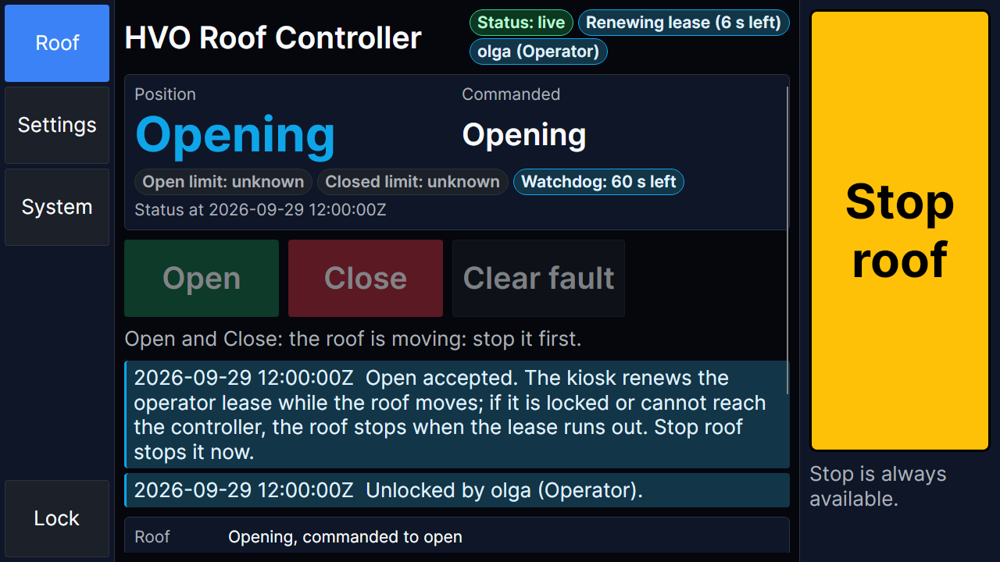

## The screen

- **The rail** at the left: Roof, and Unlock. Once the kiosk is unlocked: Roof, Settings, System and Lock.
- **The header**: the controller's name, and badges for the status (`Status: live`, `connecting`, `reconnecting`,
  `STALE`, `unreachable` or `refused`), the operator lease while the kiosk renews it (`Renewing lease (6 s left)`), and
  who unlocked the kiosk (`olga (Operator)`), or `Locked`.
- **Banners** under the header: the mode banner when the controller is not driving the observatory roof as in normal
  use (for example `EMULATED HAT: …`), a stale or unreachable status, a latched fault, relays that could not be
  verified, and safety inputs that could not be read.
- **Stop roof** at the right of every page ([Stop](#stop)), with its answer under it.
- Every button is at least 12 mm in both directions, and the text scales with it, so it can be used with gloves and
  read from a step back. The sizes come from `PixelsPerMillimetre`: 8.2 for the Raspberry Pi Touch Display 2
  (1280x720 in landscape), about 5.2 for the first 7-inch touch display (800x480).

<p>
  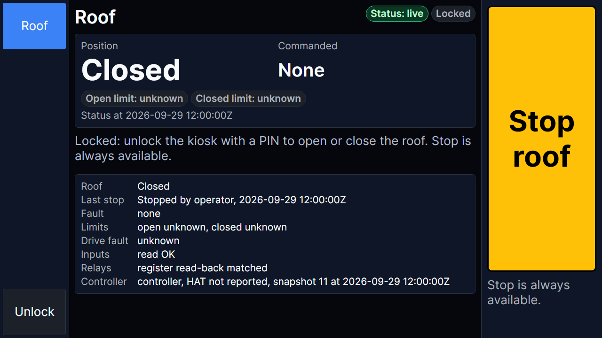
  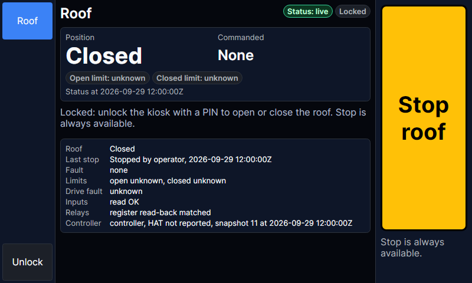
</p>

## Locked

Between people, the kiosk is locked. It shows the roof with its device key, which has the Viewer role, and offers Stop.
Open, Close and Clear fault are hidden:
`Locked: unlock the kiosk with a PIN to open or close the roof. Stop is always available.`

**Unlock** asks `Who are you?`. The names are the people with a PIN (`GET Auth/Pin/Users`, read with the device key).
A person chooses their name and types their PIN on the keypad; the PIN shows as dots and is only held until it is sent.
A wrong PIN says so, and repeated wrong PINs lock that name out at every kiosk, and this kiosk for every name
([Lockout](security.md#signing-in)). When no one has a PIN yet, the page says how to give one:
`hvo-roof users set <name> --pin` or `hvo-roof pins set <name>` ([cli.md](cli.md#commands)), or the web UI's People
page.

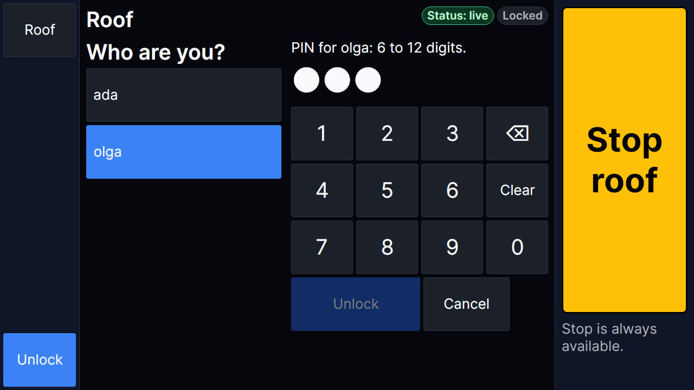

**Lock** ends the person's PIN session at the controller, then locks. The kiosk also locks by itself:

- after `IdleLockSeconds` without a touch (`Locked after 2 min without a touch.`), but never while it renews the lease
  of a motion started here, nor while a command's answer is awaited;
- when the controller ends the PIN session (its idle timeout, its lifetime, or an admin ending it):
  `The controller ended the PIN session, so the kiosk is locked.` The kiosk keeps the session open while someone uses
  it, and locks when the controller would end it anyway;
- when systemd stops it (SIGTERM): it ends the PIN session before it exits, so nobody's session outlives the kiosk.

When the kiosk locks while the roof moves on its command, it stops renewing the lease and says so:
`The kiosk was locked, so it stopped renewing the operator lease. If the roof is still moving, it stops when the lease runs out.`

## Unlocked

What an unlocked kiosk offers depends on the person's role, as the controller gives it. A Viewer cannot have a PIN.

### Roof

- **Open, Close and Clear fault** need the Operator role. A button that cannot be used says why under it, for example
  `Open and Close: the roof is moving: stop it first.` Open and Close are not offered on a stale status: the roof could
  not be watched.
- **The operator lease.** When the controller has a lease (`OperatorLeaseTimeout`), a move started here holds it, and
  the kiosk renews it while the roof moves (the `Renewing lease` badge). It stops renewing when the roof stops, when
  Stop is sent, and when the kiosk locks; the controller then stops the roof when the lease runs out
  ([commissioning C9](commissioning.md#c9-operator-lease-expiry)).
- **Notices** keep the last five things that happened, with their time: a command's answer, who unlocked the kiosk, the
  controller restarting, and safety alerts (`SAFETY: …`).

<p>
  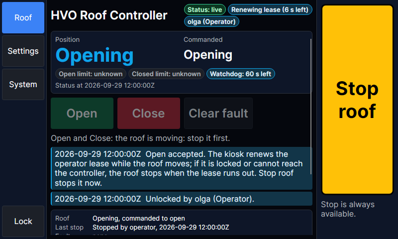
  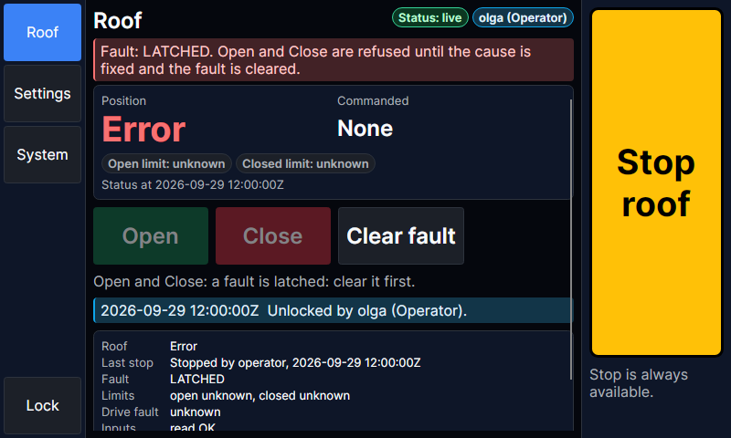
</p>

### Settings

An unlocked kiosk shows the controller's settings by group, from the controller's catalogue, as the web UI and
`hvo-roof settings` do ([Settings](security.md#settings)). The controller says which settings the person may change:
an operator the UI group (for example `KioskScreenTimeout`), an admin the rest.

- **Change** opens a touch editor: a keypad for numbers and durations (`120`, `90 s`, `00:05:00`), a keyboard for text
  (letters, and a page of digits and symbols), and a button per value for true or false and a setting's choices.
- **Save** checks the value, then shows the change for review before anything is sent. A safety-critical change needs
  **Confirm and send**; a change that applies after a restart says so.
- **Secrets are not typed on the kiosk**, where others can watch:
  `Secrets are not typed on the kiosk: set them in the web UI or with hvo-roof.`
- **Hand edits** to the settings file are shown, to apply or discard.
- **Local-only settings** ([Local-only settings](security.md#local-only-settings)), such as ignoring the limit
  switches, can be changed only by an admin at a kiosk whose key is marked both `Kiosk` and `Local`.

<p>
  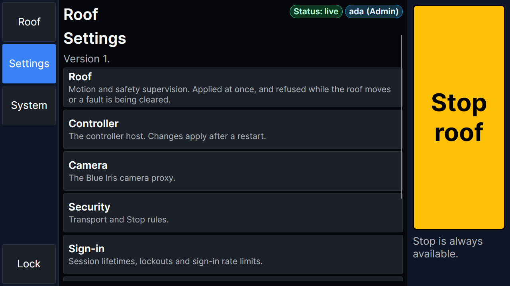
  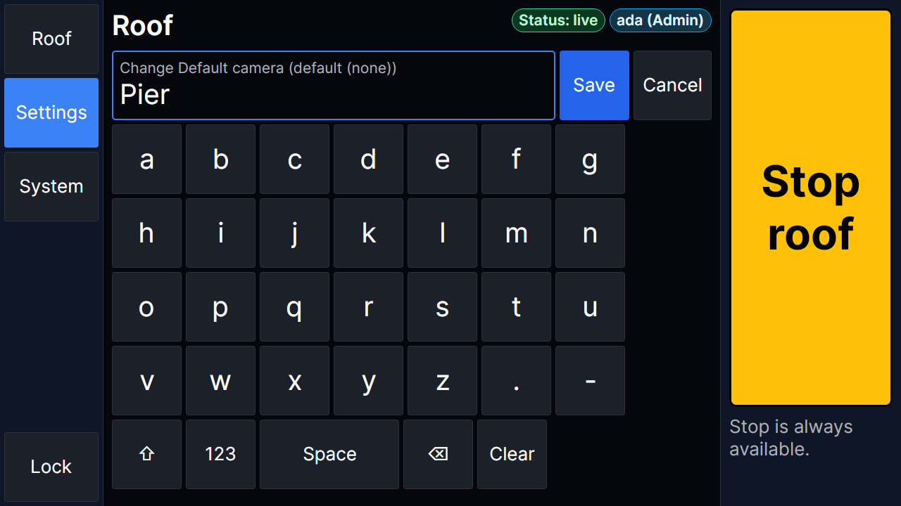
</p>
<p>
  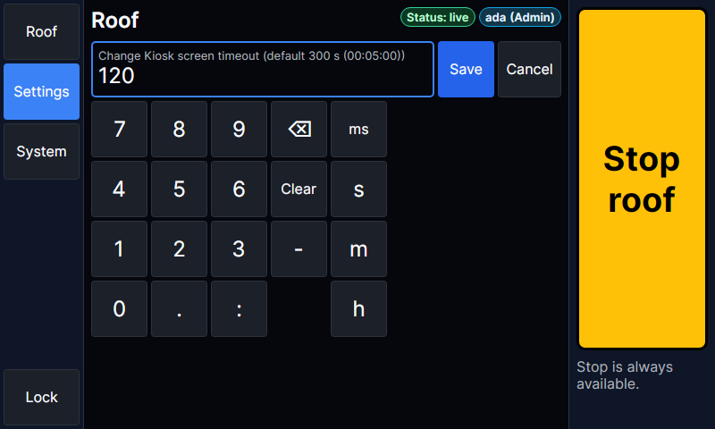
</p>

### System

The controller's health checks and readiness, and for an admin its version, host and resource use, and **Restart**:
the controller stops the roof, verifies the stop, and exits, and its supervisor starts it again. A restart that would
load a pending hand edit shows it first.

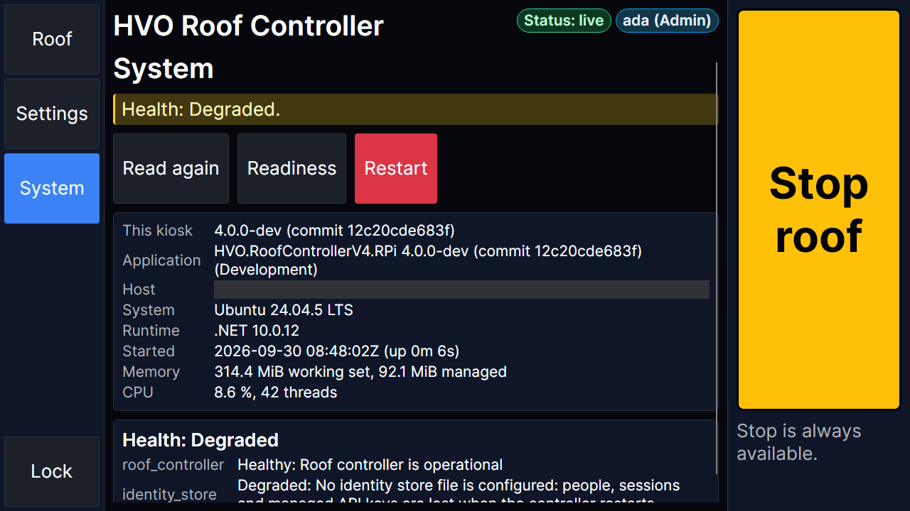

## The status

The status is current only while the hub delivers it, as in every client.

- **Before the first status** the kiosk says `Connecting to the controller…`, and claims no position.
- **Stale.** After 3 s without a status or heartbeat:
  `STALE: no status since …. Showing the last known state; Stop still works.` The position and the command are labelled
  "last known", and Open and Close are not offered.
- **Unreachable.** When the controller cannot be reached:
  `The controller cannot be reached. No status since …: showing the last known state. Stop is still tried; its answer shows whether it arrived.`
- **Refused.** When the controller refuses the device key (it was removed, or is no longer a kiosk key):
  `The controller refused this kiosk's device key, so there is no live status.` Stop is still tried.
- **The controller restarted.** A new controller instance is noted, and the screen comes on.

<p>
  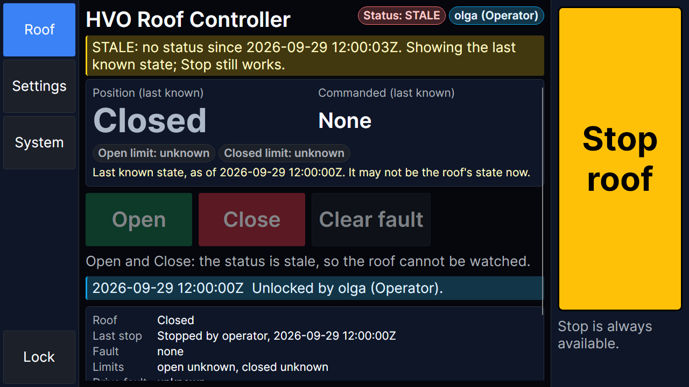
  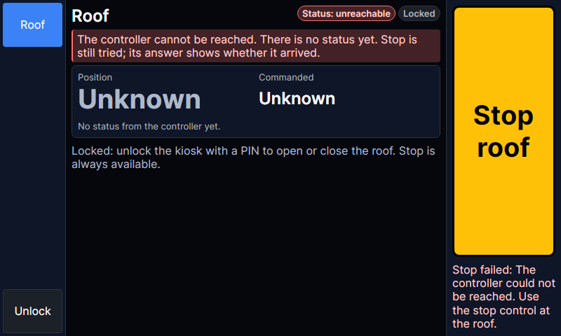
</p>

## The screen timeout

The screen goes black after the controller's `RoofControllerUi:KioskScreenTimeout` without a touch (5 minutes by
default, at most 4 hours; 0 keeps it on). An operator may change it, from the kiosk or any client. The kiosk reads it
at start and every 5 minutes. The screen stays on while the roof moves, while a command or Stop is on its way, and while
the kiosk holds a lease, and comes on when the roof starts or stops moving, when the controller restarts, and on a
safety alert.

The touch that wakes a black screen goes no further, so a touch on the dark screen cannot press what is under it: it
takes a second touch to press Stop. With `BacklightFile`, the kiosk also turns the backlight off while the screen is
black, and on again at the touch.

## Stop

**Stop roof** is at the right of every page, locked or not. It is never disabled, needs no PIN and no role, and uses
the same words as every other client.

- It is sent at once, on a connection of its own, with the device key (and the PIN session when there is one): it never
  waits for a command, a lock or the status.
- The answer shows under it, for example `Stop acknowledged. Relay register verified de-energized.`, or why Stop
  failed, with `Use the stop control at the roof.` Nothing else claims that Stop arrived.
- Stop wins: an Open or Close accepted after a Stop was sent is stopped again.

## Install

The kiosk runs on the controller's Pi, beside the controller's container, as a systemd service. It needs Raspberry Pi
OS Lite (no desktop): nothing else may hold the display.

1. **Packages.** The display and input libraries, and fontconfig:

   ```bash
   sudo apt install libdrm2 libgbm1 libegl1 libgles2 libinput10 libfontconfig1
   ```

   To hide the console's cursor behind the kiosk, add `vt.global_cursor_default=0` to `/boot/firmware/cmdline.txt`.

2. **The user.** The kiosk runs as `hvo-kiosk`, in `video` (the display, and the backlight with the udev rule),
   `input` (the touchscreen) and `render` (the GPU):

   ```bash
   sudo useradd --system --user-group --no-create-home --shell /usr/sbin/nologin hvo-kiosk
   sudo usermod -aG video,input,render hvo-kiosk
   ```

3. **The program.** Steps 3, 5 and 6 install the program and its files from one directory that holds them side by
   side, and run in it. CI builds that directory for the Pi: unpack its `hvo-roof-kiosk-<run id>` artifact and `cd`
   into it. Or publish it from a checkout, at the repository's root:

   ```bash
   dotnet publish src/HVO.RoofControllerV4.Kiosk -c Release -r linux-arm64 -o hvo-roof-kiosk
   cp src/HVO.RoofControllerV4.Kiosk/deploy/* hvo-roof-kiosk/
   cd hvo-roof-kiosk
   ```

   Then install the program:

   ```bash
   sudo install -d /opt/hvo-roof-kiosk
   sudo install -m 755 hvo-roof-kiosk /opt/hvo-roof-kiosk/
   ```

4. **The device key.** Give the kiosk a key of its own, with the `RoofViewer` role, marked `Kiosk` (and `Local`, so an
   admin may change the local-only settings here). Add it to the controller's secrets as any configured key
   ([Provisioning API keys](security.md#provisioning-api-keys)), under the next free index:

   ```bash
   N=3   # the next free index (sudo ls /etc/hvo-roof/secrets)
   KEY=$(openssl rand -base64 32 | tr -d '\n')
   D=/etc/hvo-roof/secrets/RoofControllerSecurity__ApiKeys__$N
   printf '%s' 'roof-kiosk' | sudo tee "${D}__Name"  >/dev/null
   printf '%s' 'RoofViewer' | sudo tee "${D}__Role"  >/dev/null
   printf '%s' "$KEY"       | sudo tee "${D}__Key"   >/dev/null
   printf '%s' 'true'       | sudo tee "${D}__Kiosk" >/dev/null
   printf '%s' 'true'       | sudo tee "${D}__Local" >/dev/null
   sudo find /etc/hvo-roof/secrets -type f -exec chmod 600 {} +
   ```

   Then give the kiosk its copy, readable by `hvo-kiosk` alone, and restart the controller so it reads the new key:

   ```bash
   sudo install -d -m 750 -g hvo-kiosk /etc/hvo-roof-kiosk
   printf '%s' "$KEY" | sudo install -m 400 -o hvo-kiosk -g hvo-kiosk /dev/stdin /etc/hvo-roof-kiosk/device-key
   unset KEY
   docker restart roof-controller
   ```

   The kiosk warns at start when others than its owner can read the file.

5. **Settings.** Install the example settings as `appsettings.Local.json`, and set what differs ([Settings](#settings)):

   ```bash
   sudo install -m 644 appsettings.Local.example.json /opt/hvo-roof-kiosk/appsettings.Local.json
   sudoedit /opt/hvo-roof-kiosk/appsettings.Local.json
   ```

   In HTTPS mode the controller's API is published on port 8443 only, so the
   kiosk uses `https://localhost:8443/`. The certificate is not issued for `localhost`, so pin it by its SHA-256. Take
   it from the certificate the controller serves on that port, which works in this directory and whoever issued it:

   ```bash
   openssl s_client -connect localhost:8443 </dev/null 2>/dev/null | openssl x509 -noout -fingerprint -sha256 | cut -d= -f2
   ```

   and put that in `ServerCertificateSha256`. Under `pi-lan-http` the kiosk uses `http://localhost:8080` and no pin.

6. **The service.** Install the unit, and the udev rule for the backlight when `BacklightFile` is set. The rule acts
   on the `add` event the boot sends, so apply it now with one (`udevadm trigger` sends `change` unless told):

   ```bash
   sudo install -m 644 hvo-roof-kiosk.service /etc/systemd/system/
   sudo install -m 644 99-hvo-roof-kiosk-backlight.rules /etc/udev/rules.d/
   sudo udevadm trigger --action=add --subsystem-match=backlight
   sudo systemctl daemon-reload
   sudo systemctl enable --now hvo-roof-kiosk
   ```

   It starts at boot, and again 5 s after an exit or a crash. Settings it cannot start with stop it with exit code 78
   and `The roof kiosk did not start: …` in the journal (`journalctl -u hvo-roof-kiosk`), and systemd does not restart
   it: fix them, then `sudo systemctl restart hvo-roof-kiosk`.

7. **PINs.** An admin gives each operator a PIN (6 to 12 digits) with `hvo-roof pins set <name>`, or on the web UI's
   People page.

## Settings

The kiosk's settings are the `Kiosk` section of `appsettings.Local.json` next to the program, then the environment
(`Kiosk__*`), then the command line (`--Kiosk:Name=value`), later ones winning.

| Setting | Default | Meaning |
|---------|---------|---------|
| `ControllerUrl` | `http://localhost:8080` | The controller's API. |
| `DeviceKeyFile` | none (required) | The file with the kiosk's device key, on one line. Only the kiosk's user may read it. |
| `ServerCertificateSha256` | none | For an `https://` `ControllerUrl` with a certificate the Pi does not trust: its SHA-256, as 64 hex digits (colons allowed). |
| `IdleLockSeconds` | `120` | How long the kiosk stays unlocked without a touch, from 10 to 3600. |
| `PixelsPerMillimetre` | `8.2` | The display's pixels per millimetre, from 2 to 40, which sets the size of everything. 8.2: the Raspberry Pi Touch Display 2; about 5.2: the first 7-inch touch display. |
| `Card` | the first connected | The display's DRM device, such as `/dev/dri/card1`. |
| `Rotation` | `0` | How far the picture is turned, clockwise: 0, 90, 180 or 270. The Touch Display 2's panel is portrait, so it needs 90 or 270 for landscape ([Assumptions](#assumptions)). |
| `InputDevices` | every device | The touchscreen's input devices, such as `/dev/input/by-path/…-event` (`Kiosk__InputDevices__0=…`). None: every device libinput finds. |
| `BacklightFile` | none | A backlight control written when the screen goes black and wakes, such as `/sys/class/backlight/10-0045/bl_power`. None: the screen is drawn black with the backlight on. |
| `BacklightOn`, `BacklightOff` | `0`, `4` | What `BacklightFile` is given to turn the backlight on and off (`bl_power`: 0 on, 4 powered down). |
| `Window`, `WindowSize` | `false`, `1280x720` | Runs the kiosk in a desktop window instead (for development; `--window` for short). |

The logging level is `Logging:LogLevel:Default` (`Information`); the log goes to the journal. The device key never
appears in the log or on the screen.

To try the kiosk on a workstation, start a development controller ([emulator.md](emulator.md#development)), which
listens on `http://localhost:5195`, then, from `src/`:

```bash
dotnet run --project HVO.RoofControllerV4.Kiosk -- --window --Kiosk:ControllerUrl=http://localhost:5195/ \
  --Kiosk:DeviceKeyFile=/path/to/kiosk-key
```

## Assumptions

The kiosk is tested without the Pi or the display ([Tests](#tests)). These facts about the Pi are taken from the
Raspberry Pi and Avalonia documentation, and are checked when the kiosk is first installed:

- **The display.** A Pi 5 has more than one DRM card, and card0 can be the render-only GPU (v3d), so the kiosk takes
  the first card with a connected connector (`/sys/class/drm/card*-*/status`), and `Card` names one when that is
  wrong. The kiosk logs the card it uses.
- **The touchscreen.** libinput finds the Touch Display's touch controller on the seat with no configuration. When
  another input device gets in the way, `InputDevices` names the touchscreen.
- **The size.** The Touch Display 2 is 1280x720 in landscape on a 155 mm wide picture (8.2 px/mm); the first 7-inch
  display is 800x480 on 154 mm (5.2 px/mm). The kiosk's pages are checked at both sizes.
- **The way up.** The Touch Display 2's panel is 720x1280 portrait, so landscape takes `Rotation` 90 or 270, whichever
  is the right way up in its mount (the example settings have 90); the first 7-inch display is landscape at 0. The
  kernel's `video=…,rotate=` setting turns only the text console, not the kiosk. At start the kiosk (Avalonia
  12.1.3's libinput input) sets every touch device's libinput calibration matrix from `Rotation`, so touches turn with
  the picture, and a udev `LIBINPUT_CALIBRATION_MATRIX` is overridden. A touch controller mounted differently from its
  panel (touches mirrored, or turned against the picture) is corrected below libinput, with the touchscreen's
  device-tree properties (`touchscreen-inverted-x`, `touchscreen-inverted-y`, `touchscreen-swapped-x-y`), which the
  touch displays' overlays take as `invx`, `invy` and `swapxy`.
- **The backlight.** The Touch Display's backlight is `/sys/class/backlight/<name>/bl_power`, where 0 is on and 4 is
  off; the name depends on the display and the Pi, so `BacklightFile` names it.
- **The fonts.** The kiosk carries its font (Inter), so it needs no fonts installed; Skia's native library still
  needs the fontconfig library (`libfontconfig1`) to load.

Night mode (a red screen that keeps dark adaptation) was considered, and is left for later.

## Tests

Nothing here needs the Pi, the display or the roof.

- **The console and the pages** (`tests/HVO.RoofControllerV4.RPi.Tests/Kiosk`): unlocking and locking, the idle lock,
  the lease (renewed only while this kiosk moves the roof), Stop's answers, the stale, unreachable and refused status,
  the screen timeout, the settings editors and their refusals, System and Restart, and that an answer that arrives
  after the kiosk locks is not shown to the next person. Against the controller's API in process, with a mocked roof.
- **The program** (`KioskProgramTests`): its settings, the device key, the display and the backlight, and exit code 78
  for settings it cannot start with; CI runs the published program without settings to check that code. The install
  steps above are checked against the files they install, which are the files of CI's artifact.
- **The renders** (`KioskRenderTests`) draw each screen headless (Avalonia's headless platform with Skia) at 1280x720
  and 800x480, and check that nothing overlaps, that no text is cut off but for the three texts shortened on purpose (a
  controller name longer than half the header, which the Controller row shows whole; a long name on its pill; the end
  of a long value being typed), that every button is at least 12 mm, and that Stop is shown in
  full on every screen and stops the roof even when touched as the screen blanks. The pictures on this page are those renders; CI keeps them as the `kiosk-renders`
  artifact. To refresh them, from `src/`:

  ```bash
  HVO_KIOSK_RENDERS_DIR=/tmp/kiosk-renders dotnet test ../tests/HVO.RoofControllerV4.RPi.Tests -c Release \
    --filter "FullyQualifiedName~KioskRenderTests"
  for f in ../docs/images/kiosk/*.png; do cp "/tmp/kiosk-renders/$(basename "$f")" "$f"; done
  ```

  The admin's System page masks the host's name.
- **The soak** (`KioskSoakScenarios`, `TestCategory=KioskSoak`) runs the kiosk against the whole controller and the
  emulated roof: an operator unlocks it, opens the roof, stops it midway, closes it and locks it, over and over, while
  the controller restarts every fourth cycle. It checks that every Stop is acknowledged, that the kiosk reconnects
  within 45 s of each restart, that the emulated plant saw no violation, and, on a run long enough, that memory and
  threads stay flat. It runs nightly for 30 minutes (`scenarios.yml`); see the
  [tests' README](../tests/HVO.RoofControllerV4.RPi.Tests/README.md#kiosk-renders-and-soak).
