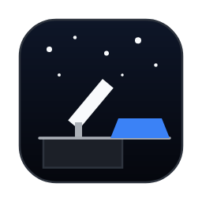
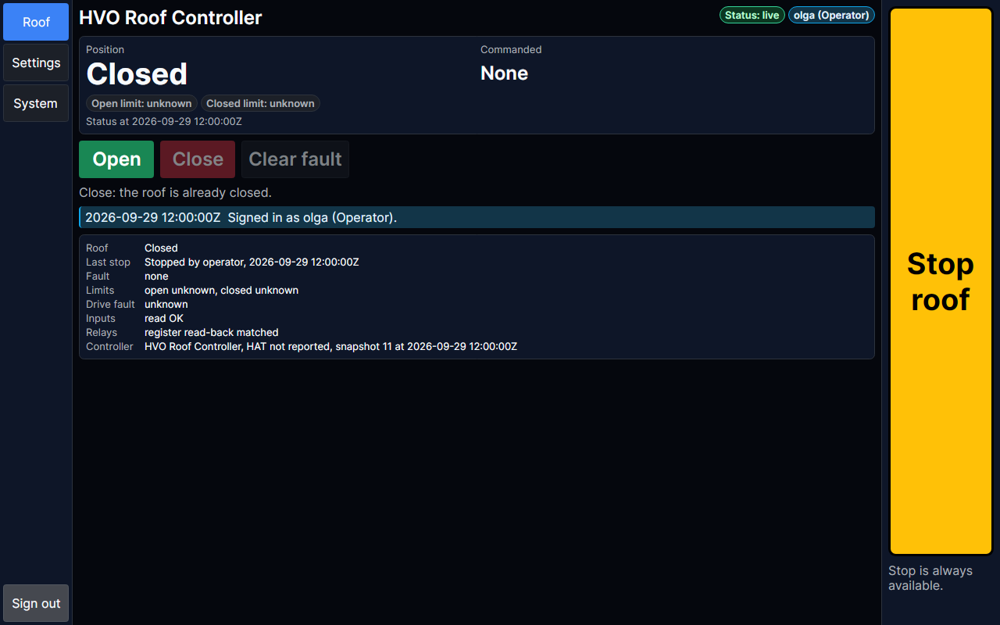
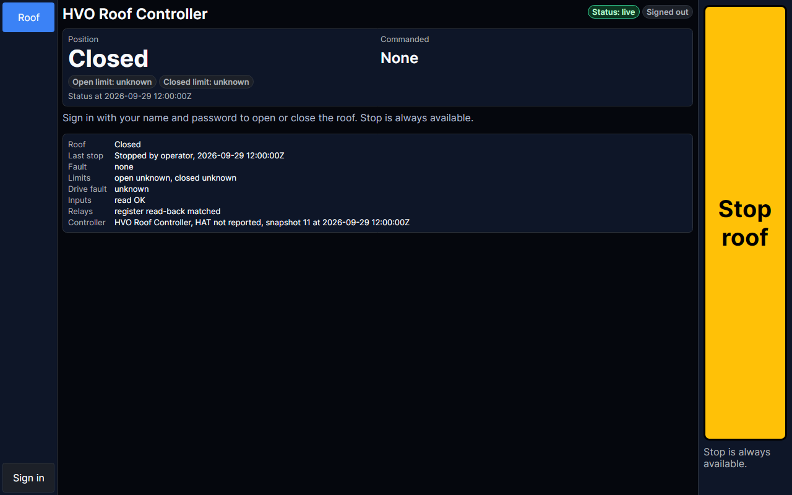
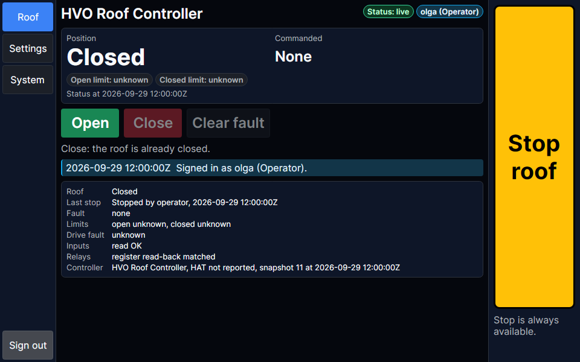
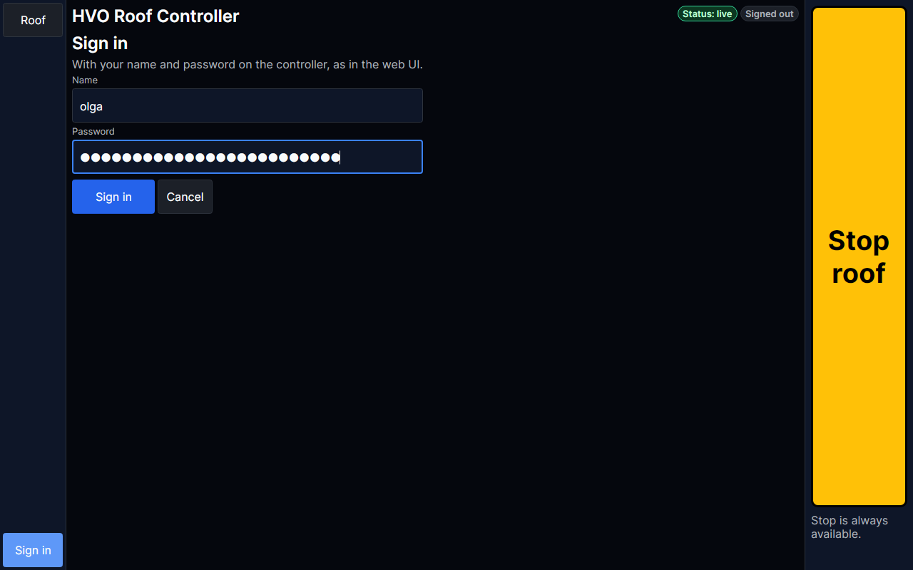
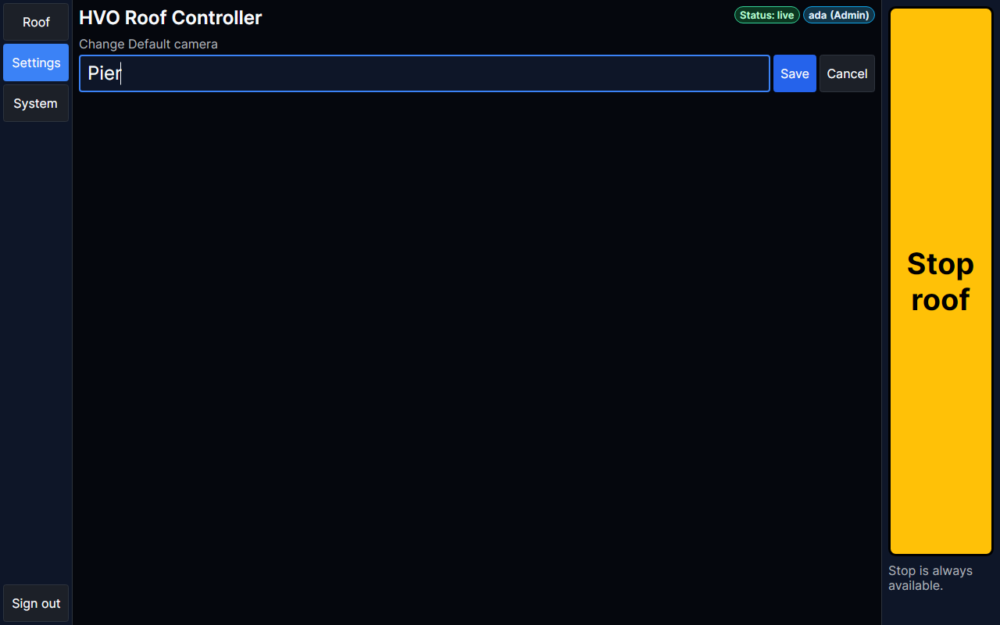
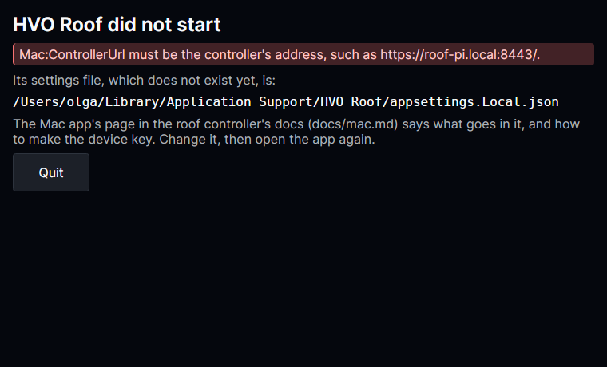

# Mac app



The Mac app (`HVO Roof.app`, `HVO.RoofControllerV4.Mac`) is the [kiosk](kiosk.md)'s screens in a window on a Mac with
Apple silicon. Anyone at the Mac can watch the roof and press Stop. To open or close the roof, or to change settings, a
person signs in with their name and password, as in the [web UI](web.md).

Like [`hvo-roof`](cli.md), the web UI and the kiosk, it is a client of the controller: it calls the REST API and follows
the live status hub with the device key made for this Mac, and never drives the HAT itself. The controller decides what
the person who signed in may do. Its screens are the kiosk's (`HVO.RoofControllerV4.Screens`), in HVO Dark, the
observatory's web theme, sized for a mouse and a keyboard. It is built on Linux, without Xcode, and signed there
([Build it yourself](#build-it-yourself)).



## The window

The window opens at 1280x800 points, and can be made as small as 960x600: Stop, the pages and the status still fit.

- **The rail** at the left: Roof, and Sign in. Once a person is signed in: Roof, Settings, System and Sign out.
- **The header**: the controller's name, and badges for the status (`Status: live`, `connecting`, `reconnecting`,
  `STALE`, `unreachable` or `refused`), the operator lease while the app renews it, and who is signed in
  (`olga (Operator)`), or `Signed out`.
- **Banners** under the header, as on the kiosk: the mode banner, a stale or unreachable status, a latched fault,
  relays that could not be verified, and safety inputs that could not be read.
- **Stop roof** at the right of every page ([Stop](#stop)), with its answer under it.

The window never blanks: the controller's `KioskScreenTimeout` is for the kiosk, and the app does not read it.

<p>
  
  
</p>

## Signed out

When no one is signed in, the app shows the roof with its device key, which has the Viewer role, and offers Stop.
Open, Close and Clear fault are hidden:
`Sign in with your name and password to open or close the roof. Stop is always available.`

**Sign in** asks for a name and a password: the password is the one the person uses in the web UI and with
`hvo-roof login`. It shows as a dot per character, and is only held until it is sent. Return signs in; Escape or
Cancel leaves without it. A wrong password says so and empties the password box, and repeated wrong passwords lock that
name out for a while, as everywhere ([Signing in](security.md#signing-in)). An admin gives people their password on the
web UI's People page, or with `hvo-roof users set <name> --password`.



**Sign out** ends the person's session at the controller, and the app is back to its device key. The app also signs
out by itself:

- after `IdleLockSeconds` (15 minutes by default) without a click or a key press:
  `Signed out after 15 min without use.` It does not while it renews the lease of a motion started here, nor while a command's answer is awaited;
- when the controller ends the session (its lifetime, a changed password or role, or an admin ending it):
  `The controller ended the session, so the app signed out.`;
- when it quits (the window closed, ⌘Q, or Ctrl+C in the Terminal it was started from): it ends the session first, so
  nobody's session outlives the app.

When the app signs out while the roof moves on its command, it stops renewing the lease and says so:
`Signed out, so the app stopped renewing the operator lease. If the roof is still moving, it stops when the lease runs out.`

## Signed in

What the app offers depends on the person's role, as the controller gives it, and is what the kiosk offers
([Unlocked](kiosk.md#unlocked)):

- **Roof**: Open, Close and Clear fault for an operator, the operator lease renewed while a motion started here goes
  on, and the notices.
- **Settings**: the controller's settings by group. **Change** opens a text box for a number, a duration or text,
  typed on the keyboard: Return saves it and Escape cancels. True or false, and a setting's choices, are a button per
  value. The change is shown for review before anything is sent, and a safety-critical change needs
  **Confirm and send**. Secrets are not typed here:
  `Secrets are not typed in this app: set them in the web UI or with hvo-roof.`
- **System**: the app's own version, the controller's health checks and readiness, and for an admin its version, host
  and resource use, and **Restart**.

People, API keys and sessions are managed in the web UI and with `hvo-roof`, not here.



The status is current only while the hub delivers it, as in every client: before the first status the app claims no
position, and a stale, unreachable or refused status is said as on the kiosk ([The status](kiosk.md#the-status)).

## Stop

**Stop roof** is at the right of every page, signed in or not. It is never disabled, needs no sign-in and no role, and
uses the same words as every other client.

- It is sent at once, on a connection of its own, with the device key (and the person's session when there is one): it
  never waits for a command, a sign-in or the status.
- The answer shows under it, for example `Stop acknowledged. Relay register verified de-energized.`, or why Stop
  failed, with `Use the stop control at the roof.` Nothing else claims that Stop arrived.
- Stop wins: an Open or Close accepted after a Stop was sent is stopped again.

## Install

1. **The app.** Each release has the app among its assets, as `HVO-Roof-<version>.zip`
   ([Versions and releases](releasing.md#the-assets)): download it, open it, and move `HVO Roof.app` to Applications.
   CI also builds, signs and checks the app on every run, as the `hvo-roof-mac-<run id>.zip` artifact on the run's
   page on GitHub (Actions). Or build it yourself ([Build it yourself](#build-it-yourself)).

2. **The first launch.** The app is signed ad hoc, with no Apple certificate, which is enough for your own Macs but not
   for Gatekeeper to know who made it. So the first time, macOS refuses to open it from a download. Either:

   - open it once, choose Done when macOS refuses, then in System Settings → Privacy & Security choose
     **Open Anyway** for HVO Roof, and confirm (on macOS 14 and earlier, Control-click the app in the Finder and choose
     Open, then Open); or
   - remove the download's quarantine mark in Terminal, then open it as any app:

     ```bash
     xattr -dr com.apple.quarantine "/Applications/HVO Roof.app"
     ```

   After that it opens like any other app. Without its settings it shows why it did not start
   ([Settings](#settings)), which is expected at this point.

3. **The device key.** Give the Mac a key of its own, with the Viewer role. It is an ordinary key, not a kiosk key:
   people sign in at the Mac with their password, which needs no kiosk key, and a Mac's key that is lost or stolen
   then cannot be used to try PINs. An admin adds it on the web UI's People page (API keys, role Viewer, not a kiosk
   key), or with `hvo-roof`:

   ```bash
   hvo-roof keys add mac-olga --role viewer
   ```

   Either shows the key once. Copy it, then on the Mac put it in the app's settings folder, readable by you alone:

   ```bash
   mkdir -p ~/Library/Application\ Support/HVO\ Roof
   cd ~/Library/Application\ Support/HVO\ Roof
   (umask 077; pbpaste > device-key)
   ```

   `pbpaste` writes what you copied without showing it; copy something else afterwards, so the key does not stay on
   the clipboard. The app warns at start when others than you can read the file
   (`chmod 600 device-key`). A key that is removed or rotated at the controller stops working at once: the app says
   `The controller refused this app's device key, so there is no live status.`, and Stop is still tried.

4. **Settings.** In the same folder, write `appsettings.Local.json` with the controller's address:

   ```json
   {
     "Mac": {
       "ControllerUrl": "https://roof-pi.local:8443/",
       "ServerCertificateSha256": "<the certificate's SHA-256>"
     }
   }
   ```

   In HTTPS mode the controller's API is on port 8443 (the `pi` profile). A certificate the Mac does not trust, such as
   a self-signed one, is pinned by its SHA-256. Take it on the controller's Pi, where no one can come between:

   ```bash
   openssl s_client -connect localhost:8443 </dev/null 2>/dev/null | openssl x509 -noout -fingerprint -sha256 | cut -d= -f2
   ```

   and put that in `ServerCertificateSha256`. A certificate the Mac trusts needs no pin.

   When a private CA issued the certificate, such as the installer's, trust the CA instead: copy the CA's certificate
   (PEM or DER) into the settings folder, name it in `ServerCaCertificateFile` in place of `ServerCertificateSha256`,
   and use an address the certificate names (its host name or IP address). Only that CA is trusted, and a certificate
   reissued under it needs no change here, where a pin would. Under `pi-lan-http` the app uses
   `http://roof-pi.local:8080/` and neither, and the device key and passwords cross the LAN in clear text
   ([Deployment](deployment.md)).

5. **Open the app.** It shows the roof, signed out.

### When it does not start

Settings the app cannot start with (no `ControllerUrl`, a device key file that is missing or holds more than a key, a
CA certificate file that is missing or holds no CA's certificate, a value out of range) open a window that says why, and where the settings file is, instead of the roof. Change the
settings, then open the app again.



Started from Terminal, the app writes its log there (one line an entry, in UTC), and settings it cannot start with
give `HVO Roof did not start: …` and exit code 78:

```bash
"/Applications/HVO Roof.app/Contents/MacOS/hvo-roof-mac"
```

`--check` opens the window, draws it, writes `HVO Roof check: the window opened and was drawn at …` and exits 0, or
exits 1 if no window opens or it is not drawn within 60 s; settings it cannot start with are then only written, with
exit code 78.
The device key never appears in the log or on the screen.

## Settings

The app's settings are the `Mac` section of `appsettings.Local.json` in its settings folder, then the environment
(`Mac__*`), then the command line (`--Mac:Name=value`), later ones winning. The settings folder is
`~/Library/Application Support/HVO Roof`, or the folder `HVO_ROOF_MAC_SETTINGS` names (for example to reach a second
controller, from Terminal: an app opened from the Finder does not get Terminal's variables).

| Setting | Default | Meaning |
|---------|---------|---------|
| `ControllerUrl` | none (required) | The controller's API, `http` or `https`, such as `https://roof-pi.local:8443/`. |
| `DeviceKeyFile` | `device-key` | The file with the Mac's device key, on one line. A relative path is in the settings folder; `~/` is your home folder. Only you should be able to read it. |
| `ServerCertificateSha256` | none | For an `https://` `ControllerUrl` with a certificate the Mac does not trust: its SHA-256, as 64 hex digits (colons allowed). Not with `ServerCaCertificateFile`. |
| `ServerCaCertificateFile` | none | For an `https://` `ControllerUrl` with a certificate a private CA issued: the file with the CA's certificate, PEM or DER. A relative path is in the settings folder; `~/` is your home folder. Only that CA is trusted; the certificate must name the host in `ControllerUrl`. Not with `ServerCertificateSha256`. |
| `IdleLockSeconds` | `900` | How long the app stays signed in without use, from 10 to 3600. |
| `PixelsPerMillimetre` | `4` | Sets the size of everything, from 2 to 40. At 4, a button is at least 48 points in both directions and the text is 16 points. |

The logging level is `Logging:LogLevel:Default` (`Information`).

To try the app on a Linux desktop, start a development controller ([emulator.md](emulator.md#development)), which
listens on `http://localhost:5195`. Put a Viewer key in `~/.config/hvo-roof-mac/device-key` (or under
`$XDG_CONFIG_HOME/hvo-roof-mac`), then, from `src/`:

```bash
dotnet run --project HVO.RoofControllerV4.Mac -- --Mac:ControllerUrl=http://localhost:5195/
```

## Build it yourself

On Linux (or a Mac), from `src/`, publish the program for Apple silicon, then make the bundle with
[`bundle/bundle.py`](../src/HVO.RoofControllerV4.Mac/bundle/bundle.py) and sign it with
[rcodesign](https://github.com/indygreg/apple-platform-rs) (CI uses 0.29.0; no Xcode):

```bash
dotnet publish HVO.RoofControllerV4.Mac -c Release -r osx-arm64 -o hvo-roof-mac
python3 HVO.RoofControllerV4.Mac/bundle/bundle.py make hvo-roof-mac mac --rcodesign /path/to/rcodesign
python3 HVO.RoofControllerV4.Mac/bundle/bundle.py check "mac/HVO Roof.app"
(cd mac && zip -qry hvo-roof-mac.zip "HVO Roof.app")
```

`make` puts the program, its three native libraries (Avalonia's macOS windowing, Skia and HarfBuzz) and the icon in the
bundle, fills in `Info.plist` (the version, `--build`'s number, and the oldest macOS the program's files are built for),
and signs it ad hoc. The version is `--version`'s, such as CI's `4.0.0-ci.123`, or else the one in
`Directory.Build.props` ([Versions and releases](releasing.md)). macOS reads only its first three numbers, so
`CFBundleShortVersionString` is `4.0.0`, and a `--version` that is not a product version stops `make` before it does
anything. It checks the program and libraries in the publish folder first: one that is missing, damaged or
has no arm64 code stops it with a line naming that file. It builds and signs the new bundle beside the last one, then
swaps them with two renames (the last bundle moves aside, the new one takes its place), so a `make` that stops at any
step, rcodesign failing included, leaves the last bundle as it was. If some of the last bundle cannot be deleted
afterwards (a folder in it that cannot be written), `make` names the folder it is in, to delete by hand. `check` reads
back what `make` promises: `Info.plist`, arm64 code with a signature in every program file, the icon at each size, and
nothing else. Given `--version`, it also checks that `CFBundleShortVersionString` is that version's first three
numbers.

**Sharing the app** with Macs that are not yours would need it signed with a Developer ID certificate and notarised by
Apple, which needs an Apple Developer account. rcodesign can do both from Linux (its `sign` with the certificate and
the hardened runtime, then `notary-submit --staple`). It is not done here: the app is for the observatory's own Macs.

## Assumptions

The app is tested without a Mac by the tests below, and then on a Mac by CI:

- **On a Mac.** CI's `mac-app` job, on GitHub's `macos-latest` runner (Apple silicon), unpacks the artifact as the
  Finder would, checks the signature with Apple's `codesign --verify --deep --strict`, and runs the app with
  `--check`: macOS runs the signed program, and Avalonia's windowing and Skia load and draw. It also checks exit code
  78 without settings. Gatekeeper's first-launch step, a person's clicks and the Mac's screen are not part of it.
- **Apple silicon.** The app is built for arm64 only. `Info.plist` asks for the oldest macOS its files are built for
  (12.0 today); use a macOS that .NET 10 supports.
- **Gatekeeper.** An ad hoc signed app from a download is refused until it is allowed once (Install step 2), from
  Apple's documentation of Gatekeeper; how that step looks differs between macOS versions.

## Tests

Nothing here needs a Mac, the controller's Pi or the roof.

- **The console** (`MacConsoleTests`): with a plain viewer key, Stop needs no one signed in; a person signs in with
  their password, which is never shown or logged, and the app sends their session; wrong passwords are refused and lock
  the name out; the app signs out when it is not used, when the controller ends the session, and on Sign out; the
  screen never blanks; and the lease and a refused device key are said in the app's words. Against the controller's
  API in process, with a mocked roof.
- **The screens** (`MacScreenTests`): the signed-out page, the sign-in page (a dot per character, Return signs in,
  Escape leaves without the password, a wrong password empties its box), and a setting typed in a text box, at 1280x800
  and 960x600, drawn headless (Avalonia's headless platform with Skia), with the kiosk's checks that nothing overlaps
  and no text is cut off.
- **The program** (`MacProgramTests`): the settings and where they are read from, the device key, exit code 78 and
  the refusal, `--check`'s flag, and the bundle's `Info.plist`. CI runs the published program without settings to
  check that code.
- **The app** (`MacAppTests`): `--check` exits 0 once the window is drawn and 1 when it is not or there is none, the
  refusal window, and the icon: it is drawn in code (`MacIcon`), at each size macOS uses, and `bundle/AppIcon.icns`
  must hold that drawing.
- **The bundle script** (`tests/mac/test_bundle.py`): `bundle.py` reads whole Mach-O files (thin, and universal in both
  the 32-bit and 64-bit forms), `Info.plist` and `AppIcon.icns`. `check` reports damaged ones (cut short, or with a size
  of 0) as problems with exit code 1. `make` stops on a damaged program or library, on rcodesign failing, or on a rename
  in the swap failing, with a line naming it, and leaves the last bundle as it was: neither hangs nor ends in a
  traceback. A folder in the last bundle that cannot be written does not stop it. Run it from the repository root with
  `python3 -m unittest discover -s tests/mac -p 'test_*.py'`.
- **The bundle**: CI makes it from the osx-arm64 publish, signs it with rcodesign, checks it with `bundle.py check`
  and rcodesign's `print-signature-info`, and keeps it as the `hvo-roof-mac-<run id>.zip` artifact for 14 days.

The pictures on this page are the tests' renders; CI keeps them with the kiosk's, as `mac-*` in the `kiosk-renders`
artifact. To refresh them, from `src/`:

```bash
HVO_KIOSK_RENDERS_DIR=/tmp/mac-renders dotnet test ../tests/HVO.RoofControllerV4.RPi.Tests -c Release \
  --filter "FullyQualifiedName~Mac"
for f in ../docs/images/mac/*-*x*.png; do cp "/tmp/mac-renders/mac-$(basename "$f")" "$f"; done
```

To change the icon, change `MacIcon`, then draw it at each size and pack them:

```bash
HVO_MAC_ICON_DIR=/tmp/mac-icon dotnet test ../tests/HVO.RoofControllerV4.RPi.Tests -c Release \
  --filter "FullyQualifiedName~TheIcon"
python3 HVO.RoofControllerV4.Mac/bundle/make-icns.py HVO.RoofControllerV4.Mac/bundle/AppIcon.icns /tmp/mac-icon/icon-*.png
cp /tmp/mac-icon/icon-256.png ../docs/images/mac/icon-256.png
```
