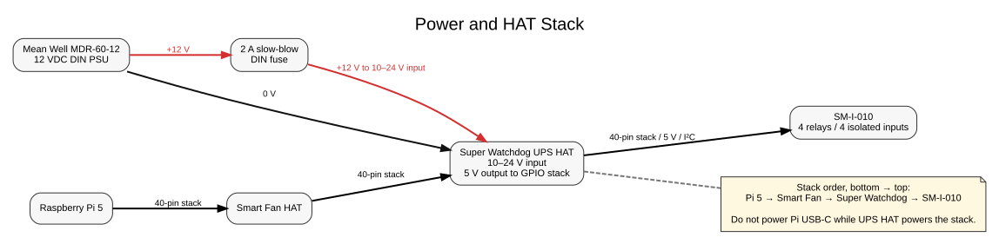
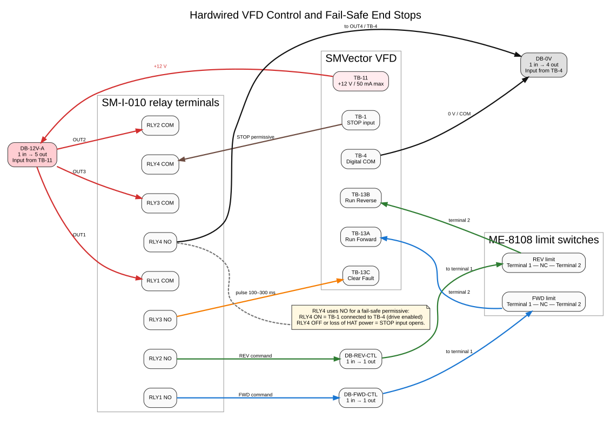
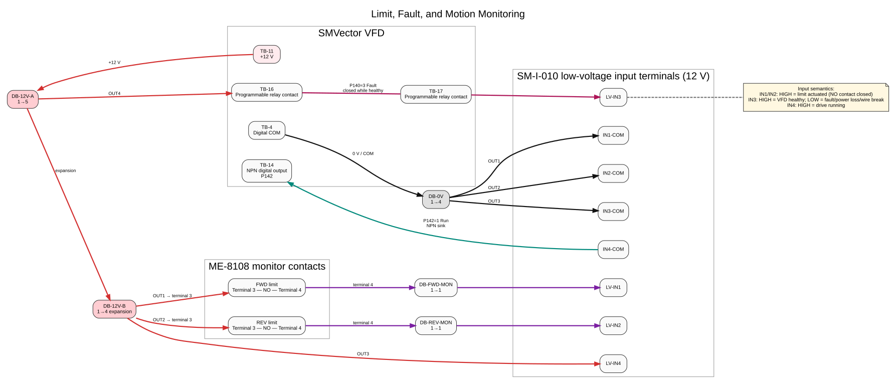
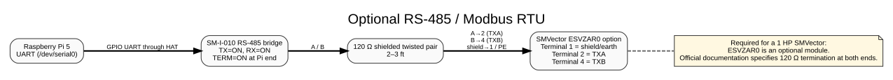

# Roof Controller Wiring - Raspberry Pi 5, SM-I-010, ME-8108 Limits, and Lenze/AC Tech SMVector

> **Status:** Final recommended hardwired design, with optional RS-485/Modbus monitoring.
> **Assumed drive:** 0.33-10 HP SMVector, including the likely 1 HP model. Verify the printed terminal labels and exact model number before energizing the system.

> **Diagrams:** Source Graphviz DOT files, SVG diagrams, and PNG renderings live alongside this document in [`diagrams/`](diagrams/).

> **Software compatibility - do not commission without resolving:** This document describes active-HIGH end-position monitoring (`IN1`/`IN2`) and active-HIGH VFD healthy (`IN3`). The current controller defaults instead treat limits as Normally Closed / active-LOW, and treat a raw HIGH `IN3` as an active fault. The wiring and controller configuration/code must be aligned and verified during the bring-up sequence before connecting the roof mechanism.

## 1. Purpose

This document defines the complete wiring between:

- Raspberry Pi 4/5
- Sequent Microsystems Smart Fan HAT
- Sequent Microsystems Super Watchdog UPS HAT
- Sequent Microsystems SM-I-010 Four Relays / Four Isolated Inputs HAT
- Lenze/AC Tech SMVector VFD
- Two Moujen ME-8108 limit switches
- DIN-rail distribution blocks

The design provides:

- Hardwired forward and reverse control
- A fail-safe STOP permissive
- Hardwired direction end stops independent of software
- Always-available limit position monitoring
- VFD fault/healthy monitoring
- VFD running/motion monitoring
- Clear-fault control
- Optional RS-485/Modbus monitoring

## 2. Important corrections from earlier drafts

1. **The ME-8108 is not a three-terminal COM/NC/NO switch.** It has four independent terminals:
   - **1-2 = normally closed contact**
   - **3-4 = normally open contact**
2. **The VFD's 12 V signals must use the SM-I-010 `LV-INx` terminals.** The 12 V signal is in the board's low-voltage 3-30 V range. Leave `HV-INx` unused.
3. **The final STOP permissive uses `RLY4 NO`, not NC.** This makes loss of Raspberry Pi/HAT power open the TB-1 stop loop.
4. **VFD fault monitoring is fail-safe.** Set `P140 = 3 (Fault)`: the VFD relay is energized while healthy and drops out on a fault or loss of VFD power. Therefore:
   - `IN3 = HIGH` means VFD healthy
   - `IN3 = LOW` means fault, VFD power loss, or broken fault-monitor wiring

## 3. Safety and isolation rules

- Disconnect VFD mains power and verify the DC bus is discharged before working inside the VFD.
- The VFD motor terminals and incoming AC power are hazardous.
- Keep motor power wiring physically separated from Cat6, limit-switch, and RS-485 wiring.
- Do **not** connect the DIN PSU 0 V or Raspberry Pi ground to VFD `TB-4`.
- The SM-I-010 relay contacts are dry contacts, and its inputs are optically isolated. Preserve that isolation.
- `TB-11` is a small VFD auxiliary supply: **+12 VDC, 50 mA maximum**. Use it only for VFD logic and SM-I-010 opto-input current.
- The Super Watchdog HAT must be the only 5 V source feeding the Raspberry Pi stack. Do not simultaneously power the Pi USB-C port.

## 4. Raspberry Pi and HAT stack

Bottom to top:

1. Raspberry Pi 4/5
2. Smart Fan HAT
3. Super Watchdog UPS HAT
4. SM-I-010



### 4.1 Pi/HAT bus connections

No individual jumper wires are required between the Pi and HATs; the 40-pin stacking header carries power and I2C.

| Function | Raspberry Pi GPIO | Physical pin |
|---|---:|---:|
| I2C SDA | GPIO2 | 3 |
| I2C SCL | GPIO3 | 5 |
| Super Watchdog reset toggle | GPIO11 | 23 |
| 5 V stack rail | - | 2 and 4 |
| Ground | - | 6, 9, 14, 20, 25, 30, 34, 39 |

SM-I-010 details:

- Interface: I2C
- Address range: `0x0E` through `0x15`, selected by stack ID
- Input range used here: `LV-INx`, 3-30 VDC
- Relay contacts: COM, NO, and NC; 8 A at 240 VAC or 24 VDC
- Approximate relay coil current: 80 mA per energized relay

Super Watchdog details:

- I2C address: `0x30`
- Power input: 10-24 VDC on the wide-input connector
- Standard Super Watchdog output: 5 V, 2.5 A continuous / 3 A peak

> **Pi 5 power warning:** The standard Super Watchdog is below the Raspberry Pi 5's possible peak requirement. This installation has a light USB load, but monitor for undervoltage warnings during CPU load and while multiple relays are energized. Sequent recommends its higher-current Multichemistry Watchdog for demanding Pi 5 systems.

### 4.2 External power

- Mean Well MDR-60-12 `+12 V` -> 2 A slow-blow DIN fuse -> Super Watchdog `10-24 V +`
- Mean Well MDR-60-12 `0 V` -> Super Watchdog `10-24 V -`
- Super Watchdog supplies 5 V to the Pi and all HATs through the GPIO header

The VFD's `TB-11` supply is **not** used to power the Pi or HATs.

## 5. SMVector control terminals used

For 0.33-10 HP SMVector drives:

| VFD terminal | Function in this design |
|---|---|
| `TB-1` | STOP input / run permissive |
| `TB-4` | Digital reference/common |
| `TB-11` | Internal +12 VDC supply, 50 mA maximum |
| `TB-13A` | Run Forward input |
| `TB-13B` | Run Reverse input |
| `TB-13C` | Clear Fault input |
| `TB-14` | Programmable NPN digital output |
| `TB-16`, `TB-17` | Two ends of the programmable relay contact |

`TB-16` and `TB-17` are a dry relay contact; they have no polarity and can be swapped.

## 6. ME-8108 terminal identification

Each ME-8108 provides two isolated contact pairs:

| ME-8108 terminal pair | State when not actuated | Use |
|---|---|---|
| `1-2` | Closed | Fail-safe VFD direction interlock |
| `3-4` | Open | Position monitoring input |

When the limit is actuated:

- `1-2` opens, stopping/blocking travel in that direction
- `3-4` closes, telling the Raspberry Pi that the end position has been reached

The terminal pairs are dry contacts and have no polarity.

## 7. DIN distribution blocks

This design follows a strict rule:

> **Only one conductor is placed in any VFD, HAT, relay, or limit-switch terminal. All fan-out occurs through DIN distribution blocks.**

### 7.1 DB-12V-A - 1 input to 5 outputs

| Port | Connection |
|---|---|
| IN | VFD `TB-11` |
| OUT1 | `RLY1 COM` |
| OUT2 | `RLY2 COM` |
| OUT3 | `RLY3 COM` |
| OUT4 | VFD `TB-16` - fault relay feed |
| OUT5 | DB-12V-B input |

### 7.2 DB-12V-B - 1 input to 4 outputs

| Port | Connection |
|---|---|
| IN | DB-12V-A OUT5 |
| OUT1 | FWD limit terminal `3` |
| OUT2 | REV limit terminal `3` |
| OUT3 | SM-I-010 `LV-IN4` |
| OUT4 | Spare +12 V logic output |

### 7.3 DB-0V - 1 input to 4 outputs

| Port | Connection |
|---|---|
| IN | VFD `TB-4` |
| OUT1 | SM-I-010 `IN1-COM` |
| OUT2 | SM-I-010 `IN2-COM` |
| OUT3 | SM-I-010 `IN3-COM` |
| OUT4 | `RLY4 NO` |

### 7.4 One-to-one cable-transition blocks

These blocks do not fan out; they provide a clean VFD-hub transition between Cat6 cables.

| Block | Input | Output |
|---|---|---|
| DB-FWD-CTL | `RLY1 NO` | FWD limit terminal `1` |
| DB-REV-CTL | `RLY2 NO` | REV limit terminal `1` |
| DB-FWD-MON | FWD limit terminal `4` | SM-I-010 `LV-IN1` |
| DB-REV-MON | REV limit terminal `4` | SM-I-010 `LV-IN2` |

## 8. Complete hardwired control



### 8.1 Forward path

1. `TB-11` -> DB-12V-A IN
2. DB-12V-A OUT1 -> `RLY1 COM`
3. `RLY1 NO` -> DB-FWD-CTL IN
4. DB-FWD-CTL OUT -> FWD limit terminal `1`
5. FWD limit terminal `2` -> `TB-13A`

Behavior:

- RLY1 OFF: no forward request
- RLY1 ON and limit not actuated: `TB-13A` receives +12 V and drive runs forward
- FWD limit actuated or limit cable broken: terminals 1-2 open and forward stops/is blocked

### 8.2 Reverse path

1. DB-12V-A OUT2 -> `RLY2 COM`
2. `RLY2 NO` -> DB-REV-CTL IN
3. DB-REV-CTL OUT -> REV limit terminal `1`
4. REV limit terminal `2` -> `TB-13B`

Behavior mirrors the forward path.

### 8.3 Clear Fault

1. DB-12V-A OUT3 -> `RLY3 COM`
2. `RLY3 NO` -> `TB-13C`
3. Pulse RLY3 ON for approximately 100-300 ms, then OFF

Do not hold Clear Fault continuously.

### 8.4 STOP permissive

1. `TB-1` -> `RLY4 COM`
2. `RLY4 NO` -> DB-0V OUT4
3. DB-0V IN -> `TB-4`

Behavior:

- RLY4 ON: TB-1 is connected to TB-4; terminal-strip operation is permitted
- RLY4 OFF: TB-1 circuit opens; drive receives STOP
- Pi/HAT power loss: relay drops out and STOP opens

## 9. Monitoring connections



### 9.1 FWD end-position input - IN1

1. DB-12V-B OUT1 -> FWD limit terminal `3`
2. FWD limit terminal `4` -> DB-FWD-MON IN
3. DB-FWD-MON OUT -> SM-I-010 `LV-IN1`
4. DB-0V OUT1 -> SM-I-010 `IN1-COM`
5. Leave `HV-IN1` unused

State:

- FWD limit not actuated: `IN1 = LOW`
- FWD limit actuated: `IN1 = HIGH`

### 9.2 REV end-position input - IN2

1. DB-12V-B OUT2 -> REV limit terminal `3`
2. REV limit terminal `4` -> DB-REV-MON IN
3. DB-REV-MON OUT -> SM-I-010 `LV-IN2`
4. DB-0V OUT2 -> SM-I-010 `IN2-COM`
5. Leave `HV-IN2` unused

State:

- REV limit not actuated: `IN2 = LOW`
- REV limit actuated: `IN2 = HIGH`

### 9.3 VFD healthy/fault input - IN3

Recommended fail-safe logic:

1. DB-12V-A OUT4 -> VFD `TB-16`
2. VFD `TB-17` -> SM-I-010 `LV-IN3`
3. DB-0V OUT3 -> SM-I-010 `IN3-COM`
4. Leave `HV-IN3` unused
5. Set `P140 = 3 (Fault)`
6. Set `P144 = 0` unless inversion is intentionally required

`P140 = 3` keeps the relay energized while the VFD is healthy and de-energizes it on a trip or loss of VFD power.

State:

- `IN3 = HIGH`: VFD healthy and powered
- `IN3 = LOW`: VFD fault, VFD power lost, or monitoring wire broken

Recommended software names:

```csharp
bool vfdHealthy = input3;
bool vfdFault = !input3;
```

### 9.4 Drive-running input - IN4

1. DB-12V-B OUT3 -> SM-I-010 `LV-IN4`
2. SM-I-010 `IN4-COM` -> VFD `TB-14`
3. Leave `HV-IN4` unused
4. Set `P142 = 1 (Run)`
5. Set `P144 = 0` unless inversion is intentionally required

`TB-14` is an NPN sinking output. While active, it pulls the input loop toward the VFD digital common.

State:

- `IN4 = HIGH`: VFD is running / roof is being driven
- `IN4 = LOW`: VFD is stopped

Alternative: set `P142 = 6 (At Speed)` if the application later needs an at-commanded-speed indication rather than simple motion.

## 10. Final relay state table

| Requested state | RLY1 FWD | RLY2 REV | RLY3 Clear Fault | RLY4 STOP permissive |
|---|---:|---:|---:|---:|
| Safe power-up | OFF | OFF | OFF | OFF |
| Ready / idle | OFF | OFF | OFF | ON |
| Move FWD | ON | OFF | OFF | ON |
| Move REV | OFF | ON | OFF | ON |
| Normal ramp stop | OFF | OFF | OFF | ON |
| Assert STOP permissive open | OFF | OFF | OFF | OFF |
| Clear fault | OFF | OFF | Pulse ON | OFF |

Interlocks required in software:

- Never energize RLY1 and RLY2 simultaneously.
- Drop RLY1 immediately when IN1 becomes HIGH.
- Drop RLY2 immediately when IN2 becomes HIGH.
- Block FWD if IN1 is already HIGH.
- Block REV if IN2 is already HIGH.
- Do not enable motion if IN3 indicates VFD fault/not healthy.
- After commanding motion, require IN4 to become HIGH within a configured timeout.
- When stopping, require IN4 to return LOW within a configured timeout.

The drive documentation states that if Run Forward and Run Reverse are asserted together, the drive stops; software must still prevent this state.

## 11. VFD parameter configuration

### Required core settings

| Parameter | Setting | Purpose |
|---|---:|---|
| `P100` | `1` | Start control source = Terminal Strip |
| `P110` | `0` recommended | Disable automatic restart |
| `P111` | Select and test | Stop method: 0 coast, 1 coast + DC brake, 2 ramp, 3 ramp + DC brake |
| `P112` | `1` | Enable Forward and Reverse |
| `P120` | `2` | Active-high digital inputs |
| Physical `ALsw` | `+` / High | Must match P120 |
| `P121` | `13` | TB-13A = Run Forward |
| `P122` | `14` | TB-13B = Run Reverse |
| `P123` | `20` | TB-13C = Clear Fault |
| `P140` | `3` | Relay output = Fault/healthy fail-safe behavior |
| `P142` | `1` | TB-14 output = Run |
| `P144` | `0` | No inversion of P140 or P142 |

### Motion tuning to verify

| Parameter | Function |
|---|---|
| `P102` | Minimum frequency |
| `P103` | Maximum frequency |
| `P104` | Acceleration time |
| `P105` | Deceleration time |
| `P171` | Current limit |
| `P500` | Fault history |

The acceleration/deceleration and stop method must be tested with the actual roof mass, gearing, braking distance, and end-stop placement.

## 12. Suggested Cat6 allocation

The actual Cat6 conductor colors are optional; these assignments keep each function paired.

### C-RELAY-01 - Pi/HAT stack to VFD hub

| Pair | Conductor A | Conductor B |
|---|---|---|
| Orange | DB-12V-A OUT1 -> RLY1 COM | RLY1 NO -> DB-FWD-CTL |
| Green | DB-12V-A OUT2 -> RLY2 COM | RLY2 NO -> DB-REV-CTL |
| Brown | DB-12V-A OUT3 -> RLY3 COM | RLY3 NO -> TB-13C |
| Blue | TB-1 -> RLY4 COM | RLY4 NO -> DB-0V OUT4 |

### C-LIMIT-01 - VFD hub to roof end stops

| Pair | Conductor A | Conductor B |
|---|---|---|
| Orange | DB-FWD-CTL -> FWD terminal 1 | FWD terminal 2 -> TB-13A |
| Green | DB-REV-CTL -> REV terminal 1 | REV terminal 2 -> TB-13B |
| Blue | DB-12V-B OUT1 -> FWD terminal 3 | FWD terminal 4 -> DB-FWD-MON |
| Brown | DB-12V-B OUT2 -> REV terminal 3 | REV terminal 4 -> DB-REV-MON |

### C-MON-01 - VFD hub to SM-I-010 inputs

| Pair | Conductor A | Conductor B |
|---|---|---|
| Orange | DB-FWD-MON -> LV-IN1 | DB-0V OUT1 -> IN1-COM |
| Green | DB-REV-MON -> LV-IN2 | DB-0V OUT2 -> IN2-COM |
| Blue | TB-17 -> LV-IN3 | DB-0V OUT3 -> IN3-COM |
| Brown | DB-12V-B OUT3 -> LV-IN4 | TB-14 -> IN4-COM |

## 13. Optional RS-485 / Modbus RTU

A 1 HP SMVector does not have TXA/TXB on its standard terminal strip. It requires the optional **ESVZAR0 RS-485/Modbus module**.



### SM-I-010 setup

- DIP `TX = ON`
- DIP `RX = ON`
- DIP `TERM = ON` when the Pi/HAT end is a bus endpoint
- Release the onboard processor's RS-485 control before using the Pi UART:

```bash
4rel4in 0 rs485wr 0 0 0 0 0
```

### ESVZAR0 terminals

| Module terminal | Function |
|---|---|
| `1` | Shield / earth / network common |
| `2` | TXA |
| `3` | No connection |
| `4` | TXB |
| `5` | No connection |

Wiring:

- SM-I-010 A -> ESVZAR0 terminal 2, TXA
- SM-I-010 B -> ESVZAR0 terminal 4, TXB
- Cable shield/drain -> ESVZAR0 terminal 1 and VFD PE
- 120 ohm termination across TXA/TXB at the VFD end
- Use the SM-I-010 termination switch at the Pi end

For the optional module:

| Parameter | Suggested setting |
|---|---:|
| `P400` | `2` Modbus RTU |
| `P410` | `1` or chosen slave address |
| `P411` | `3` for 19,200 baud |
| `P412` | `1` for 8-N-1 |
| `P425` | Communication timeout |
| `P426` | Desired timeout action |

The hardwired relay/limit design remains authoritative even when Modbus is used for telemetry.

## 14. Bring-up and verification sequence

1. Disconnect the motor from the roof mechanism or make the mechanism safe.
2. Verify all distribution blocks with a continuity meter before energizing.
3. Verify no continuity exists between the Pi/DIN-PSU 0 V and VFD TB-4.
4. Verify each ME-8108:
   - terminals 1-2 closed when not actuated
   - terminals 1-2 open when actuated
   - terminals 3-4 open when not actuated
   - terminals 3-4 closed when actuated
5. Power the VFD without enabling RLY4: drive must remain stopped.
6. Enable RLY4: drive remains stopped because RLY1/RLY2 are off.
7. Test FWD with the motor/mechanism safe:
   - RLY1 ON starts FWD
   - actuating FWD limit opens terminals 1-2 and stops FWD
   - IN1 becomes HIGH
8. Repeat for REV and IN2.
9. Force or simulate a VFD fault: IN3 must transition LOW.
10. Run drive: IN4 must transition HIGH.
11. Stop: IN4 must return LOW.
12. Pulse RLY3 and verify fault reset behavior.
13. Test loss of Raspberry Pi/HAT power:
   - RLY1/RLY2 drop out
   - RLY4 drops out
   - TB-1 stop permissive opens

## 15. Source documents

- [Sequent Microsystems SM-I-010 product and technical details](https://sequentmicrosystems.com/products/four-relays-four-inputs-for-raspberry-pi)
- [Sequent Microsystems Super Watchdog UPS HAT](https://sequentmicrosystems.com/products/super-watchdog-hat-with-battery-backup-for-raspberry-pi)
- [Lenze/AC Tech SMVector Operating Instructions (SV01)](https://www.dynamicconveyor.com/wp-content/uploads/2023/04/AC-TECH-SV-Control-Manual-2.pdf)
- [Moujen ME-8 Series datasheet](https://mm.digikey.com/Volume0/opasdata/d220001/medias/docus/4576/ME-8_Series.pdf)
- [SMVector ESVZAR0 RS-485/Modbus Communications Guide](https://www.qfautomation.com/uploads/product-manual/Communications%20Interface%20Reference%20Guide%20for%20the%20SMVector%20ESVZAR0%20RS-485%20Modbus%20Communication%20Module.pdf)

## 16. Final verification note

The exact SMVector model number and software revision have not yet been confirmed. Before field operation:

- Photograph or record the full VFD model number.
- Verify the control terminal strip matches the 0.33-10 HP diagram.
- Verify `P501` software revision if using `P144`.
- Verify the physical AL assertion switch position.
- Verify the ME-8108 terminal numbers with a continuity meter rather than relying only on molded markings.