# Web UI

The web UI (`HVO.RoofControllerV4.Web`) is the roof controller's browser interface for phones, tablets and desktops. It
runs in the controller's container as a process of its own, on port 8088
([The container's two processes](deployment.md#the-containers-two-processes)). It is a client of the controller, like
[`hvo-roof`](cli.md): it calls the controller's REST API and follows its live status hub, over the container's
loopback, and never drives the HAT itself. The controller decides what each person may do. The web UI only uses their
role to choose what to offer.

It uses HVO Dark, the observatory's web theme, as does the terminal interface ([Colours](cli.md#colours)).

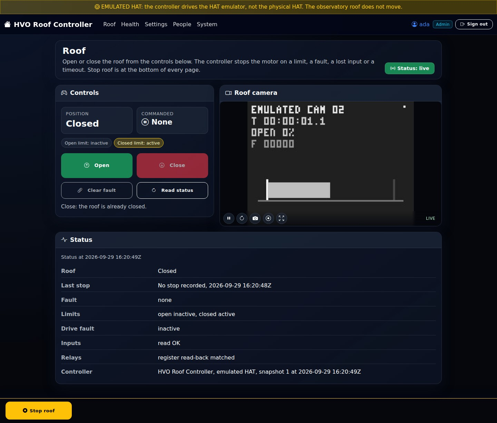

## Reaching it

Open `https://<pi>:8088/` (the deploy script and the `pi` Compose profile serve HTTPS; `ALLOW_INSECURE_HTTP=true` and
`pi-lan-http` serve `http://`). Browsers must trust the certificate
([deployment.md](deployment.md#2-tls-certificate)). A page opened while signed out goes to the sign-in page, and back
to the page after signing in.

## Signing in

People sign in with their name and password, which the web UI checks at the controller (`POST Auth/Session`: see
[Signing in](security.md#signing-in)). An admin adds people on the People page, or with `hvo-roof setup --create-admin`
for the first admin ([cli.md](cli.md#setup)).

<p>
  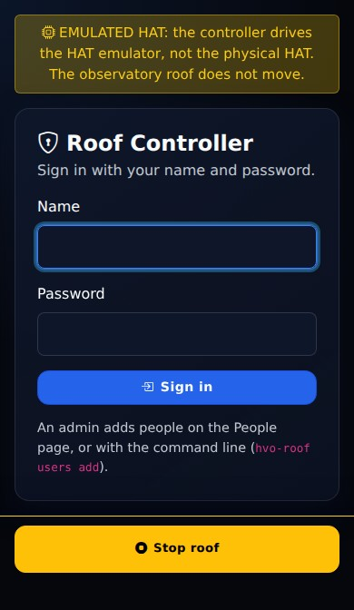
  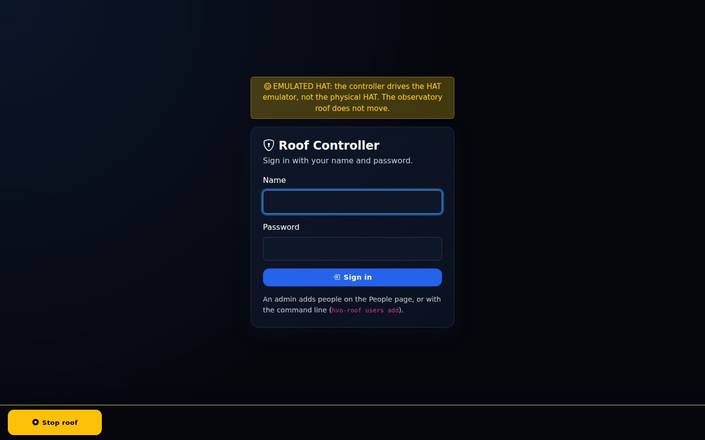
</p>

- The web UI keeps the controller's session in the `hvo.roof.web` cookie: HttpOnly, `SameSite=Strict`, sent over HTTPS
  only when the page was served over HTTPS, and never lasting longer than the session (12 hours by default:
  `SessionLifetime`). It does not slide: the person signs in again when the session ends.
- A wrong name or password always says the same thing. After `SignInAttemptsPerMinute` attempts from one address in a
  minute (10 by default), the web UI refuses more before asking the controller; the controller's own lockout
  (`LockoutThreshold`) applies as well.
- **Sign out** ends the session at the controller. So does an admin ending it on the People page, or the person's
  password being changed elsewhere: the next thing the page does says they are signed out.
- **Change password** (the person's name at the top of the page) changes it at the controller. The person's other
  sessions end; this one stays open.
- Only a signed-in person may open a live page. The sign-in page is a plain form that needs no live connection.

## Pages

| Page | Who sees it | What it has |
|------|-------------|-------------|
| Roof (`/`) | everyone | The position, what was commanded, Open, Close and Clear fault (Operator and Admin), the operator lease while a move started here runs, the roof camera, and the status in detail. |
| Health (`/health`) | everyone | Whether the controller is running and ready, the container's supervisor, and the controller's health checks, the worst first. Checked again every `StatusRefreshSeconds`. |
| Settings (`/settings`) | everyone | The settings by group, from the controller's catalogue: those the person's role may read, and the controller says which of them they may change. |
| People (`/people`) | Admin | People (add, role, password, kiosk PIN, remove), API keys (add, rotate, change, remove) and sessions (end). |
| System (`/system`) | Admin | The controller's version, host and resource use, readiness, Restart, and Forced restart. |
| Change password (`/account/password`) | everyone | The person's own password. |

A Viewer and an Operator see Roof, Health and Settings in the navigation. Opening an admin page without the Admin role
says so, and shows nothing of it. On every page, the **mode banner** says when the controller is not driving the
observatory roof as in normal use (for example an emulated HAT), so an emulator or a simulation is never mistaken for
the roof.

### Roof

The page follows the controller's live status: the hub sends a full status at each change and a heartbeat each second.

<p>
  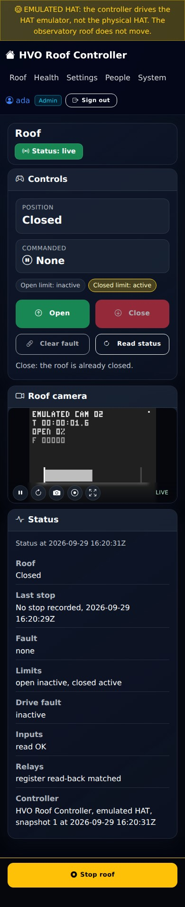
  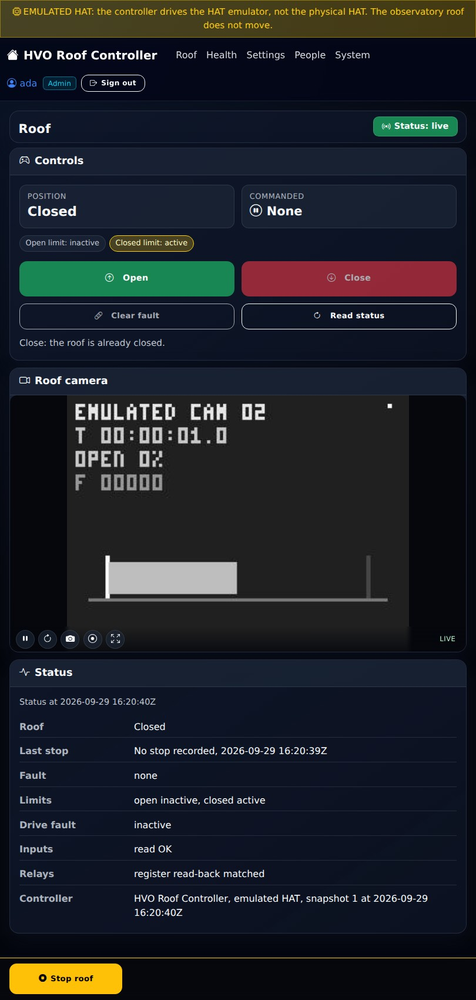
</p>

- **Open, Close and Clear fault** need the Operator role. A Viewer sees them disabled, with
  `Open, Close and Clear fault need the Operator role. Stop is always available.` A button that cannot be used says
  why, for example that the roof is already closed.
- **The operator lease.** When the controller has a lease (`OperatorLeaseTimeout`), a move started from the page holds
  it, and the page renews it while the roof moves (`Renewing lease (12 s left)`). The page renews it only while its
  live connection is up. When the page closes, or its connection is lost, it stops renewing, and the roof stops when the
  lease runs out ([commissioning C9](commissioning.md#c9-operator-lease-expiry)). After a reconnect it does not renew
  again, and says so:
  `The connection dropped, so this page stopped renewing the operator lease. If the roof is still moving, it stops when the lease runs out.`
- **A stale status.** The status is current only while the hub delivers it. After 3 s without a status or heartbeat,
  the page says `STALE: no status since …. Showing the last known state; Stop still works.`, labels the position and
  the command "last known", and offers no Open or Close. A status read while the live status is not connected is stale
  from the start. Stop still works.
- **Nothing is claimed that the controller has not said.** Before the first status the page says it is connecting
  (`No status yet.`), rather than showing a position.

<p>
  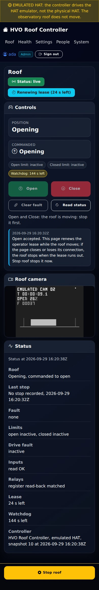
  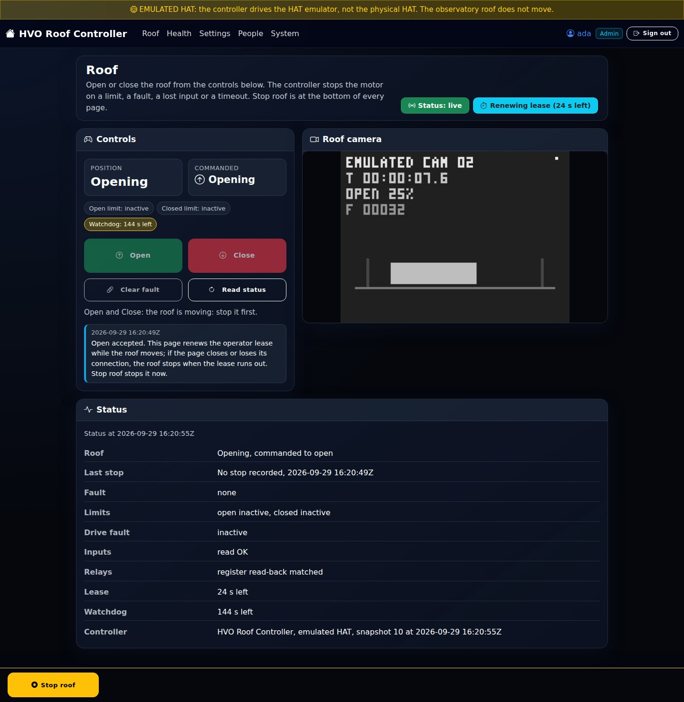
</p>

#### The camera

The roof page shows the roof camera, camera 2 on the Blue Iris server, or the cameras in `CameraIds` (up to four). The
browser reads each stream from the web UI (`/camera/{id}/mjpeg`), which relays it from the controller's camera proxy
with the person's session ([Camera proxy](security.md#camera-proxy)), so the page never holds a credential for the
controller or the camera. A stream ends when the person's session ends.

- **Live** only while frames arrive. With no new frame it shows **Stalled**, and **Reconnecting** or **Offline** when
  the stream fails; the last frame stays, greyed, under `No live video — last frame hh:mm:ss`, and the player tries
  again by itself.
- Pause, reconnect, snapshot, record (in the browser) and full screen.
- The camera is in the web UI only: the terminal interface has none.

### Health

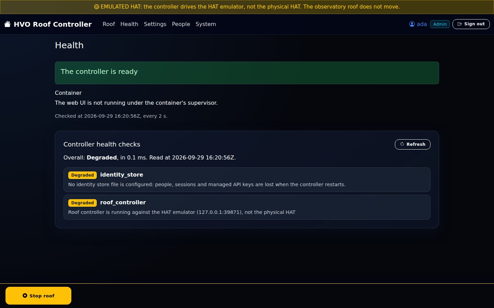

The top says whether the controller is running and ready, from the controller's readiness and the supervisor's state
(for example a controller the supervisor left stopped after repeated crashes). The health checks are read with the
person's session, and show how long they took.

### Settings

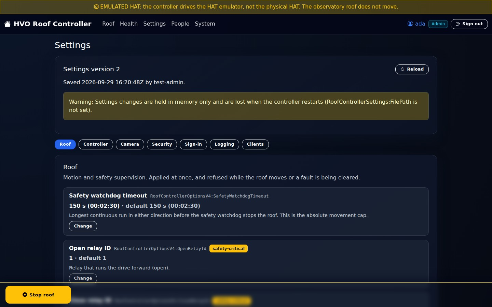

The settings come from the controller's catalogue, by group, with each setting's key, value, default and description.
A setting that cannot be changed here says why, as the controller gives it.

- **One change at a time.** **Change** opens an editor for one setting. **Save** checks the value, then shows the
  change for review (`<setting>: <old value> -> <new value>`, with notes such as `[SAFETY-CRITICAL]` or
  `[applies after a restart]`) before anything is sent. A safety-critical change needs
  **Confirm and send**.
- **Secrets are never shown.** A secret shows only whether it is set. It is typed twice, and a group's secrets are set
  and cleared together: the camera's user name and password are asked for in one editor
  (`User name and Password are set and cleared together.`), and **Clear secret** clears both. **Change** is always a
  change, even with the value already set, so the answer never shows whether a guess was right.
- **When the controller refuses a change**, the page shows its reason, for example the camera server rule below. When
  another admin changed the settings in the meantime (a version conflict), the page reads them again and asks to check
  them before trying again.
- **Hand edits.** A change made to the settings file by hand is shown with its changes, to apply (or confirm and apply)
  or discard ([Hand edits](security.md#hand-edits)).

**Moving the camera proxy to another server.** The camera's credentials stay with the server they were set for
([Secrets](security.md#secrets)): while the user or password is set, the controller refuses a change of
`BlueIris:BaseUrl` to another server. To move it:

1. **Clear secret** on the camera's user name or password (both are cleared).
2. **Change** `BlueIris:BaseUrl` to the new server.
3. **Change** the user name or password, and type both for the new server.

### People

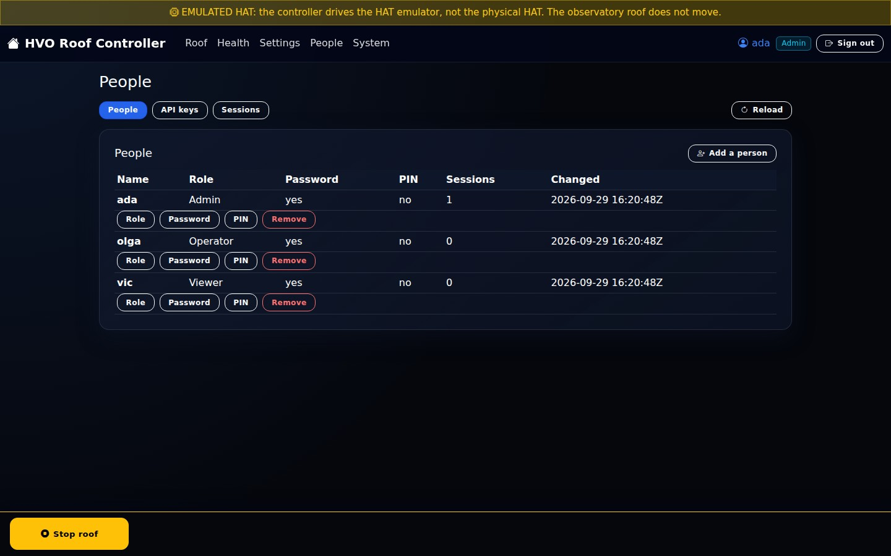

An admin adds people and sets their role, password and kiosk PIN, adds and rotates API keys, and ends sessions
([Managing people, keys and sessions](security.md#managing-people-keys-and-sessions)). A new key's secret is shown
once, as it is created; neither the page nor the controller shows it again.

### System

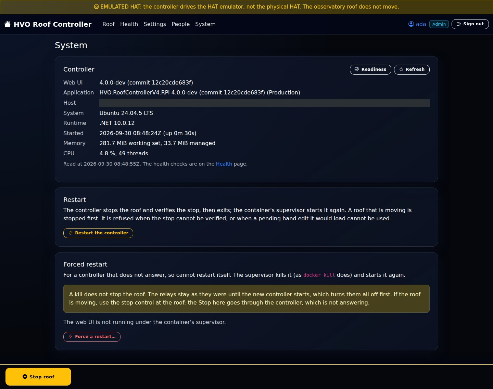

- **Restart the controller** asks first (`Restart the controller? It stops the roof first, and does not answer until it has started again.`).
  The controller stops the roof, verifies the stop, and exits; the supervisor starts it again. A restart that would
  load a pending hand edit shows it, and needs confirming when it is safety-critical.
- **Forced restart** is for a controller that does not answer, so cannot restart itself. The web UI asks the container's
  supervisor to kill the controller and start it again
  ([The container's two processes](deployment.md#the-containers-two-processes)). A kill does not stop the roof: the page
  says so, and to use the stop control at the roof if the roof is moving. To send it, type `restart`.

## Stop

**Stop roof** is on every page, the sign-in page too, in a bar fixed to the bottom of the screen. It is never
disabled, needs no role and no PIN, and uses the same words as every other client. The page keeps room for the bar at
its end, so the bar never covers the end of a page.

- The Stop bar is outside the live page. `wwwroot/js/stop.js` posts it (`POST /stop`) with `fetch` and shows the
  answer next to the button, so Stop works while the page's live connection is down. Without the script, the browser
  posts the form itself and shows the answer as a page.
- The web UI sends Stop to the controller with the person's session. With `StopKeyFile`, it sends its own key as well,
  naming the person (`X-On-Behalf-Of`), so Stop still works when their session has ended at the controller (a Viewer
  key is enough). A page that was signed out when it loaded sends no credential: the controller then decides, with
  `RoofControllerSecurity:AllowAnonymousStop`.
- The answer says what the controller verified, for example
  `Stop acknowledged. Relay register verified de-energized.`, or why Stop failed, with
  `Use the stop control at the roof.` The page waits up to 25 s for the answer.
- **The reconnect dialog.** When a page loses its live connection, a dialog covers it, and it has its own **Stop roof**
  (`Stop still works while this page is disconnected.`). When the web UI cannot be reached, it says
  `Stop failed: The web UI could not be reached. Use the stop control at the roof.`
  ([commissioning C15](commissioning.md#c15-stop-from-the-web-uis-reconnect-dialog)).

## Settings

The web UI's settings are the `RoofWeb` section, from the environment (`RoofWeb__*`) in the container. The supervisor
passes the web UI these and nothing else of the controller's settings
([The web UI's user and settings](deployment.md#the-web-uis-user-and-settings)).

| Setting | Default | Meaning |
|---------|---------|---------|
| `Urls` | `http://+:8088` | Where the web UI listens, as URLs separated by semicolons. |
| `ControllerUrl` | `http://localhost:8080` | The controller's API, over the container's loopback. |
| `Certificate:Path`, `Certificate:PasswordFile` | the controller's | The certificate for an `https://` URL (a `.pfx` file), and a file with its password. |
| `SupervisorStatePath` | none | The supervisor's state file (`supervisor.json`). Without it, the pages say there is no supervisor. |
| `SupervisorControlPath` | none | The supervisor's control directory, where a forced restart is asked for. |
| `StatusRefreshSeconds` | `2` | How often the pages check the controller's readiness and the supervisor's state, from 1 to 60. |
| `StopKeyFile` | none | A file with the web UI's own API key for Stop (a Viewer key is enough). None: Stop uses the person's session alone. In the container, point it at a Viewer key's file in the secrets directory, such as `/run/secrets/RoofControllerSecurity__ApiKeys__2__Key`; the supervisor gives the web UI a private copy ([The web UI's user and settings](deployment.md#the-web-uis-user-and-settings)). |
| `AllowedOrigins` | none | Origins, besides the web UI's own, that may post its forms and open its live connection, for example `https://roof.example.org` behind a proxy. Scheme, host and port only. |
| `DataProtectionPath` | none; in the container `/var/lib/hvo-roof-web/keys` | A directory for the keys that protect the sign-in cookie and the forms, so they survive a restart. None: the keys are in memory, and everyone signs in again after the web UI restarts. In the container the supervisor gives it a directory only the web UI can read, which lasts as long as the container: a redeploy signs everyone out. |
| `SignInAttemptsPerMinute` | `10` | Sign-in attempts accepted from one address a minute, from 1 to 1000. |
| `CameraIds` | camera 2 | The cameras the roof page shows, by their number on the camera server (1 to 99), at most 4: for example `RoofWeb__CameraIds__0=2`. |

The web UI checks its settings at start, and an invalid one stops it with
`The roof controller's web UI did not start: ...`.

Every answer carries `X-Content-Type-Options: nosniff`, `X-Frame-Options: DENY` and `Referrer-Policy: same-origin`.
Every form post (sign-in, sign-out, Stop) and the live connection must come from the web UI's own pages or an
`AllowedOrigins` origin; anything else is refused with 403 `origin_not_allowed`.

## Tests

Nothing here needs the Pi, the HAT or the roof.

- **Pages** are rendered with bUnit against a fake controller (`tests/HVO.RoofControllerV4.RPi.Tests/Web`): what each
  role is offered, the stale view, the lease, settings changes, secrets and refusals, people and keys, restart and
  forced restart, and the web UI's host (sign-in, the cookie, the origin check, the headers and Stop).
- **Browser tests** (`TestCategory=Browser`, `tests/HVO.RoofControllerV4.RPi.Tests/Browser`) run the web UI in
  Chromium against the whole controller and the emulated roof, on phones and tablets (upright and sideways) and a
  desktop window: sign-in, Stop in view and uncovered on every page and stopping the roof, what each role is offered,
  the stale status, the camera stalling and going offline, the lease when the page closes or loses its connection
  (commissioning C9), and the reconnect dialog's Stop (commissioning C15). Install Chromium once with
  `pwsh tests/HVO.RoofControllerV4.RPi.Tests/bin/Release/net10.0/playwright.ps1 install --with-deps chromium`, then,
  from `src/`:

  ```bash
  dotnet test ../tests/HVO.RoofControllerV4.RPi.Tests -c Release --filter TestCategory=Browser
  ```

- **The screenshots** above come from `WebScreenshotTests`, which signs in as an admin against the emulated roof and
  camera and visits every page on a phone, a tablet and a desktop. It checks that no page scrolls sideways and that no
  page holds a key or a password; the key panel is never opened and the controller's host name is masked. To refresh
  them, from `src/`:

  ```bash
  WEB_SCREENS_OUT="$PWD/../docs/images/web" dotnet test ../tests/HVO.RoofControllerV4.RPi.Tests -c Release \
    --filter "TestCategory=Browser&FullyQualifiedName~WebScreenshotTests"
  ```
